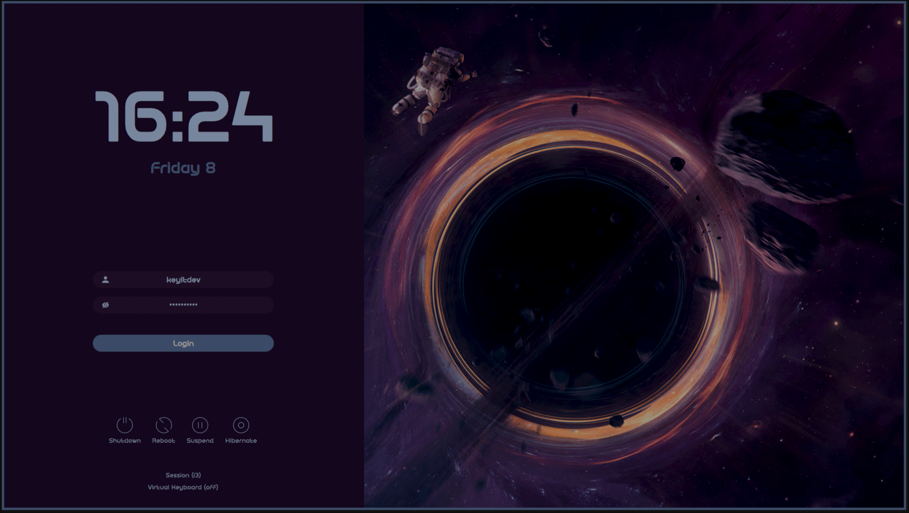

I really like making the programs I use look and behave exactly the way I want.
This includes my keyboard, the entire desk setup, my text editor, and the OS as
a whole. However, I have time constraints, and I don’t want this customization
to take too much of my time.

On this page, I will describe how I achieved my current configuration without
spending too much time on it.

## [Stylix](https://github.com/nix-community/stylix)

> Stylix is a theming framework for NixOS, Home Manager, nix-darwin, and
> Nix-on-Droid that applies color schemes, wallpapers, and fonts to a wide range
> of applications.
>
> Unlike color scheme utilities such as base16.nix or nix-colors, Stylix goes
> further by applying themes to supported applications, following the "it just
> works" philosophy.

I personally use it mainly to quickly apply sensible settings on various apps.
Using `autoEnable` will enable customization for all programs that are enabled
in your Home Manager configuration. You can later disable customization for
specific programs in `stylix.targets` inside a Home Manager module.

Some programs, such as GRUB or Plymouth, need to be disabled inside the NixOS
module instead of the Home Manager one.

You can also easily set a cursor package and its size through this.

```nix
{inputs, ...}: {
  flake-file.inputs.stylix.url = "github:danth/stylix";

  flake.nixosModules.stylix = {pkgs, ...}: let
    fonts = import ./fonts/_consts.nix {inherit pkgs;};
  in {
    imports = [inputs.stylix.nixosModules.stylix];
    stylix = {
      enable = true;
      # base16Scheme = "${pkgs.base16-schemes}/share/themes/ayu-dark.yaml";
      # base16Scheme = "${pkgs.base16-schemes}/share/themes/tokyo-night.yaml";
      base16Scheme = "${pkgs.base16-schemes}/share/themes/tokyodark-terminal.yaml";

      cursor = {
        size = 16;
        package = pkgs.bibata-cursors;
        name = "Bibata-Modern-Classic";
      };
      autoEnable = true;
      targets = {
        grub.enable = false;
        plymouth.enable = false;
      };
      fonts = {
        sizes = {
          applications = 12;
          terminal = 15;
          desktop = 10;
          popups = 10;
        };
        monospace = {
          package = fonts.codePkg;
          name = fonts.codeName;
        };
        sansSerif = {
          package = fonts.sansSerifPkg;
          name = fonts.sansSerifName;
        };

        emoji = {
          package = fonts.emojiPkg;
          name = fonts.emojiName;
        };
      };
    };
  };

  flake.homeModules.general = {
    stylix.targets = {
      hyprlock.enable = false;
      nvf.enable = false;
    };
  };
}
```

## [Waypaper](https://github.com/anufrievroman/waypaper)

I really like to have a fresh wallpaper every time I turn on my pc. This makes
my system feel fresh every time. I can do this because I have a library of tens
of absolute banger 4k+ wallpapers(No I will not share them, finding them by hand
is a part of the experience).

Using [waypaper](https://github.com/anufrievroman/waypaper) with
[swaybg](https://github.com/swaywm/swaybg) as a backend, I can easily make my
wallpaper change randomly every time Hyprland starts. I just add
`waypaper --random` to `exec-once` in the Hyprland configuration.

You also need to remember to set the correct option in the Waypaper GUI.

## [Plymouth](https://wiki.archlinux.org/title/Plymouth)


Plymouth allows you to display nice-looking animations during the startup and
shutdown of your PC. This looks especially good if you have encrypted your disk
(as you should) with a very strong password, so the screen does not look too
ugly while you type your 30-character passphrase.

I personally use the `rings_2` animation from
[Plymouth themes](https://github.com/adi1090x/plymouth-themes?tab=readme-ov-file).

```nix
{
  flake.nixosModules.plymouth = {pkgs, ...}: {
    boot = {
      plymouth = {
        enable = true;
        theme = "rings_2";
        themePackages = with pkgs; [
          (adi1090x-plymouth-themes.override {
            selected_themes = ["rings_2"];
          })
        ];
      };

      # Enable "Silent boot"
      consoleLogLevel = 3;
      initrd.verbose = false;
      kernelParams = [
        "quiet"
        "udev.log_level=3"
        "systemd.show_status=auto"
        "video=3840x2160"
      ];

      # Hide the OS choice for bootloaders.
      # Spam space when booting to show it anyway
      loader.timeout = 0;
    };
    boot.initrd.systemd.enable = true;
  };
}
```

## [Hyprland](https://github.com/hyprwm/Hyprland)

> Hyprland is a 100% independent, dynamic tiling Wayland compositor that doesn't
> sacrifice on its looks. It provides the latest Wayland features, is highly
> customizable, has all the eyecandy, the most powerful plugins, easy IPC, much
> more QoL stuff than other compositors and more...

I use Hyprland as my window manager mainly because it is very stable and looks
great. Stylix has support for it, but it can really only set window borders.

My configuration is very simple. I do not have any crazy shortcuts. It is mostly
a set of settings that I gathered throughout my journey with NixOS. The base
came from a configuration that I translated from the native Hyprland config. It
is very bare-bones: just basic rounded borders, small gaps, and snap transition
animations.

This part handles inputs that control audio on your system:

```nix
bindel = [
  ", XF86AudioRaiseVolume, exec, wpctl set-volume @DEFAULT_AUDIO_SINK@ 5%+"
  ", XF86AudioLowerVolume, exec, wpctl set-volume @DEFAULT_AUDIO_SINK@ 5%-"
];
bindl = [
  ", XF86AudioNext,  exec, playerctl next"
  ", XF86AudioPause, exec, playerctl play-pause"
  ", XF86AudioPlay,  exec, playerctl play-pause"
  ", XF86AudioPrev,  exec, playerctl previous"
  ", XF86AudioMute, exec, wpctl set-mute @DEFAULT_AUDIO_SINK@ toggle"
];
```

`xwayland.force_zero_scaling = true;` - This is needed because I use 1.5 scaling
on my 4K monitor so that text is clearly visible. This works well with native
Wayland applications, but programs running through X11(steam) don't scale
properly and end up with very low resolution. To fix this, I disable scaling for
them and scale them using their built-in settings instead.

For movement, I use **Super + keys from the home row**. This is very ergonomic
for my keyboard layout. To move a window to a workspace, I simply add the
**Shift** modifier.

```nix
        "Super, s , workspace, 1"
        "Super SHIFT, s, movetoworkspace, 1"

        "Super, d , workspace, 2"
        "Super SHIFT, d, movetoworkspace, 2"

        "Super, f , workspace, 3"
        "Super SHIFT, f, movetoworkspace, 3"

        "Super,  j , workspace, 4"
        "Super SHIFT, j , movetoworkspace, 4"

        "Super, k , workspace, 5"
        "Super SHIFT, k , movetoworkspace, 5"

        "Super, l , workspace, 9"
        "Super SHIFT, l , movetoworkspace, 9"
```

my whole generic config

```nix
{
  flake.homeModules.general = {
    wayland.windowManager.hyprland.enable = true;
    services.hyprpolkitagent.enable = true;
    wayland.windowManager.hyprland.settings = {
      cursor = {
        no_hardware_cursors = true;
        no_warps = false;
      };
      input.kb_layout = "pl";
      xwayland.force_zero_scaling = true;
      exec-once = [
        "Hypridle"
        "waybar"
        "waypaper --random"
      ];

      bindm = [
        "Super, mouse:272, movewindow"
        "Super, mouse:273, resizewindow"
      ];
    # stylix modifies the qt theme by the qtct by default
      env = [
        "QT_QPA_PLATFORMTHEME,qt6ct"
      ];
      general = {
        gaps_in = 3;
        gaps_out = 3;
        border_size = 2;
        resize_on_border = true;
        allow_tearing = false;
        layout = "master";
      };
      # Handle some multimedia key inputs
      bindel = [
        ", XF86AudioRaiseVolume, exec, wpctl set-volume @DEFAULT_AUDIO_SINK@ 5%+"
        ", XF86AudioLowerVolume, exec, wpctl set-volume @DEFAULT_AUDIO_SINK@ 5%-"
      ];
      bindl = [
        ", XF86AudioNext,  exec, playerctl next"
        ", XF86AudioPause, exec, playerctl play-pause"
        ", XF86AudioPlay,  exec, playerctl play-pause"
        ", XF86AudioPrev,  exec, playerctl previous"
        ", XF86AudioMute, exec, wpctl set-mute @DEFAULT_AUDIO_SINK@ toggle"
      ];
      decoration = {
        rounding = 2;
        active_opacity = 1.0;
        inactive_opacity = 0.9;
        shadow.enabled = true;
        blur.enabled = true;
      };

      animations = {
        enabled = true;
        bezier = "ease,0.4,0.02,0.21,1";
        animation = [
          "windows, 1, 3.5, ease, slide"
          "windowsOut, 1, 3.5, ease, slide"
          "border, 1, 6, default"
          "fade, 1, 3, ease"
          "workspaces, 1, 0.5, ease"
        ];
      };
      bind = [
        "Super, Space, togglefloating,"
        "Super SHIFT Control_L, Q, exit,"
        "Super SHIFT, C, killactive,"
        "Super Control_L, E, exec,shutdown now"
        "Super Control_L, S, exec,systemctl suspend"
        "Super SHIFT Control_L, R, exec, reboot"

        "Super, G, exec, ghostty"
        "Super, H, exec, rofi -show drun"
        "Super, X, exec, hyprlock"
        "Super, T, exec, /etc/nixos/NNC/utils/record/start.bash"
        "Super SHIFT, T, exec, /etc/nixos/NNC/utils/record/end.bash"
        "Super, O, exec, grimblast -n copy area"
        "Super Control_L, O, exec, grimblast -n edit area"
        ", Print, exec, grimblast copy area"

        "Super , R, fullscreen,"

        "Super, A , workspace, 0"
        "Super SHIFT, A, movetoworkspace, 0"

        "Super, s , workspace, 1"
        "Super SHIFT, s, movetoworkspace, 1"

        "Super, d , workspace, 2"
        "Super SHIFT, d, movetoworkspace, 2"

        "Super, f , workspace, 3"
        "Super SHIFT, f, movetoworkspace, 3"

        "Super,  j , workspace, 4"
        "Super SHIFT, j , movetoworkspace, 4"

        "Super, k , workspace, 5"
        "Super SHIFT, k , movetoworkspace, 5"

        "Super, l , workspace, 9"
        "Super SHIFT, l , movetoworkspace, 9"
      ];
    };
  };
}
```

## [Hyprpanel](https://github.com/Jas-SinghFSU/HyprPanel?tab=readme-ov-file)


> HyprPanel as the name implies is a panel built specifically for Hyprland. It's
> an extremely customizable panel that provides useful widgets out of the box to
> display information about your system (volume, network status, bluetooth,
> battery, calendar, notifications, OSDs, etc.). Additionally, it provides quick
> access to context menus that allow you to control your system settings without
> having to rely on external tools.

I've recently moved from [waybar](https://github.com/Alexays/Waybar) to the
hyprpanel. It generally achieves the main goal that I have - great looking rice
without any effort.

Other advantages over Waybar:

- Feels less hacky.
- Better Stylix support.
- Plug and play.
- Easily customizable.
- Great GUI settings.
- Great looking notifications handler.
- All buttons on the bar are clickable with custom menus.

The only issue I have is customizing it on NixOS. To change some settings with
home-manager you need to do:

1. Disable home-manager configuration for hyprpanel - otherwise you will not be
   able to see the changed configuration.
2. Rebuild your system to apply the previous change.
3. Restart the hyprpanel.
4. Open GUI setting of hyprpanel and make changes that you want to do in your
   home-manager config.
5. Export the config using a button in setting.
6. Open the exported config and move its contents to your .nix config
7. Translate the json to nix and re-enable the home-manager configuration for
   hyprpanel.
8. Rebuild your system to apply changes.
9. See if you've achieved desired results, if not repeat.

my config:

```nix
{
  flake.homeModules.general = {
    programs.hyprpanel = {
      enable = true;
      settings = {
        terminal = "ghostty";
        menus = {
          clock.time.military = false;
          clock.time.hideSeconds = true;
          power.lowBatteryNotification = true;
        };
        bar = {
          launcher.icon = "";
          battery.hideLabelWhenFull = true;
          clock.showTime = true;
          clock.format = "%m %d  %H:%M";
          layouts = {
            "0" = {
              left = ["dashboard" "workspaces" "windowtitle"];
              middle = [];

              right = [
                "volume"
                "network"
                "bluetooth"
                # "systray"
                "clock"
                "notifications"
                "battery"
              ];
            };
          };
        };
        theme.bar = {
          transparent = true;
          margin_sides = "0.5em";
          floating = true;
        };
      };
    };
  };
}
```

## [Hyprlock](https://github.com/hyprwm/hyprlock/)

> Hyprland's simple, yet multi-threaded and GPU-accelerated screen locking
> utility.

I use it with a combination of [hypridle](https://github.com/hyprwm/hypridle) to
automatically lock my screen when I'm away form my computer. I also have a
`Super + X` shortcut for quick screen locking. Of course this is not as safe as
turning off your PC - especially if your disk is encrypted.

My Hyprlock config:

```nix
    programs.hyprlock = {
      enable = true;
      settings = {
        general = {
          disable_loading_bar = true;
          hide_cursor = true;
          no_fade_in = false;
          grace = 0;
        };

        background = [
          {
            path = "";
            blur_passes = 0;
            blur_size = 0;

            contrast = 0.8916;
            brightness = 0.8172;
            vibrancy = 0.1696;
            vibrancy_darkness = 0.0;
          }
        ];

        input-field = [
          {
            monitor = "";
            size = "600, 80";
            outline_thickness = 3;
            dots_size = 0.4; # Scale of input-field height, 0.2 - 0.8
            dots_spacing = 0.4; # Scale of dots' absolute size, 0.0 - 1.0
            dots_center = true;
            outer_color = "rgba(0, 0, 0, 0)";
            inner_color = "rgba(255, 255, 255, 0.1)";
            font_color = "rgb(200, 200, 200)";
            fade_on_empty = false;
            font_family = "SF Pro Display Bold";
            placeholder_text = ''<i><span foreground="##ffffff99"> Enter Pass </span></i>'';
            hide_input = false;
            position = "0, -510";
            halign = "center";
            valign = "center";
          }
        ];

        # Time-Hour
        label = [
          {
            monitor = "";
            text = ''cmd[update:1000] echo "<span>$(date +"%I")</span>"'';
            color = ''rgba(255, 255, 255, 1)'';
            font_size = 250;
            font_family = "StretchPro";
            position = "-80, 230";
            halign = "center";
            valign = "center";
          }

          # Time-Minute
          {
            monitor = "";
            text = ''cmd[update:1000] echo "<span>$(date +"%M")</span>"'';
            color = "rgba(147, 196, 255, 1)";
            font_size = 250;
            font_family = "StretchPro";
            position = "0, -20";
            halign = "center";
            valign = "center";
          }

          # Day-Month-Date
          {
            monitor = "";
            text = ''cmd[update:1000] echo -e "$(date +"%d %B, %a.")"'';
            color = ''rgba(255, 255, 255, 100)'';
            font_size = 45;
            font_family = ''Suisse Int'l Mono'';
            position = ''20, -180'';
            halign = ''center'';
            valign = ''center'';
          }

          # USER
          {
            monitor = "";
            text = "    $USER";
            color = "rgba(216, 222, 233, 0.80)";
            outline_thickness = 2;
            dots_size = 0.3; # Scale of input-field height, 0.2 - 0.8
            dots_spacing = 0.3; # Scale of dots' absolute size, 0.0 - 1.0
            dots_center = true;
            font_size = 50;
            font_family = "SF Pro Display Bold";
            position = "0, -400";
            halign = "center";
            valign = "center";
          }
        ];
      };

      settings.general = {
        fractional_scaling = 1;
      };
    };
```

My Hypridle config:

```nix
{
  flake.homeModules.general = {
    services.hypridle.enable = true;
    services.hypridle.settings = {
      general = {
        after_sleep_cmd = "hyprctl dispatch dpms on";
        before_sleep_cmd = "loginctl lock-session"; # lock before suspend.
        ignore_dbus_inhibit = false;
        lock_cmd = "hyprlock";
      };

      listener = [
        {
          timeout = 300;
          on-timeout = "hyprlock";
        }
        {
          timeout = 150; # 2.5min.
          on-timeout = "hyprctl dispatch dpms off"; # screen off when timeout has passed
          on-resume = "hyprctl dispatch dpms on && brightnessctl -r"; # screen on when activity is detected after timeout has fired.
        }
      ];
    };
  };
}
```

## [Rofi](https://github.com/davatorium/rofi)

> A window switcher, Application launcher and dmenu replacement.


I know that there are many modern alternatives but I just have a working config
for it. The only mode that I use is dmenu anyway.

## [SDDM](https://github.com/sddm/sddm)



> SDDM is a modern display manager for X11 and Wayland sessions aiming to be
> fast, simple and beautiful.

SDDM is a display manager of my choice, mainly because of its looks and how
popular it is. It is the default display manager on KDE Palsma. I chose the
[sddm-astronaut](https://github.com/Keyitdev/sddm-astronaut-theme)'s blackhole
theme for it, but there are a lot of other good ones. I use this to override the
theme type.

```nix
custom = pkgs.sddm-astronaut.override {
  embeddedTheme = "black_hole";
};
```

If you are curious how I've figured this out, because you can't find anything
about this anywhere: I've opened the sddm-astronaut github repo thru
search.nixos nix packages, than looked in the
[source code of the nix package](https://github.com/NixOS/nixpkgs/blob/nixos-unstable/pkgs/by-name/sd/sddm-astronaut/package.nix#L53).
Than found this part:

```nix
{
  lib,
  stdenvNoCC,
  fetchFromGitHub,
  kdePackages,
  formats,
  themeConfig ? null,
  embeddedTheme ? "astronaut",
}:
```

And thought that the `embeddedTheme` seems like the right setting.

My whole config:

```nix
{
  flake.nixosModules.sddm = {pkgs, ...}: let
    custom = pkgs.sddm-astronaut.override {
      embeddedTheme = "black_hole";
    };
  in {
    environment.systemPackages = [
      custom
    ];

    services.displayManager.sddm = {
      theme = "sddm-astronaut-theme";
      extraPackages = [custom];
      wayland = {
        enable = true;
        compositor = "kwin";
      };
      enable = true;
    };
  };
}
```

:::tip

If you ever have a problem with SDDM, or other software that doesn't allow you
to boot into your normal desktop environment do following:

Press Ctrl + LAlt + F2/F3/F... to go to another tty. This will show you a
'terminal' window that allows you to log in and use your pc in a terminal mode.
Than you can just update your config or do anything else to open normal
graphicall environment.

I had a problem with sddm not showing up. I had to start hyprland by hand thru
this method. Thankfully this issue was resolved after about 2weeks with a new
update.

:::

---

#### Bugs

If you find anything to improve in this project's code, please create an issue
describing it on the
[GitHub repository for this project](https://github.com/FilipRuman/NNC/issues).
For website-related issues, create an issue
[here](https://github.com/FilipRuman/pages/issues).

#### Support

All pages on this site are written by a human, and you can access everything for
free without ads. If you find this work valuable, please give a star to the
[GitHub repository for this project](https://github.com/FilipRuman/NNC).

<script src="https://giscus.app/client.js"
        data-repo="FilipRuman/NNC"
        data-repo-id="R_kgDOQ3xb7Q"
        data-category="Announcements"
        data-category-id="DIC_kwDOQ3xb7c4C4CG7"
        data-mapping="specific"
        data-term="rice"
        data-strict="0"
        data-reactions-enabled="1"
        data-emit-metadata="0"
        data-input-position="top"
        data-theme="preferred_color_scheme"
        data-lang="en"
        data-loading="lazy"
        crossorigin="anonymous"
        async>
</script>
