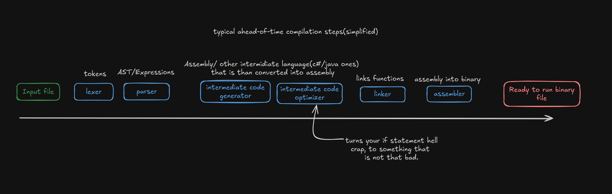

This tutorial will walk you step-by-step through building a lexer and Pratt
parser for the C language. By the end you will understand how real-world
compilers work.

## Knowledge Requirements

You only need basic programming experience. You don’t need to know Rust or C.
The tutorial introduces most of the needed concepts as we go.

## Additional Tips

I will skip writing tests within this tutorial, you should write test for code
that you wrote.

Feel free to experiment! Modify the syntax and add new operators. It will help
you solidify your knowledge.

---

#### Bugs

If you find anything to improve in this project's code, please create an issue
describing it on the
[GitHub repository for this project](https://github.com/FilipRuman/RIP/issues).
For website-related issues, create an issue
[here](https://github.com/FilipRuman/pages/issues).

#### Support

All pages on this site are written by a human, and you can access everything for
free without ads. If you find this work valuable, please give a star to the
[GitHub repository for this project](https://github.com/FilipRuman/RIP).

