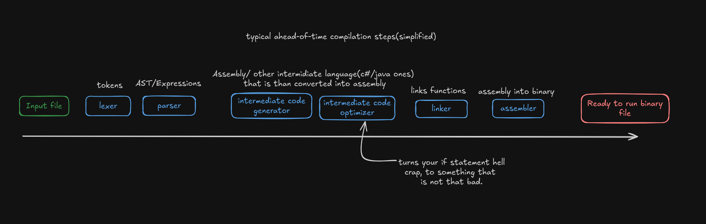

Like a constitution every good tutorial needs a preamble. 
This project will show, step by step, how to write prat parser & lexer for C-lang.
 

Great learning resource on writing parsers. + great if you want to use go-lang instead of rust.
![[https://www.youtube.com/watch?v=V77J9l8N-P8]]

## Knowledge requirements:
Only basic knowledge of programming is required.
You should be able to follow this without prior knowledge of rust and c. 
## Additional tips
I will be skipping any testing in this project, but you should test code that you wrote every once a while.  
Writing good tests requiters high knowledge of the project and language, so it will help you to solidify the knowledge.

I highly encourage you to modify this project while you are writing it- Add new features or modify syntax of the parsed code,
this will also improve your knowledge about parsers. 
