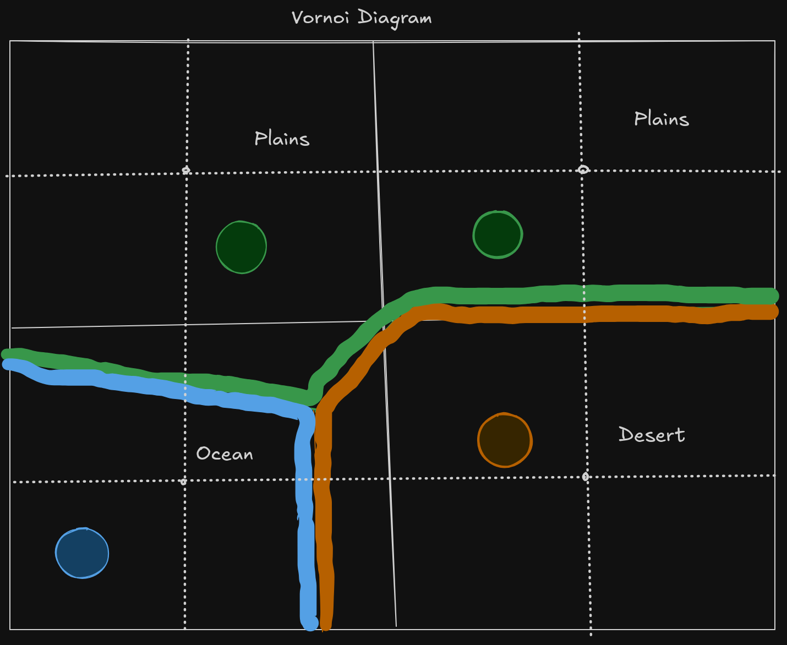
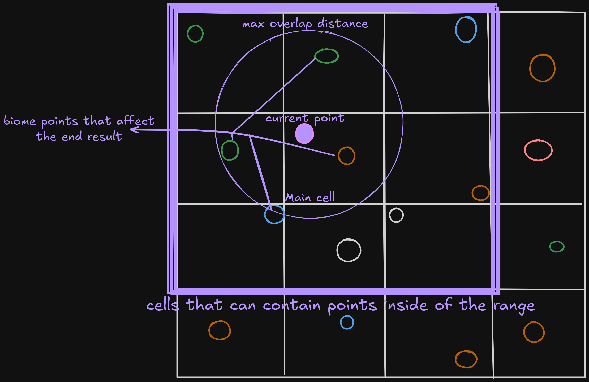
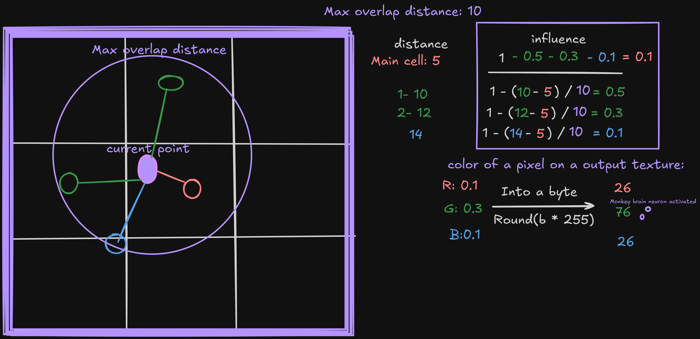
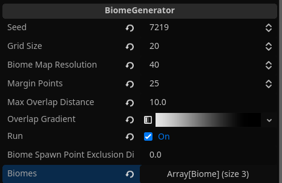
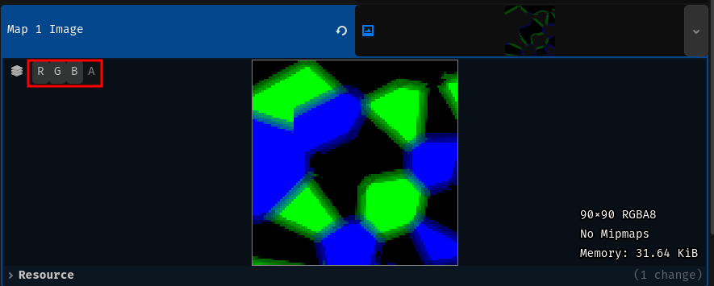
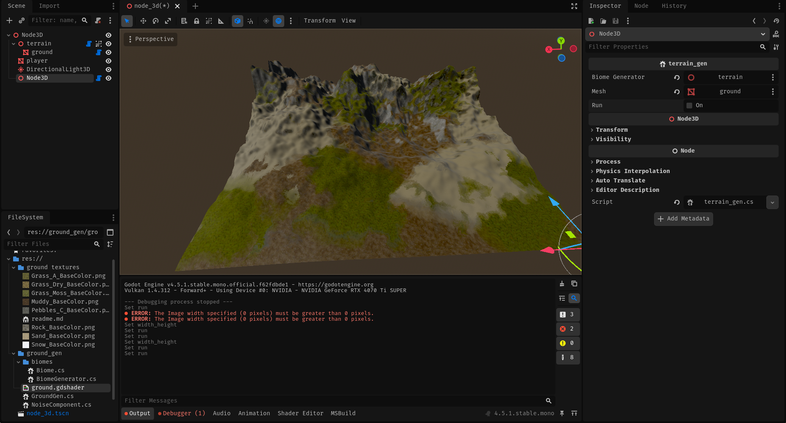
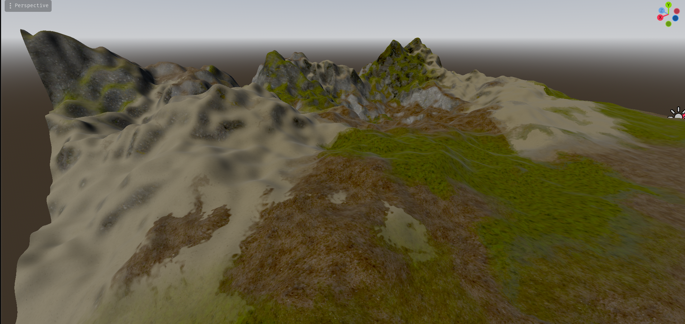

We will be generating biome map for our our shader.
This will be done by Generating a grid of points. We will be treating those points as biome 'seeds'. 
We will be generating a  saying which biome 'seed' is closer. 
That way we will know what biome to choose at a certain point. 


But this will result in a sharp edges between biomes, which would look ugly.
So we will need to implement a smart algorithm that will smooth out texture transitions, and our ground shader with noise will do the rest.
Thankfully the shader that we had implemented, has a structure that easily allows us to do this.
## Generating a simple texture
``` cs
//BiomeGenerator.cs
    [Export] public int width;
    [Export] public int height;
    [Export] public Image map;
    public void GenerateMaps(int x_base, int y_base, int width_height)
    {
        // the format of this data looks like this: rgba color bytes for every pixel in a x->y order. 
        var map_data = new byte[width * height * 4];
        for(int x = 0; x < width; x++){
            for(int y = 0; y < height; y++){
                int i = x + y * width;
                int color_offset = i % 3;
                map[i+color_offset] = 255;
                map[i+3] = 255;
            }
        }
        map = Image.CreateFromData(width,height, false, Image.Format.Rgba8, map_data);
    }
```
Running this code will result in a texture with alternating red, green, blue colors.
## Generating a biome grid



We will basically generate an array of cells that have a position and biome. 
Each position will be generated by taking a base position of a cell in a grid and adding a offset that is smaller than a half of a cell width.
```cs
//BiomeGenerator.cs
    [Export] int seed;
    [Export] int grid_size;
    [Export] int biome_map_resolution;
    [Export] Biome[] biomes;
    class GridCell
    {
        public Vector2 pos;
        public Biome biome;

        public GridCell(Vector2 pos, Biome biome)
        {
            this.pos = pos;
            this.biome = biome;
        }
    }
    class Grid
    {
        GridCell[] cells;
        int grid_cells_per_axis;

        public Grid(GridCell[] cells, int grid_cells_per_axis)
        {
            this.cells = cells;
            this.grid_cells_per_axis = grid_cells_per_axis;
        }

        public GridCell this[int x, int y]
        {
            get
            {
                return cells[x + 1 + (y + 1) * grid_cells_per_axis];
            }
        }
    }

    private Grid GenerateGrid(int grid_cells_per_axis, int x_base, int y_base)
    {
        var cells = new GridCell[(grid_cells_per_axis + 2) * (grid_cells_per_axis + 2)];

        // + 2 to generate position outside of this chunk of terrain, on the: left, right, up, down. This is needed to ensure consistency between chunks.
        for (int x = 0; x < grid_cells_per_axis + 2; x++)
        {
            for (int y = 0; y < grid_cells_per_axis + 2; y++)
            {
                // -1 for the border 
                GD.Seed((ulong)((x + x_base - 1) * (y + y_base - 1) * seed));

                float x_offset = GD.Randf() * grid_size - grid_size / 2f;
                float y_offset = GD.Randf() * grid_size - grid_size / 2f;
                int grid_index = x + y * grid_cells_per_axis;
                Vector2 final_pos = new((x - 1) * grid_size + x_offset, (y - 1) * grid_size + y_offset);

                // Godot has the weirdest rng implementation I've seen
                Biome biome = biomes[GD.Randi() % (biomes.Length)];
                cells[grid_index] = new(final_pos, biome);
            }
        }

        Grid grid = new(cells, grid_cells_per_axis);

        return grid;
    }
```
Biome class only needs to look like this, for now:
```cs
//Biome.cs
using Godot;
[Tool, GlobalClass]
public partial class Biome : Resource
{
    // only this much for now
    [Export] public byte type_index;
}
```
Now we need to write a simple function that will run all of the generation code, and than output a valid image
We will use 2 output textures like in the shader.
```cs
//BiomeGenerator.cs

    [Export] public Image map_1_image;
    [Export] public Image map_2_image;
    public void GenerateMaps(int x_base, int y_base)
    {

        int grid_cells_per_axis = Mathf.CeilToInt(width_height / (float)grid_size);
        Grid grid = GenerateGrid(grid_cells_per_axis, x_base, y_base);

        int points_per_axis = grid_cells_per_axis * biome_map_resolution;
        // width * height * bytes per pixel
        var map_1_data = new byte[points_per_axis * points_per_axis * 4];
        var map_2_data = new byte[points_per_axis * points_per_axis * 4];

        for (int x = 0; x < points_per_axis; x++)
        {
            for (int y = 0; y < points_per_axis; y++)
            {
                // calculate biome data for all of the points:
            }
        }

        map_1_image = Image.CreateFromData(points_per_axis, points_per_axis, false, Image.Format.Rgba8, map_1_data);
        map_2_image = Image.CreateFromData(points_per_axis, points_per_axis, false, Image.Format.Rgba8, map_2_data);
    }
```

Next we will need to be able to get cells that we need to check, from our grid.
This will work by taking position of the current point that we work with and calculating a position for it in a grid space.
Also at the same time we might as well calculate distance of a 'cell point' to the point that we work with currently.
This will be really useful later.

```cs
    class CellDataCombo : IComparable<CellDataCombo>
    {
        public GridCell cell;
        public float distance;
        public float influence;

        public CellDataCombo(GridCell cell, float distance, float influence)
        {
            this.cell = cell;
            this.distance = distance;
            this.influence = influence;
        }

        public int CompareTo(CellDataCombo other)
        {
            return distance.CompareTo(other.distance);
        }
    }
    private CellDataCombo HandleCell(int x, int y, GridCell cell)
    {
        float distance = cell.pos.DistanceTo(new(x, y));
        return new(cell, distance, influence: 0/*will be calculated later*/);
    }
    private void GetCellsToCheck(int x, int y, Grid grid, List<CellDataCombo> output)
    {
        int x_grid = x / biome_map_resolution;
        int y_grid = y / biome_map_resolution;

        // really fast because the output list has already allocated the memory
        //...
        //...
        //...
        output.Add(HandleCell(x, y, grid[x_grid - 1, y_grid + 1]));
        output.Add(HandleCell(x, y, grid[x_grid, y_grid + 1]));
        output.Add(HandleCell(x, y, grid[x_grid + 1, y_grid + 1]));
        output.Add(HandleCell(x, y, grid[x_grid - 1, y_grid]));
        output.Add(HandleCell(x, y, grid[x_grid, y_grid]));
        output.Add(HandleCell(x, y, grid[x_grid + 1, y_grid]));
        output.Add(HandleCell(x, y, grid[x_grid - 1, y_grid - 1]));
        output.Add(HandleCell(x, y, grid[x_grid, y_grid - 1]));
        output.Add(HandleCell(x, y, grid[x_grid + 1, y_grid - 1]));
    }
```
Next we can use this function to get the needed cells.
Than we can sort them and get the cell with the closest point - main cell.
```cs
//BiomeGenerator.cs
    public void GenerateMaps(int x_base, int y_base)
    {
        ///...
        for (int x = 0; x < points_per_axis; x++)
        {
            for (int y = 0; y < points_per_axis; y++)
            {

                GetCellsToCheck(x, y, grid, cells);
                cells.Sort();
                var main_cell = cells[0]; cells.RemoveAt(0);
            }
        }
        ///...
    }
```
Sow now we have cells that influence the output biome texture at a certain point. 
We even have the closest cell, but how do we calculate how the output texture should actually look like?
We will do this more or less like on this diagram:

We will basically do the same, but we will also use a Godot's gradient texture so that we can configure the transitions between biomes to look like we want. 
Also instead of just subtracting the sum of the influences from the main cell influence, we will be normalizing all of the influences.
```cs
//BiomeGenerator.cs
    static byte FloatToByte(float v)
    {
        return (byte)MathF.Round(v * 255f);
    }


    [Export] float max_overlap_distance;

    private void CalculateInfluencesForCeils(
        List<CellDataCombo> neighbors,
        CellDataCombo main, Vector2 pos,
        float[] bakedGradient)
    {
        main.influence = 1.0f;

        for (int i = neighbors.Count - 1; i >= 0; i--)
        {
            handle_neighbour_cell(neighbors, main, pos, bakedGradient, i);
        }
        // normalize the influence
        float sum = main.influence;
        foreach (var n in neighbors)
            sum += n.influence;

        if (sum > 0)
        {
            main.influence /= sum;
            foreach (var n in neighbors)
                n.influence /= sum;
        }
    }

    private void handle_neighbour_cell(List<CellDataCombo> neighbors, CellDataCombo main, Vector2 pos, float[] bakedGradient, int cell_index_in_list)
    {
        var neighbor = neighbors[cell_index_in_list];
        if (neighbor.cell.biome.type_index == main.cell.biome.type_index)
        {
            neighbors.RemoveAt(cell_index_in_list);
            return;
        }

        float distance =
            (pos.DistanceSquaredTo(neighbor.cell.pos) - pos.DistanceSquaredTo(main.cell.pos)) /
            (2.0f * main.cell.pos.DistanceTo(neighbor.cell.pos));

        float abs_distance = Mathf.Abs(distance);

        if (abs_distance >= max_overlap_distance)
        {
            neighbors.RemoveAt(cell_index_in_list);
            return;
        }
        float overlap_percentage = abs_distance / max_overlap_distance; // 0 at boundary

        float influence = bakedGradient[FloatToByte(overlap_percentage)];

        // This is needed so that we know at what side of the border we are
        if (distance > 0)
        {
            neighbor.influence = influence;
        }
        else
        {
            neighbor.influence = 0;
            main.influence += influence;
        }
        return;
    }
```


Now we need to just use that function to calculate influence and than assign it into the data for the texture, but before that we also need to bake gradient values.


``` cs
//BiomeGenerator.cs

    [Export] Gradient overlap_gradient;

    private float[] bake_gradient()
    {
        var backed_gradient = new float[256];
        for (int i = 0; i < 256; i++)
        {
            backed_gradient[i] = overlap_gradient.Sample(i / 255f).R;
        }

        return backed_gradient;
    }

    public void GenerateMaps(int x_base, int y_base)
    {
        float[] backed_gradient = bake_gradient();

        // alloc heap once
        List<CellDataCombo> cells = new(9);
        for (int x = 0; x < points_per_axis; x++)
        {
            for (int y = 0; y < points_per_axis; y++)
            {
                GetCellsToCheck(x, y, grid, cells);
                cells.Sort();

                var main_cell = cells[0]; cells.RemoveAt(0);
                CalculateInfluencesForCeils(cells, main_cell, new(x, y), backed_gradient);

                cells.Add(main_cell);
                int base_index = (x + y * points_per_axis) * 4;

                foreach (CellDataCombo cell in cells)
                {
                    // using big ass switch statement would be faster, especially when using more than 2 textures but this is cleaner, so choose your poison.
                    var map = cell.cell.biome.type_index / 4 == 0 ? map_1_data : map_2_data;
                    int index = cell.cell.biome.type_index % 4;
                    map[base_index + index] = FloatToByte(cell.influence);
                }
                cells.Clear();
            }
        }
    }
```
Now we can just run this code and see the output textures.
But to apply this texture on our terrain shader easily we need to write a simple temporary script like this:
```cs
using Godot;

[Tool]
public partial class terrain_gen : Node
{
    [Export] BiomeGenerator biome_generator;
    [Export] MeshInstance3D mesh;

    [Export] bool run;
    public override void _Process(double delta)
    {

        if (run)
        {
            run = false;
            ShaderMaterial material = (ShaderMaterial)mesh.GetSurfaceOverrideMaterial(0);

            ImageTexture map_2 = ImageTexture.CreateFromImage(biome_generator.map_2_image);
            material.SetShaderParameter("map_2", map_2);
            ImageTexture map_1 = ImageTexture.CreateFromImage(biome_generator.map_1_image);
            material.SetShaderParameter("map_1", map_1);
        }


    }
}

```
You can configure the biome generator, similarly to mine:


After running your code, you should look at the output texture.
If you look at different color channels of your output texture, you should see smooth transitions between colors, this indicates that our code works as intended and the smooth transitions should also appear on the ground texters if you use the generated biome textures as a source. 


And this is the finished effect






In the end your biome generator script should look like this:
```cs
//BiomeGenerator.cs
using System;
using System.Collections.Generic;
using Godot;
[Tool]
public partial class BiomeGenerator : Node
{

    [Export] int seed;
    [Export] int grid_size;
    [Export] int biome_map_resolution;

    [Export] public Image map_1_image;

    [Export] public Image map_2_image;

    [Export] float max_overlap_distance;
    [Export] Gradient overlap_gradient;
    [Export] bool run;

    [Export] int width_height;
    [Export] Biome[] biomes;
    public override void _Process(double delta)
    {

        if (run)
        {
            run = false;
            GenerateMaps(0, 0);
        }

        base._Process(delta);
    }

    class GridCell
    {
        public Vector2 pos;
        public Biome biome;

        public GridCell(Vector2 pos, Biome biome)
        {
            this.pos = pos;
            this.biome = biome;
        }
    }
    class Grid
    {
        GridCell[] cells;
        int grid_cells_per_axis;

        public Grid(GridCell[] cells, int grid_cells_per_axis)
        {
            this.cells = cells;
            this.grid_cells_per_axis = grid_cells_per_axis;
        }

        public GridCell this[int x, int y]
        {
            get
            {
                return cells[x + 1 + (y + 1) * grid_cells_per_axis];
            }
        }
    }
    /// map float (expected 0..1) to byte 0..255.
    static byte FloatToByte(float v)
    {
        // TODO: try removing the round operation
        return (byte)MathF.Round(v * 255f);
    }
    class CellDataCombo : IComparable<CellDataCombo>
    {
        public GridCell cell;
        public float distance;
        public float influence;

        public CellDataCombo(GridCell cell, float distance, float influence)
        {
            this.cell = cell;
            this.distance = distance;
            this.influence = influence;
        }

        public int CompareTo(CellDataCombo other)
        {
            return distance.CompareTo(other.distance);
        }
    }
    private Grid GenerateGrid(int grid_cells_per_axis, int x_base, int y_base)
    {
        var cells = new GridCell[(grid_cells_per_axis + 2) * (grid_cells_per_axis + 2)];

        // + 2 to generate position outside of this chunk of terrain, on the: left, right, up, down. This is needed to ensure consistency between chunks.
        for (int x = 0; x < grid_cells_per_axis + 2; x++)
        {
            for (int y = 0; y < grid_cells_per_axis + 2; y++)
            {
                // -1 for the border 
                GD.Seed((ulong)((x + x_base - 1) * (y + y_base - 1) * seed));

                float x_offset = GD.Randf() * grid_size - grid_size / 2f;
                float y_offset = GD.Randf() * grid_size - grid_size / 2f;
                int grid_index = x + y * grid_cells_per_axis;
                Vector2 final_pos = new((x - 1) * grid_size + x_offset, (y - 1) * grid_size + y_offset);

                Biome biome = biomes[GD.Randi() % (biomes.Length)];
                cells[grid_index] = new(final_pos, biome);
            }
        }

        Grid grid = new(cells, grid_cells_per_axis);

        return grid;
    }

    private CellDataCombo HandleCell(int x, int y, GridCell cell)
    {
        float distance = cell.pos.DistanceTo(new(x, y));
        return new(cell, distance, influence: 0/*will be calculated later*/);
    }
    private void GetCellsToCheck(int x, int y, Grid grid, List<CellDataCombo> output)
    {
        int x_grid = x / biome_map_resolution;
        int y_grid = y / biome_map_resolution;

        // really fast because the output list has already allocated the memory
        output.Add(HandleCell(x, y, grid[x_grid - 1, y_grid + 1]));
        output.Add(HandleCell(x, y, grid[x_grid, y_grid + 1]));
        output.Add(HandleCell(x, y, grid[x_grid + 1, y_grid + 1]));
        output.Add(HandleCell(x, y, grid[x_grid - 1, y_grid]));
        output.Add(HandleCell(x, y, grid[x_grid, y_grid]));
        output.Add(HandleCell(x, y, grid[x_grid + 1, y_grid]));
        output.Add(HandleCell(x, y, grid[x_grid - 1, y_grid - 1]));
        output.Add(HandleCell(x, y, grid[x_grid, y_grid - 1]));
        output.Add(HandleCell(x, y, grid[x_grid + 1, y_grid - 1]));
    }


    private void CalculateInfluencesForCeils(
        List<CellDataCombo> neighbors,
        CellDataCombo main, Vector2 pos,
        float[] bakedGradient)
    {
        main.influence = 1.0f;

        // In a reverse order so that we can remove neighbors that doesn't mach our requirements
        for (int i = neighbors.Count - 1; i >= 0; i--)
        {
            handle_neighbour_cell(neighbors, main, pos, bakedGradient, i);
        }
        // normalize
        float sum = main.influence;
        foreach (var n in neighbors)
            sum += n.influence;

        if (sum > 0)
        {
            main.influence /= sum;
            foreach (var n in neighbors)
                n.influence /= sum;
        }
    }

    private void handle_neighbour_cell(List<CellDataCombo> neighbors, CellDataCombo main, Vector2 pos, float[] bakedGradient, int cell_index_in_list)
    {
        var neighbor = neighbors[cell_index_in_list];
        if (neighbor.cell.biome.type_index == main.cell.biome.type_index)
        {
            neighbors.RemoveAt(cell_index_in_list);
            return;
        }

        float distance =
            (pos.DistanceSquaredTo(neighbor.cell.pos) - pos.DistanceSquaredTo(main.cell.pos)) /
            (2.0f * main.cell.pos.DistanceTo(neighbor.cell.pos));

        float abs_distance = Mathf.Abs(distance);

        if (abs_distance >= max_overlap_distance)
        {
            neighbors.RemoveAt(cell_index_in_list);
            return;
        }
        float overlap_percentage = abs_distance / max_overlap_distance; // 0 at boundary

        float influence = bakedGradient[FloatToByte(overlap_percentage)];

        // Pairwise split
        if (distance > 0)
        {
            neighbor.influence = influence;
        }
        else
        {
            neighbor.influence = 0;
            main.influence += influence;
        }
        // neighbor.influence = Mathf.Clamp(neighbor.influence, 0.0f, 1.0f);
        return;
    }

    public void GenerateMaps(int x_base, int y_base)
    {

        int grid_cells_per_axis = Mathf.CeilToInt(width_height / (float)grid_size);
        Grid grid = GenerateGrid(grid_cells_per_axis, x_base, y_base);

        int points_per_axis = grid_cells_per_axis * biome_map_resolution;
        var map_1_data = new byte[points_per_axis * points_per_axis * 4];
        var map_2_data = new byte[points_per_axis * points_per_axis * 4];

        float[] backed_gradient = bake_gradient();

        // alloc heap once
        List<CellDataCombo> cells = new(9);
        for (int x = 0; x < points_per_axis; x++)
        {
            for (int y = 0; y < points_per_axis; y++)
            {
                GetCellsToCheck(x, y, grid, cells);
                cells.Sort();

                var main_cell = cells[0]; cells.RemoveAt(0);
                CalculateInfluencesForCeils(cells, main_cell, new(x, y), backed_gradient);

                cells.Add(main_cell);
                int base_index = (x + y * points_per_axis) * 4;

                foreach (CellDataCombo cell in cells)
                {
                    // using big ass switch statement would be faster, especially when using more than 2 textures but this is cleaner, so choose your poison.
                    var map = cell.cell.biome.type_index / 4 == 0 ? map_1_data : map_2_data;
                    int index = cell.cell.biome.type_index % 4;
                    map[base_index + index] = FloatToByte(cell.influence);
                }
                cells.Clear();
            }
        }

        map_1_image = Image.CreateFromData(points_per_axis, points_per_axis, false, Image.Format.Rgba8, map_1_data);
        map_2_image = Image.CreateFromData(points_per_axis, points_per_axis, false, Image.Format.Rgba8, map_2_data);
    }

    private float[] bake_gradient()
    {
        var backed_gradient = new float[256];
        for (int i = 0; i < 256; i++)
        {
            backed_gradient[i] = overlap_gradient.Sample(i / 255f).R;
        }

        return backed_gradient;
    }
}
```

