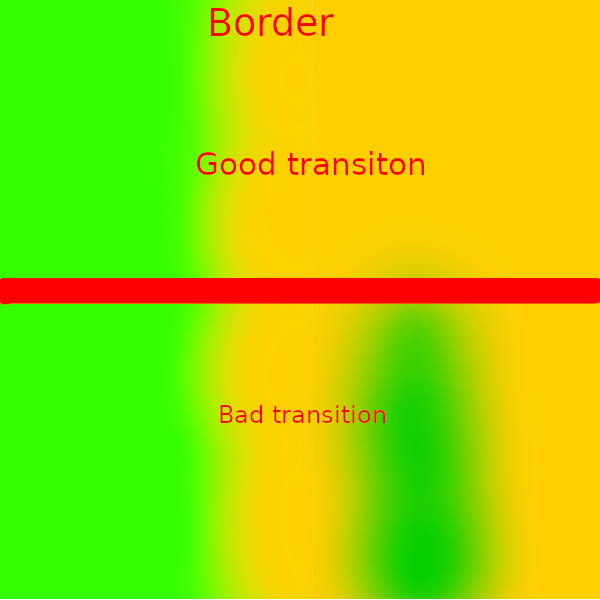

We will be generating biome map for our our shader. This will be done by
Generating a grid of points. We will be treating those points as biome 'seeds'.
We will be generating a
 saying which
biome 'seed' is closer. That way we will know what biome to choose at a certain
point. 

But this will result in a sharp edges between biomes, which would look ugly. So
we will need to implement a smart algorithm that will smooth out texture
transitions, and our ground shader with noise will do the rest. Thankfully the
shader that we had implemented, has a structure that easily allows us to do
this.

## Generating a simple texture

```cs
//BiomeGenerator.cs
    [Export] public int width;
    [Export] public int height;
    [Export] public Image map;
    public void GenerateMaps(int x_base, int y_base, int width_height)
    {
        // the format of this data looks like this: rgba color bytes for every pixel in a x->y order. 
        var map_data = new byte[width * height * 4];
        for(int x = 0; x < width; x++){
            for(int y = 0; y < height; y++){
                int i = x + y * width;
                int color_offset = i % 3;
                map[i+color_offset] = 255;
                map[i+3] = 255;
            }
        }
        map = Image.CreateFromData(width,height, false, Image.Format.Rgba8, map_data);
    }
```

Running this code will result in a texture with alternating red, green, blue
colors.

## Generating a biome grid

 We will basically generate an array of cells that
have a position and biome. Each position will be generated by taking a base
position of a cell in a grid and adding a offset that is smaller than a half of
a cell width.

## Generating base grid

Let`s start by writing a class that will hold all of the needed data.

```cs
//BiomeGenerator.cs
    [Export] int seed_base;
    [Export] int grid_cell_size;
    [Export] int biome_map_resolution;
    [Export] Biome[] biomes;
    public class GridCell
    {
        public Vector2 world_pos;
        public Biome biome;

        public GridCell(Vector2 world_pos, Biome biome)
        {
            this.world_pos = world_pos;
            this.biome = biome;
        }
    }
    class Grid
    {
        GridCell[] cells;
        int grid_stride;
        int grid_margin;

        public Grid(GridCell[] cells, int grid_cells_per_axis, int grid_margin)
        {
            this.cells = cells;
            this.grid_stride = grid_cells_per_axis;
            this.grid_margin = grid_margin;
        }

        public GridCell this[int x, int y]
        {
            get
            {
                return cells[x + grid_margin + (y + grid_margin) * grid_stride];
            }
        }
    }
```

Now we need to somehow generate this class. We will start by generating a script
that will be a foundation of our later code;

```cs
    private Grid GenerateGrid(Vector2 base_world_position, int cells_per_axis_with_margin, int grid_margin)
    {
        var cells = new GridCell[cells_per_axis_with_margin * cells_per_axis_with_margin];

        for (int x = 0; x < cells_per_axis_with_margin; x++)
        {
            for (int y = 0; y < cells_per_axis_with_margin; y++)
            {
                //Generate cells
            }
        }

        Grid grid = new(cells, cells_per_axis_with_margin, grid_margin);

        return grid;
    }
```

Now we will just calculate the world position of the cell that we work with and
directly put it into the cells array.

```cs
    private Grid GenerateGrid(Vector2 base_world_position, int cells_per_axis_with_margin, int grid_margin)
    {
    ...
            for (int y = 0; y < cells_per_axis_with_margin; y++)
            {

                float world_x = base_world_position.X + (x - grid_margin) * grid_cell_size;
                float world_y = base_world_position.Y + (y - grid_margin) * grid_cell_size;

                int grid_index = x + y * cells_per_axis_with_margin;

                Biome biome = biomes[GD.Randi() % (biomes.Length)];
                cells[grid_index] = new(new Vector2(world_x, world_y), biome);
            }
    ...
    }
```

But now we need to add some randomness, so we need to generate a random number
for each cell and use it to generate an offset for it.

```cs
    private Grid GenerateGrid(Vector2 base_world_position, int cells_per_axis_with_margin, int grid_margin)
    {
    ...
            for (int y = 0; y < cells_per_axis_with_margin; y++)
            {
                float world_x = base_world_position.X + (x - grid_margin) * grid_cell_size;
                float world_y = base_world_position.Y + (y - grid_margin) * grid_cell_size;
                ulong seed =
    (ulong)seed_base ^
    (ulong)Mathf.FloorToInt(world_x) * 73856093UL ^
    (ulong)Mathf.FloorToInt(world_y) * 19349663UL;

                GD.Seed(seed);

                float x_offset = GD.Randf() * (grid_cell_size * 0.5f);
                float y_offset = GD.Randf() * (grid_cell_size * 0.5f);
                int grid_index = x + y * cells_per_axis_with_margin;
                Vector2 final_pos = new(world_x + x_offset, world_y + y_offset);


                Biome biome = biomes[GD.Randi() % (biomes.Length)];
                cells[grid_index] = new(final_pos, biome);
            }
    ...
    }
```

So in the end we should get this:

```cs
    private Grid GenerateGrid(Vector2 base_world_position, int cells_per_axis_with_margin, int grid_margin)
    {
        var cells = new GridCell[cells_per_axis_with_margin * cells_per_axis_with_margin];

        for (int x = 0; x < cells_per_axis_with_margin; x++)
        {
            for (int y = 0; y < cells_per_axis_with_margin; y++)
            {
                float world_x = base_world_position.X + (x - grid_margin) * grid_cell_size;
                float world_y = base_world_position.Y + (y - grid_margin) * grid_cell_size;
                ulong seed =
    (ulong)seed_base ^
    (ulong)Mathf.FloorToInt(world_x) * 73856093UL ^
    (ulong)Mathf.FloorToInt(world_y) * 19349663UL;

                GD.Seed(seed);

                float x_offset = GD.Randf() * (grid_cell_size * 0.5f);
                float y_offset = GD.Randf() * (grid_cell_size * 0.5f);
                int grid_index = x + y * cells_per_axis_with_margin;
                Vector2 final_pos = new(world_x + x_offset, world_y + y_offset);


                Biome biome = biomes[GD.Randi() % (biomes.Length)];
                cells[grid_index] = new(final_pos, biome);
            }
        }

        Grid grid = new(cells, cells_per_axis_with_margin, grid_margin);

        return grid;
    }
```

## Using data From the grid to generate biome map

### Class for storing biome data

Biome class only needs to look like this, for now:

```cs
//Biome.cs
using Godot;
[Tool, GlobalClass]
public partial class Biome : Resource
{
    // only this much for now
    [Export] public byte index_in_biomes_array;
}
```

Now we need to write a simple function that will run all of the generation code,
and than output a valid data. We will store output data in a special class that
we will implement later.

```cs //BiomeGenerator.cs
    public OutputData GenerateMaps(Vector2 base_world_position, int width_height, Biome[] biomes)
    {
        this.biomes = biomes;

        int grid_cells_per_axis = Mathf.CeilToInt(width_height / (float)grid_cell_size);
        int points_per_axis = grid_cells_per_axis * biome_map_resolution;

        float point_size = width_height / (float)(grid_cells_per_axis * biome_map_resolution);


        // 1 on each side + noise displacement(grid cells) so that the margin points good looking values 
        int grid_margin = 1 + Mathf.CeilToInt(Mathf.Max(x_noise.Amplitude, y_noise.Amplitude) / (float)grid_cell_size);
        int grid_cells_with_margin = grid_cells_per_axis + grid_margin * 2;
        Grid grid = GenerateGrid(base_world_position, grid_cells_with_margin, grid_margin: grid_margin);

        byte[][] biome_maps = InitializeBiomeMapArray(points_per_axis);

        for (int x = 0; x < points_per_axis; x++)
        {
            for (int y = 0; y < points_per_axis; y++)
            {
                // Calculate biome data for each point and write it to the biome maps 2D array
            }
        }

        return new(points_per_axis, biome_maps);
    }
```

I`ve used a 2D array for the biome maps because we will need to split the output
into 2 or more biome textures. This is because each texture has only 4 color
channels - RGBA. This than allows us to store Data for only 4 Biome types per
one biome texture. So to support for example, 16 biomes we need 4 biome
textures.

We will initialize this array like this:

```cs
//BiomeGenerator.cs
    private static byte[][] InitializeBiomeMapArray(int points_per_axis)
    {
        var biome_maps = new byte[data_maps_count][];

        int mapSize = points_per_axis * points_per_axis * color_channels;

        for (int i = 0; i < data_maps_count; i++)
        {
            biome_maps[i] = new byte[mapSize];
        }

        return biome_maps;
    }
```

Now we also would need to implement a handy struct that will combine data form a
cell in our gird and data like distance to the current point. It will also
implement IComparable so that we can sort an list of those classes. I will later
explain what influence is.

```cs
    class CellDataCombo 
    {
        public GridCell cell;
        public float distance;
        public float influence;

        public CellDataCombo(GridCell cell, float distance, float influence)
        {
            this.cell = cell;
            this.distance = distance;
            this.influence = influence;
        }
    }
```

Now for each point we will need to get all cells that matter for us- are close
enough.

```cs
//BiomeGenerator.cs

    public OutputData GenerateMaps(Vector2 base_world_position, int width_height, Biome[] biomes)
    {
...

        List<CellDataCombo> cells = new(9);
        for (int x = 0; x < points_per_axis; x++)
        {
            for (int y = 0; y < points_per_axis ; y++)
            {
                cells.Clear();

                Vector2 world_pos = new Vector2(x, y) * point_size + base_world_position;
                Vector2I grid_pos = new(x / biome_map_resolution, y / biome_map_resolution);
                GetCellsToCheck(grid_pos, world_pos, grid, cells);

            }
        }

...
    }
```

Now we will Need to implement that funciton, it will just get all cells that are
in the neighboring cells and on the same cell as the current point that we are
working with.

```cs
private CellDataCombo HandleCell(Vector2 world_pos, GridCell cell)
{
    float distance = cell.world_pos.DistanceTo(world_pos);
    return new(cell, distance, influence: 0/*will be calculated later*/);
}
private void GetCellsToCheck(Vector2I grid_pos, Vector2 world_pos, Grid grid, List<CellDataCombo> output)
{
    // really fast because the output list has already allocated the memory
    output.Add(HandleCell(world_pos, grid[grid_pos.X - 1, grid_pos.Y + 1]));
    output.Add(HandleCell(world_pos, grid[grid_pos.X, grid_pos.Y + 1]));
    output.Add(HandleCell(world_pos, grid[grid_pos.X + 1, grid_pos.Y + 1]));
    output.Add(HandleCell(world_pos, grid[grid_pos.X - 1, grid_pos.Y]));
    output.Add(HandleCell(world_pos, grid[grid_pos.X, grid_pos.Y]));
    output.Add(HandleCell(world_pos, grid[grid_pos.X + 1, grid_pos.Y]));
    output.Add(HandleCell(world_pos, grid[grid_pos.X - 1, grid_pos.Y - 1]));
    output.Add(HandleCell(world_pos, grid[grid_pos.X, grid_pos.Y - 1]));
    output.Add(HandleCell(world_pos, grid[grid_pos.X + 1, grid_pos.Y - 1]));
}
```

Now we can use the cells that we get form this function to get the main cell-
closest one.

```cs
//BiomeGenerator.cs
    CellDataCombo GetClosestCell(IEnumerable<CellDataCombo> cells)
    {
        CellDataCombo closest = null;
        float minDistance = float.MaxValue;

        foreach (var cell in cells)
        {
            if (cell == null)
                continue;

            if (cell.distance < minDistance)
            {
                minDistance = cell.distance;
                closest = cell;
            }
        }

        return closest;
    }

    public OutputData GenerateMaps(Vector2 base_world_position, int width_height, Biome[] biomes)
    {
...

        for (int x = 0; x < points_per_axis; x++)
        {
            for (int y = 0; y < points_per_axis ; y++)
            {
                ...
                GetCellsToCheck(grid_pos, world_pos, grid, cells);

                var main_cell = GetClosestCell(cells);
                cells.Remove(main_cell);
            }
        }

...
    }
```

Next comes the trickiest part, we will need to calculate the influence of each
biome type on the current point.

```cs
//BiomeGenerator.cs

    public OutputData GenerateMaps(Vector2 base_world_position, int width_height, Biome[] biomes)
    {
...

        for (int x = 0; x < points_per_axis; x++)
        {
            for (int y = 0; y < points_per_axis ; y++)
            {
//we will implement calculating the baked_gradient later
                CalculateInfluencesForCells(cells, main_cell, new(x, y), baked_gradient);

            }
        }

...
    }
```

 We will basically do the
same, but we will also use a Godot's gradient texture so that we can configure
the transitions between biomes to look like we want. Also instead of just
subtracting the sum of the influences from the main cell influence, we will be
normalizing all of the influences.

```cs
//BiomeGenerator.cs
    private void CalculateInfluencesForCells(
        List<CellDataCombo> neighbors,
        CellDataCombo main, Vector2 world_position,
        float[] bakedGradient)
    {
        main.influence = 1.0f;


        // In a reverse order so that we can remove neighbors that doesn't mach our requirements
        for (int i = neighbors.Count - 1; i >= 0; i--)
        {
            set_neighbor_cell_influence(neighbors, main, world_position, bakedGradient, i);
        }

        // normalize
        float sum = main.influence;
        foreach (var n in neighbors)
            sum += n.influence;

        main.influence /= sum;
        foreach (var n in neighbors)
            n.influence /= sum;

    }
```

Next we will need to acutually calculate the influence, we will only assign the
influence transition to one of the biomes. We will use
`if (neighbor.cell.biome.index_in_biomes_array > main.cell.biome.index_in_biomes_array) { return; }`
so that only one of the biomes influences as the other biome. This is needed
because otherwise we would get transitions that don`t make sense:


```cs
//BiomeGenerator.cs
    private void set_neighbor_cell_influence(List<CellDataCombo> neighbors, CellDataCombo main, Vector2 world_pos, float[] bakedGradient, int cell_index_in_list)
    {

        var neighbor = neighbors[cell_index_in_list];

        if (neighbor.cell.biome.index_in_biomes_array== main.cell.biome.index_in_biomes_array)
        {
            neighbors.RemoveAt(cell_index_in_list);
            return;
        }
        
        if (neighbor.cell.biome.index_in_biomes_array > main.cell.biome.index_in_biomes_array) { return; }

        float influence = CalculateInfluence(main, bakedGradient, neighbor);

        float influence_change = main.influence - Mathf.Clamp(main.influence - influence, 0, 1);

        neighbor.influence = influence_change;
        main.influence -= influence_change;
        return;
    }

    private float CalculateInfluence(CellDataCombo main, float[] bakedGradient, CellDataCombo neighbor)
    {

        float delta =
            neighbor.distance - main.distance;
        delta = MathF.Max(delta, 0);


        if (delta >= max_overlap_distance)
            return 0;

        float overlap_percentage = delta / max_overlap_distance;

        return bakedGradient[FloatToByte(overlap_percentage)];

    }
```

Now we will implement baking generating the overlap gradient that we have used
in the influence calculation code. We will bake it because our code needs to be
really performant, and godot Grafient isn`t that fast, so we will just extract
data form it and save it into an array.

```cs
//BiomeGenerator.cs
    [Export] Gradient overlap_gradient;

    private float[] bake_gradient()
    {
        var backed_gradient = new float[256];
        for (int i = 0; i < 256; i++)
        {
            backed_gradient[i] = overlap_gradient.Sample(i / 255f).R;
        }

        return backed_gradient;
    }


    public OutputData GenerateMaps(Vector2 base_world_position, int width_height, Biome[] biomes)
    {
    ...
        float[] baked_gradient = BakeGradient();
    ...
    }
```

We will also implement those simple functions to convert float into a byte and
vice versa. This will be needed because Godot requires an array of bytes to
create a texture.

```cs
//BiomeGenerator.cs

    /// map float (expected 0..1) to byte 0..255.
    static byte FloatToByte(float v)
    {
        return (byte)MathF.Round(v * 255f);
    }

    static float ByteToFloat(byte v)
    {
        return v / 255f;
    }
```

And now finally we will use the influence that we`ve calculated.

```cs
//BiomeGenerator.cs

    public OutputData GenerateMaps(Vector2 base_world_position, int width_height, Biome[] biomes)
    {
...

        for (int x = 0; x < points_per_axis; x++)
        {
            for (int y = 0; y < points_per_axis ; y++)
            {
...
                CalculateInfluencesForCells(cells, main_cell, new(x, y), baked_gradient);

                cells.Add(main_cell);

                int base_index = (x + y  * points_per_axis) * 4;

                foreach (CellDataCombo cell in cells)
                {
                    var map_index = cell.cell.biome.index_in_biomes_array / 4;
                    int color_channel_index = cell.cell.biome.index_in_biomes_array % 4;
                    // So that the Byte doesn't overflow
                    byte clamped_value = FloatToByte(Math.Clamp(ByteToFloat(biome_maps[map_index][base_index + color_channel_index]) + cell.influence, 0, 1));
                    biome_maps[map_index][base_index + color_channel_index] = clamped_value;
                }
            }
        }

...
    }
```

### Implementing output data class

Now we need to implement one last thing. The output data class will come in
extra handy later. It will allow us to either directly create a texture out of
it's data or read data by hand for any point.

```cs
//BiomeGenerator.cs
    public class OutputData
    {
        public readonly int map_resolution;
        readonly byte[][] biome_maps;


        public OutputData(int map_resolution, byte[][] biome_maps_array)
        {
            this.map_resolution = map_resolution;
            this.biome_maps = biome_maps_array;
        }

        public ImageTexture GetTexture( int map_index)
        {
            var data = biome_maps[map_index];
            var image = Image.CreateFromData(map_resolution,map_resolution, false, Image.Format.Rgba8, data);
            return ImageTexture.CreateFromImage(image);
        }
        public List<BiomeInfluenceOutput> SampleBiomeDataForMesh(Vector2 UV)
        {
            int pixel_x = Mathf.Clamp((int)(UV.X * map_resolution), 0, map_resolution - 1);
            int pixel_y = Mathf.Clamp((int)(UV.Y * map_resolution), 0, map_resolution - 1);
            int pixel_index = pixel_x + pixel_y * map_resolution;
            int base_color_channel_index = pixel_index * color_channels;

            var output = new List<BiomeInfluenceOutput>(1);
            for (int biome_map_index = 0; biome_map_index < data_maps_count; biome_map_index++)
            {
                for (int color_channel = 0; color_channel < color_channels; color_channel++)
                {
                    int index_inside_biome_map = color_channel + base_color_channel_index;
                    int biome_index = biome_map_index * color_channel;
                    ReadFromMapAndAddToOutput(output, index_inside_biome_map, biome_index, biome_maps[biome_map_index]);
                }
            }

            return output;
        }
        public struct BiomeInfluenceOutput
        {
            public int index_in_biomes_array;
            public float influence;

            public BiomeInfluenceOutput(int index_in_biomes_array, float influence)
            {
                this.index_in_biomes_array=index_in_biomes_array;
                this.influence = influence;
            }
        }


        private static void ReadFromMapAndAddToOutput(List<BiomeInfluenceOutput> output, int index_inside_biome_map, int biome_index, byte[] map)
        {
            var influence = map[index_inside_biome_map];
            if (influence == 0) return;
            output.Add(new(biome_index, ByteToFloat(influence)));
        }
    }
```

### Adding noise

The current biomes look realy flat and boring, they look completly fake. To Fix
this we will use perlin noise. But firts we need to implement a additional class
to make our lifes easier. We will also use it in the future. It will allow us to
combine many noises with different amplitudes and frequences.

```cs
///NoiseComponent.cs
using Godot;
using System.Linq;
[Tool, GlobalClass]
public partial class NoiseComponent : Resource
{
    [Export] NoisePart[] noises;
    public float Sample(Vector2 pos)
    {
        return noises.Sum((NoisePart part) => { return part.Sample(pos); });
    }
    public float Amplitude
    {
        get { return noises.Sum((NoisePart part) => { return part.amplitude; }); }
    }
}
```

```cs
///NoisePart.cs
using Godot;
[GlobalClass, Tool]
public partial class NoisePart : Resource
{
    [Export] public FastNoiseLite noise;
    [Export] public float amplitude;
    [Export] public float frequency = 1f;

    public float Sample(Vector2 pos)
    {
        return noise.GetNoise2Dv(pos * frequency) * amplitude;
    }
}
```

Than we will use it:

```cs
///BiomeGenerator.cs
    [Export] NoiseComponent x_noise;
    [Export] NoiseComponent y_noise;

    public OutputData GenerateMaps(Vector2 base_world_position, int width_height, Biome[] biomes)
    {

...
        // 1 on each side + noise displacement(in grid cells) so that the margin points good looking values 
        int grid_margin = 1 + Mathf.CeilToInt(Mathf.Max(x_noise.Amplitude, y_noise.Amplitude) / (float)grid_cell_size);
...

        for (int x = 0; x < points_per_axis; x++)
        {
            for (int y = 0; y < points_per_axis; y++)
            {
...
                Vector2 noisy_world_pos = world_pos + GetNoise(world_pos);
                Vector2I grid_pos = new(x / biome_map_resolution, y / biome_map_resolution);
                GetCellsToCheck(grid_pos, noisy_world_pos, grid, cells);

                var main_cell = GetClosestCell(cells);
                cells.Remove(main_cell);

                CalculateInfluencesForCells(cells, main_cell, noisy_world_pos, baked_gradient);
                ...
            }
        }
    }

    private Vector2 GetNoise(Vector2 pos)
    {
        return new Vector2(x_noise.Sample(pos), y_noise.Sample(pos));
    }
```

### Final code:

```cs
using System;
using System.Collections.Generic;
using Godot;
[Tool]
public partial class BiomeGenerator : Node
{


    [Export] int seed_base;
    [Export] int grid_cell_size;
    [Export] int biome_map_resolution;
    [Export] float max_overlap_distance;
    [Export] Gradient overlap_gradient;
    [Export] bool run;

    [Export] NoiseComponent x_noise;
    [Export] NoiseComponent y_noise;

    Biome[] biomes;

    private const int data_maps_count = 2;
    private const int color_channels = 4; // rgba

    public class GridCell
    {
        public Vector2 world_pos;
        public Biome biome;

        public GridCell(Vector2 world_pos, Biome biome)
        {
            this.world_pos = world_pos;
            this.biome = biome;
        }
    }
    class Grid
    {
        GridCell[] cells;
        int grid_stride;
        int grid_margin;

        public Grid(GridCell[] cells, int grid_cells_per_axis, int grid_margin)
        {
            this.cells = cells;
            this.grid_stride = grid_cells_per_axis;
            this.grid_margin = grid_margin;
        }

        public GridCell this[int x, int y]
        {
            get
            {
                return cells[x + grid_margin + (y + grid_margin) * grid_stride];
            }
        }
    }
    /// map float (expected 0..1) to byte 0..255.
    static byte FloatToByte(float v)
    {
        return (byte)MathF.Round(v * 255f);
    }

    static float ByteToFloat(byte v)
    {
        return v / 255f;
    }

    class CellDataCombo
    {
        public GridCell cell;
        public float distance;
        public float influence;

        public CellDataCombo(GridCell cell, float distance, float influence)
        {
            this.cell = cell;
            this.distance = distance;
            this.influence = influence;
        }

    }
    private Grid GenerateGrid(Vector2 base_world_position, int cells_per_axis_with_margin, int grid_margin)
    {
        var cells = new GridCell[cells_per_axis_with_margin * cells_per_axis_with_margin];

        for (int x = 0; x < cells_per_axis_with_margin; x++)
        {
            for (int y = 0; y < cells_per_axis_with_margin; y++)
            {
                float world_x = base_world_position.X + (x - grid_margin) * grid_cell_size;
                float world_y = base_world_position.Y + (y - grid_margin) * grid_cell_size;
                ulong seed =
    (ulong)seed_base ^
    (ulong)Mathf.FloorToInt(world_x) * 73856093UL ^
    (ulong)Mathf.FloorToInt(world_y) * 19349663UL;

                GD.Seed(seed);

                float x_offset = GD.Randf() * (grid_cell_size * 0.5f);
                float y_offset = GD.Randf() * (grid_cell_size * 0.5f);
                int grid_index = x + y * cells_per_axis_with_margin;
                Vector2 final_pos = new(world_x + x_offset, world_y + y_offset);


                Biome biome = biomes[GD.Randi() % (biomes.Length)];
                cells[grid_index] = new(final_pos, biome);
            }
        }

        Grid grid = new(cells, cells_per_axis_with_margin, grid_margin);

        return grid;
    }


    private CellDataCombo HandleCell(Vector2 world_pos, GridCell cell)
    {
        float distance = cell.world_pos.DistanceTo(world_pos);
        return new(cell, distance, influence: 0/*will be calculated later*/);
    }
    private void GetCellsToCheck(Vector2I grid_pos, Vector2 world_pos, Grid grid, List<CellDataCombo> output)
    {
        // really fast because the output list has already allocated the memory
        output.Add(HandleCell(world_pos, grid[grid_pos.X - 1, grid_pos.Y + 1]));
        output.Add(HandleCell(world_pos, grid[grid_pos.X, grid_pos.Y + 1]));
        output.Add(HandleCell(world_pos, grid[grid_pos.X + 1, grid_pos.Y + 1]));
        output.Add(HandleCell(world_pos, grid[grid_pos.X - 1, grid_pos.Y]));
        output.Add(HandleCell(world_pos, grid[grid_pos.X, grid_pos.Y]));
        output.Add(HandleCell(world_pos, grid[grid_pos.X + 1, grid_pos.Y]));
        output.Add(HandleCell(world_pos, grid[grid_pos.X - 1, grid_pos.Y - 1]));
        output.Add(HandleCell(world_pos, grid[grid_pos.X, grid_pos.Y - 1]));
        output.Add(HandleCell(world_pos, grid[grid_pos.X + 1, grid_pos.Y - 1]));
    }


    private void CalculateInfluencesForCells(
        List<CellDataCombo> neighbors,
        CellDataCombo main, Vector2 world_position,
        float[] bakedGradient)
    {
        main.influence = 1.0f;


        // In a reverse order so that we can remove neighbors that doesn't mach our requirements
        for (int i = neighbors.Count - 1; i >= 0; i--)
        {
            set_neighbor_cell_influence(neighbors, main, world_position, bakedGradient, i);
        }

        // normalize
        float sum = main.influence;
        foreach (var n in neighbors)
            sum += n.influence;

        main.influence /= sum;
        foreach (var n in neighbors)
            n.influence /= sum;

    }

    private void set_neighbor_cell_influence(List<CellDataCombo> neighbors, CellDataCombo main, Vector2 world_pos, float[] bakedGradient, int cell_index_in_list)
    {
        var neighbor = neighbors[cell_index_in_list];

        if (neighbor.cell.biome.index_in_biomes_array == main.cell.biome.index_in_biomes_array)
        {
            neighbors.RemoveAt(cell_index_in_list);
            return;
        }

        if (neighbor.cell.biome.index_in_biomes_array > main.cell.biome.index_in_biomes_array) { return; }

        float influence = CalculateInfluence(main, bakedGradient, neighbor);

        float influence_change = main.influence - Mathf.Clamp(main.influence - influence, 0, 1);

        neighbor.influence = influence_change;
        main.influence -= influence_change;
        return;
    }

    private float CalculateInfluence(CellDataCombo main, float[] bakedGradient, CellDataCombo neighbor)
    {

        float delta =
            neighbor.distance - main.distance;
        delta = MathF.Max(delta, 0);


        if (delta >= max_overlap_distance)
            return 0;

        float overlap_percentage = delta / max_overlap_distance;

        return bakedGradient[FloatToByte(overlap_percentage)];

    }


    public class OutputData
    {
        public readonly int map_resolution;
        readonly byte[][] biome_maps;


        public OutputData(int map_resolution, byte[][] biome_maps_array)
        {
            this.map_resolution = map_resolution;
            this.biome_maps = biome_maps_array;
        }

        public ImageTexture GetTexture(int map_index)
        {
            var data = biome_maps[map_index];
            var image = Image.CreateFromData(map_resolution, map_resolution, false, Image.Format.Rgba8, data);
            return ImageTexture.CreateFromImage(image);
        }
        public List<BiomeInfluenceOutput> SampleBiomeDataForMesh(Vector2 UV)
        {
            int pixel_x = Mathf.Clamp((int)(UV.X * map_resolution), 0, map_resolution - 1);
            int pixel_y = Mathf.Clamp((int)(UV.Y * map_resolution), 0, map_resolution - 1);
            int pixel_index = pixel_x + pixel_y * map_resolution;
            int base_color_channel_index = pixel_index * color_channels;

            var output = new List<BiomeInfluenceOutput>(1);
            for (int biome_map_index = 0; biome_map_index < data_maps_count; biome_map_index++)
            {
                for (int color_channel = 0; color_channel < color_channels; color_channel++)
                {
                    int index_inside_biome_map = color_channel + base_color_channel_index;
                    int biome_index = biome_map_index * color_channel;
                    ReadFromMapAndAddToOutput(output, index_inside_biome_map, biome_index, biome_maps[biome_map_index]);
                }
            }

            return output;
        }
        public struct BiomeInfluenceOutput
        {
            public int biome_type_index;
            public float influence;

            public BiomeInfluenceOutput(int biome_index, float influence)
            {
                this.biome_type_index = biome_index;
                this.influence = influence;
            }
        }


        private static void ReadFromMapAndAddToOutput(List<BiomeInfluenceOutput> output, int index_inside_biome_map, int biome_index, byte[] map)
        {
            var influence = map[index_inside_biome_map];
            if (influence == 0) return;
            output.Add(new(biome_index, ByteToFloat(influence)));
        }
    }
    public OutputData GenerateMaps(Vector2 base_world_position, int width_height, Biome[] biomes)
    {
        this.biomes = biomes;

        int grid_cells_per_axis = Mathf.CeilToInt(width_height / (float)grid_cell_size);
        int points_per_axis = grid_cells_per_axis * biome_map_resolution;

        float point_size = width_height / (float)(grid_cells_per_axis * biome_map_resolution);


        // 1 on each side + noise displacement(grid cells) so that the margin points good looking values 
        int grid_margin = 1 + Mathf.CeilToInt(Mathf.Max(x_noise.Amplitude, y_noise.Amplitude) / (float)grid_cell_size);
        int grid_cells_with_margin = grid_cells_per_axis + grid_margin * 2;
        Grid grid = GenerateGrid(base_world_position, grid_cells_with_margin, grid_margin: grid_margin);

        byte[][] biome_maps = InitializeBiomeMapArray(points_per_axis);

        float[] baked_gradient = BakeGradient();

        // alloc heap once
        List<CellDataCombo> cells = new(9);

        for (int x = 0; x < points_per_axis; x++)
        {
            for (int y = 0; y < points_per_axis; y++)
            {
                cells.Clear();

                Vector2 world_pos = new Vector2(x, y) * point_size + base_world_position;
                Vector2 noisy_world_pos = world_pos + GetNoise(world_pos);
                Vector2I grid_pos = new(x / biome_map_resolution, y / biome_map_resolution);
                GetCellsToCheck(grid_pos, noisy_world_pos, grid, cells);

                var main_cell = GetClosestCell(cells);
                cells.Remove(main_cell);

                CalculateInfluencesForCells(cells, main_cell, noisy_world_pos, baked_gradient);

                cells.Add(main_cell);

                int base_index = (x + y * points_per_axis) * 4;

                foreach (CellDataCombo cell in cells)
                {
                    var map_index = cell.cell.biome.index_in_biomes_array / 4;
                    int color_channel_index = cell.cell.biome.index_in_biomes_array % 4;
                    // So that the Byte doesn't overflow
                    byte clamped_value = FloatToByte(Math.Clamp(ByteToFloat(biome_maps[map_index][base_index + color_channel_index]) + cell.influence, 0, 1));
                    biome_maps[map_index][base_index + color_channel_index] = clamped_value;
                }
            }
        }

        return new(points_per_axis, biome_maps);
    }
    private Vector2 GetNoise(Vector2 pos)
    {
        return new Vector2(x_noise.Sample(pos), y_noise.Sample(pos));
    }
    private static byte[][] InitializeBiomeMapArray(int points_per_axis)
    {
        var biome_maps = new byte[data_maps_count][];

        int mapSize = points_per_axis * points_per_axis * color_channels;

        for (int i = 0; i < data_maps_count; i++)
        {
            biome_maps[i] = new byte[mapSize];
        }

        return biome_maps;
    }


    CellDataCombo GetClosestCell(IEnumerable<CellDataCombo> cells)
    {
        CellDataCombo closest = null;
        float minDistance = float.MaxValue;

        foreach (var cell in cells)
        {
            if (cell == null)
                continue;

            if (cell.distance < minDistance)
            {
                minDistance = cell.distance;
                closest = cell;
            }
        }

        return closest;
    }
    private float[] BakeGradient()
    {
        var baked_gradient = new float[256];
        for (int i = 0; i < 256; i++)
        {
            baked_gradient[i] = overlap_gradient.Sample(i / 255f).R;
        }

        return baked_gradient;
    }
}
```

## Testing biome generation script

TODO: Now we can just run this code and see the output textures. But to apply
this texture on our terrain shader easily we need to write a simple temporary
script like this:

```cs
using Godot;

[Tool]
public partial class TerrainGen : Node
{
    [Export] BiomeGenerator biome_generator;
    [Export] MeshInstance3D mesh;

    [Export] bool run;
 
    [Export] int width_height;
    public override void _Process(double delta)
    {

        if (run)
        {
            run = false;
            Vector2 base_world_position = new(0, 0);
            var output = biome_generator.GenerateMaps(base_world_position, width_height, biomes);

            ShaderMaterial material = (ShaderMaterial)mesh.GetSurfaceOverrideMaterial(0);
            material.SetShaderParameter("map_1", output.GetTexture(width_height,0));
            material.SetShaderParameter("map_2", output.GetTexture(width_height,1));
        }


    }
}
```

You can configure the biome generator, similarly to mine:
 After running your code, you should
look at the output texture. If you look at different color channels of your
output texture, you should see smooth transitions between colors, this indicates
that our code works as intended and the smooth transitions should also appear on
the ground texters if you use the generated biome textures as a source.


