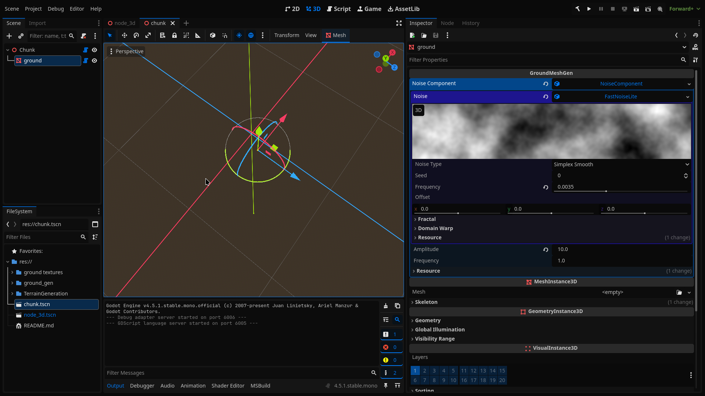
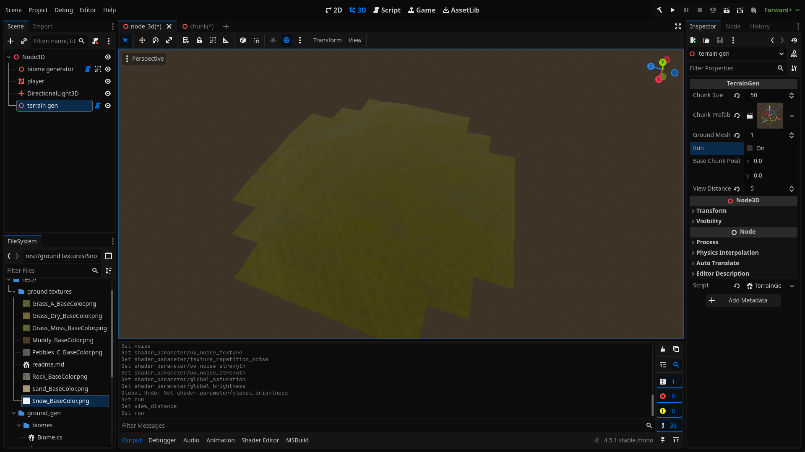
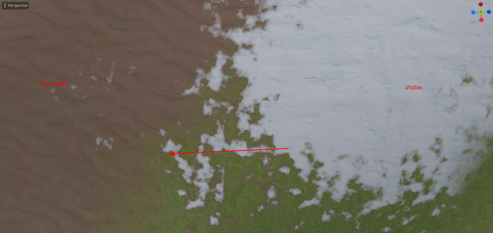

We can't generate a very large terrain at once, splitting terrain into multiple
chunks allows us to make a series of performance improvements that will allow us
to generate a map of a infinite size. We will be implementing those performance
improvements later in this tutorial.

## Generating multiple chunks

The first thing that we need to implement will be generating multiple chunks of
terrain. We will need to modify the current implementation just a tiny bit to
accomplish this.

We will be generating chunks that are in X distance form the player, so the
output should be a circle of a smaller chunks of mesh that are connected
together. For now we will skip using biomes completely.

```cs
using System.Collections.Generic;
using Godot;
using System.Linq;

[Tool]
public partial class TerrainGen : Node3D
{


    [Export] int chunk_size;
    [Export] PackedScene chunk_prefab;

    [Export]
    int ground_mesh_resolution;

    [Export] bool run;

    [Export] Vector2 base_chunk_position; 
    [Export] int view_distance;

    public override void _Process(double delta)
    {
        if (run)
        {
            run = false;
            Run();
        }

    }


    private void ClearAllChildren()
    {
        foreach (var item in GetChildren())
        {
            item.QueueFree();
        }
    }

    private void Run()
    {
        ClearAllChildren();
        GenerateAll();
    }

    private static List<Vector2> GetAllChunksPositionsInsideACircleRelative(int radius, int chunk_size)
    {
        List<Vector2> output = new();

        // could be pre-calculated once

        for (int x = -radius; x <= radius; x++)
        {
            for (int y = -radius; y <= radius; y++)
            {
                if (x * x + y * y >= radius * radius)
                    continue;

                output.Add(new(x * chunk_size, y * chunk_size));
            }
        }

        return output;
    }

    private void GenerateAll()
    {
        List<Vector2> chunk_relative_positions = GetAllChunksPositionsInsideACircleRelative(view_distance, chunk_size);

        foreach (Vector2 chunk_relative_pos in chunk_relative_positions)
        {
            Vector2 chunk_world_position = chunk_relative_pos + base_chunk_position;
            var chunk = (Chunk)chunk_prefab.Instantiate();
            AddChild(chunk);

            var mesh_gen = chunk.mesh_gen;
            mesh_gen.Run(chunk_size, chunk_world_position, ground_mesh_resolution);

        }
    }
}
```

But we need to create a chunk scirpt- the one that I've used at the end of my
implementation. It will be placed on a root of a chunk prefab and will hold
references to all of the needed things, like the mesh gen script. For now it
will be really simple.

```cs
using Godot;

[Tool]
public partial class Chunk : Node3D
{
    // the `GroundMeshGen` is just renamed version of the `GroundGen` script, because now this is a more appropriate name for it.
    [Export] public GroundMeshGen mesh_gen;
}
```

And now we need to change the `GroundMeshGen` script so that it has one function
to run all of the mesh generation.

```cs
    // Remove export
    private float triangle_size;
    private int triangle_count_per_dimension;
    private Vector2 base_world_position;

    // REMOVED: 
    // public override void _Process(double delta)
    // {
    //     if (generate)
    //     {
    //         GD.Print("generating!");
    //         generate = false;
    //         var arrayMesh = GenerateTerrainMesh();
    //         Mesh = arrayMesh;
    //     }
    //     base._Process(delta);
    // }
    //
    //
    // private ArrayMesh GenerateTerrainMesh()
    // {
    //     var st = new SurfaceTool();
    //     st.Begin(Mesh.PrimitiveType.Triangles);
    //
    //
    //     GenerateVertexes(st);
    //     GenerateIndexes(st);
    //
    //     st.GenerateNormals();
    //     st.GenerateTangents();
    //
    //
    //     return st.Commit();
    // }

    // Just 1 function
    public void Run(int size, Vector2 world_position, int resolution)
    {
        // needed because otherwise there will be a gap of 1 triangle size
        size += 1;

        // assign all of the needed variables
        this.triangle_size = 1f / resolution;
        this.triangle_count_per_dimension = size * resolution;
        this.base_world_position = world_position;

        var st = new SurfaceTool();
        st.Begin(Mesh.PrimitiveType.Triangles);


        GenerateVertexes(st);
        GenerateIndexes(st);

        st.GenerateNormals();
        st.GenerateTangents();

        Mesh = st.Commit();
    }
...
```

## Testing new implementation

We need to create the chunk prefab, it should look something like this:




## Support for multiple chunks for the ground Shader

Right now we can`t set biome data per chunk.
In Godot we can`t set a different
texture for sampling per instance of a material using a Shader. This is probably
caused because of the optimizations reasons. But what we can definitely do is
storing an array of all textures for all chunks, and than telling each chunk at
what index it should be reading.

```gdshader
const int chunk_data_maps_count = 100;
instance uniform int chunk_data_map_index;
// repeat is disabled, so that the data from one end of the chunk doesn't influence data form the other end of the chunk
uniform sampler2D[chunk_data_maps_count] map_1:repeat_disable;
uniform sampler2D[chunk_data_maps_count] map_2:repeat_disable;
```

and than access it thru:

```gdshader
void fragment(){
...
	vec4 biome_data_1 = texture(map_1[chunk_data_map_index],noisy_uv);
	vec4 biome_data_2 = texture(map_2[chunk_data_map_index],noisy_uv);
	NormalAlbedoRoughness output = collect_biome_data(biome_data_1, biome_data_2, world_pos, world_normal, adjusted_normal);
...
}
```

## Generating multiple Biome Textures

Now we need to generate and assign data for the ground shader. We will be using
the biome generator's `GenerateMaps` function for each chunk that we generate to
get a biome map data for it. Than we will get an index in the map array that we
will write the texture to. We will store all free data map indexes in a Que.
Later when we will be generating biome chunks around a moving player this will
allow us to only generate the new chunks and just write them in the place of the
old ones. Than we just need to set for each chunk which index it should use to
get the data.

```cs
///TerrainGen.cs

    private void Run()
    {
        free_data_maps = new(Enumerable.Range(0, max_chunk_data_textures_count));
        ClearAllChildren();
        GenerateAll();
    }
...
    [Export] Biome[] biomes;
    const int max_chunk_data_textures_count = 100;
    Queue<int> free_data_maps = new(Enumerable.Range(0, max_chunk_data_textures_count));
    ImageTexture[] map_1 = new ImageTexture[max_chunk_data_textures_count];
    ImageTexture[] map_2 = new ImageTexture[max_chunk_data_textures_count];
    [Export] ShaderMaterial ground_shader_material;

...
    private void GenerateAll()
    {
        List<Vector2> chunk_relative_positions = GetAllChunksPositionsInsideACircleRelative(view_distance, chunk_size);

        foreach (Vector2 chunk_relative_pos in chunk_relative_positions)
        {
            Vector2 chunk_world_position = chunk_relative_pos + base_chunk_position;
            var biome_data = biome_generator.GenerateMaps(new(chunk_world_position.X, chunk_world_position.Y), chunk_size, biomes);

            var chunk = (Chunk)chunk_prefab.Instantiate();
            AddChild(chunk);

            var mesh_gen = chunk.mesh_gen;
            mesh_gen.Run(chunk_size, chunk_world_position, ground_mesh_resolution);

            int map_index = free_data_maps.Dequeue();
            map_1[map_index] = biome_data.GetTexture( 0);
            map_2[map_index] = biome_data.GetTexture( 1);
            mesh_gen.SetInstanceShaderParameter("chunk_data_map_index", map_index);
        }

        ground_shader_material.SetShaderParameter("map_1", map_1);
        ground_shader_material.SetShaderParameter("map_2", map_2);
    }
```

And if you run it, you should see that each chunk has different data. You might
also see some issues with the output, but we will fix them really soon.

## Setting Shader Configuration thru the `TerrainGen` Script

Now that our shader is pretty complex we should implement an easier way to
configure it's properties. We will add this ability to the `TerrainGen` script.
To set Things like biome textures for albedo, normal-maps and roughness we will
add to the biome class properties for this. We Will Collect all data from all
the biomes and assign it to the shader data.

```cs
using Godot;
[Tool, GlobalClass]
public partial class Biome : Resource
{
    public byte index_in_biomes_array;
    [Export] public Texture albedo;
    [Export] public Texture normal;
    [Export] public Texture roughness;
    [Export(PropertyHint.ColorNoAlpha)] public Color tint;
    [Export] public float saturation;
    [Export] public float scale;
}
```

```cs
///TerrainGen.cs
...
    [Export] ShaderMaterial ground_shader_material;

    [ExportGroup("rock")]
    [Export] Texture rock_texture;
    [Export] Texture rock_normal_map;
    [Export] Texture rock_roughness;
    [Export] float rock_scale;
    [Export] float rock_saturation;


    [ExportGroup("additional processing")]
    [Export] float global_saturation;
    [Export] float global_brightness;

    [ExportSubgroup("other noise stats")]
    [Export] Texture other_noise;
    [Export] float metallic;
    [Export] float other_noise_scale;
    [Export] float spectacular;

...
    private void GenerateAll()
    {
        var biome_albedo_textures = new Texture[biomes.Length];
        var biome_normal_textures = new Texture[biomes.Length];
        var biome_roughness_textures = new Texture[biomes.Length];
        var texture_tint = new Vector3[biomes.Length];
        var texture_saturation = new float[biomes.Length];
        var texture_scale = new float[biomes.Length];
        int i = 0;
        foreach (var biome in biomes)
        {
            biome.index_in_biomes_array = (byte)i;
            biome_albedo_textures[i] = biome.albedo;
            biome_normal_textures[i] = biome.normal;
            biome_roughness_textures[i] = biome.roughness;
            texture_tint[i] = new(biome.tint.R, biome.tint.G, biome.tint.B);
            texture_saturation[i] = biome.saturation;
            texture_scale[i] = biome.scale;
            i++;
        }

...
        ground_shader_material.SetShaderParameter("rock_saturation", rock_saturation);
        ground_shader_material.SetShaderParameter("rock_scale", rock_scale);
        ground_shader_material.SetShaderParameter("rock_normal_map", rock_normal_map);
        ground_shader_material.SetShaderParameter("rock_roughness", rock_roughness);
        ground_shader_material.SetShaderParameter("rock_texture", rock_texture);

        ground_shader_material.SetShaderParameter("metallic", metallic);
        ground_shader_material.SetShaderParameter("spectacular", spectacular);
        ground_shader_material.SetShaderParameter("other_noise_scale", other_noise_scale);

        ground_shader_material.SetShaderParameter("texture_tint", texture_tint);
        ground_shader_material.SetShaderParameter("texture_saturation", texture_saturation);
        ground_shader_material.SetShaderParameter("texture_scale", texture_scale);

        ground_shader_material.SetShaderParameter("biome_albedo_textures", biome_albedo_textures);
        ground_shader_material.SetShaderParameter("biome_roughness_textures", biome_roughness_textures);
        ground_shader_material.SetShaderParameter("biome_normal_textures", biome_normal_textures);

        ground_shader_material.SetShaderParameter("other_noise", other_noise);

        ground_shader_material.SetShaderParameter("global_brightness", global_brightness);
        ground_shader_material.SetShaderParameter("global_saturation", global_saturation);

        ground_shader_material.SetShaderParameter("map_1", map_1);
        ground_shader_material.SetShaderParameter("map_2", map_2);
    }
```

## Final results

TODO: Add configuration We Need to remember to use seamless noise textures with
very low frequecny(about 0.001 for my scale) for the uv noise, so we don't see
any repetition in it.

You almost completely can't see any seems between the chunks. The only way for
me to spot anything is to look at the snow textures, it doesn't show up at any
other texture, just on the snow one. But even than the seam is really subtle and
you won't notice it if you add any other objects on this terrain, like rocks,
grass, trees,. I don`t really know what is causing it, so if you have an idea,
write an issue about it on the [GitHub repo of this project]TODO.



The terrain might seem a bit "blocky" but this is a natural property of the
biome map that we have generated, we will try to fix it a bit in the future. But
honestly the noise works really great right now to combat this.
