Right now our terrain looks boring, let's change it. We will be utilizing
shaders for this.

## Main Goals For this Shader.

### Biome implementation

Ground in read world looks different in different places. In the high mountains
there in only ice and snow, in Europe you mainly have beautiful grassy terrain
and a lot of trees. We can achieve this diversity in a couple different ways:

##### Reading biome data from a texture

This is the most versatile approach, so I will be using it in this project. It
allows you to easily generate biomes with different structures and vegetation,
by just once generating a pseudo random texture saying what kind of biome this
is.

##### Generating biomes by reading the height of the current mesh

You can just read at what height the current mesh is, and than just say that at
eg. 1000m this is a mountain - rocks / snow and at eg. 100 m this is a dessert.
This is not as versatile because

### Other

We need to create shader that will allow for easy blending between biomes. It
also has to allow for setting separate roughness, normal map and albedo textures
for each of the biomes. Why those 3? Because I think that they are the most
important, but you might use different set of textures(or more than 3).\
It Also has to allow for sampling textures so that they don`t look like
repeating, because it kills all of the immersion. Rendering texture of rocks on
steep hills will alos be a great addintion. And of course the most important
thing is utilization of allot of noise textures to modify different parameters
so our terrain looks more 'true'. The main thing that the noise will modify will
be offsetting the sampling point(UV) of biome map to make transitions between
different biomes look more authentic.

## Implementation

So let's start by setting material on the ground mesh to be a shader material.
Now create a gdshader and drag it onto the shader material.


For test I will write a simple shader that will set all ground color to one that
we can select by hand in the editor.

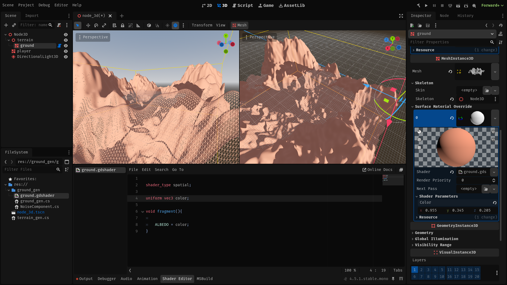

## Shader

Let's start by reading biome map from a texture. Biome data will be split
between a color channels on a 2 or more textures. This will allow for easy
implementation of smooth transition between the biomes, and makes extending this
system to allow more biomes as easy as using another texture. Using a separate
textures for biome influence and biome type selection would allow for efficient
usage of many biome types, but would require a high resolution of input textures
and would make implementation a lot harder.

### Example

- Texture1, Red: Dessert texture influence.
- Texture1, Blue: High mountain texture influence. ...
- Texture2, Red: Forest texture influence. ...
- Texture2, Alpha: texture influence.

```gdshader
uniform sampler2D map_1;
uniform sampler2D map_2;
void fragment(){
vec4 biome_types = texture(biome_type_map,UV);
vec4 biome_influences = texture(biome_influence_map,UV);
}
```

Next we will need to calculate world position and normals, this will be needed
for Triplanar mapping - technique that will allow for smooth textures and
drawing rock textures on slopes. Also I've added 'adjusted_normal' variable for
normal map that will give better results for triplanar mapping.

```gdshader
void fragment(){
	vec3 world_pos = (INV_VIEW_MATRIX * vec4(VERTEX, 1.0)).xyz;
	vec3 world_normal = normalize((INV_VIEW_MATRIX * vec4(NORMAL, 0.0)).xyz);
	vec3 adjusted_normal = pow(abs(world_normal), vec3(8.0));
}
```

To implement triplanar mapping we will use data that we've callculated, and a
rock texture. We will read texture 3 times so with apropriate weights for each
uv direction so that the texutres don't get streached in one of the orientation
like in normal linear mapping. Also we need to apply some scaling so that we can
later modify scale of our textures. This is as easy as multiplying the uv
vector.\
To Draw rock texture on the slopes we will replace the standard texture with the
rock texture for the faces that don't face up - X and Z;

```gdshader
uniform float rock_saturation;
uniform float rock_scale;
uniform sampler2D rock_texture; 
vec3 triplanar (vec3 position, vec3 worldNormal,vec3 adjusted_normal, sampler2D sampler,float scale){
	vec3 weights = adjusted_normal / (adjusted_normal.x + adjusted_normal.y + adjusted_normal.z) * 3.0;
	
	vec2 uv_x = position.zy;
	vec2 uv_y = position.xz;
	vec2 uv_z = position.xy;
	
	vec3 color = vec3(0,0,0); 
	if (weights.x > 0.01){
		color += texture(rock_texture, uv_x * rock_scale).rgb * weights.x  * rock_saturation;
	}
	if (weights.y > 0.01){
		color += texture(sampler, uv_y * scale).rgb * weights.y;
	}	
	if (weights.z > 0.01){
		color += texture(rock_texture, uv_z * rock_scale).rgb * weights.z  * rock_saturation;
	}	
	
	return color / 3.0;
}
```

Now we need a function that will actually utilize this. It will be adding
calculated color to the input color. We will be sampling texture of ground on a
specified biome, using the Triplanar function, than applying some basic
processing and adding it onto the input color with specified influence.

```gdshader
const int BIOMES_COUNT = 8;
uniform vec3[BIOMES_COUNT] texture_tint;
uniform float[BIOMES_COUNT] texture_saturation; 
uniform float[BIOMES_COUNT] texture_scale;
uniform sampler2D[BIOMES_COUNT] biome_textures;

vec3 handle_biome_color(vec3 input_color, float type_float, float influence, vec3 position, vec3 worldNormal, vec3 adjusted_normal){
	int type = int(type_float * 255.0);

	if (type == 0){
	return input_color;
	}

	int biome = type - 1;
	vec3 texture_color = triplanar(position, worldNormal, adjusted_normal, biome_textures[biome], texture_scale[biome]);
	vec3 biome_color = (texture_color + texture_tint[biome] - vec3(1) * texture_saturation[biome]) * influence;
	
	return input_color + biome_color;
}
```

now let's combine all of the things that we wrote. We will call the
`handle_biome_color` function for each biome type input color, and collect their
output.\
Then set the output color as albedo and apply some basic processing to get the
final output.

```gdshader
uniform float global_brightness;
uniform float global_saturation;
void fragment(){
	vec3 world_pos = (INV_VIEW_MATRIX * vec4(VERTEX, 1.0)).xyz;
	vec3 world_normal = normalize((INV_VIEW_MATRIX * vec4(NORMAL, 0.0)).xyz);
	vec3 adjusted_normal = pow(abs(world_normal), vec3(8.0));
	
	vec4 biome_types = texture(biome_type_map,UV);
	vec4 biome_influences = texture(biome_influence_map,UV);

	vec4 color_1 = texture(map_1,UV);
	vec4 color_2 = texture(map_2,UV);

	vec3 output_color = vec3(0,0,0);
	output_color = handle_biome_color(output_color, 0, color_1.r, world_pos, world_normal, adjusted_normal);
	output_color = handle_biome_color(output_color, 1, color_1.g, world_pos, world_normal, adjusted_normal);
	output_color = handle_biome_color(output_color, 2, color_1.b, world_pos, world_normal, adjusted_normal);
	output_color = handle_biome_color(output_color, 3, color_1.a, world_pos, world_normal, adjusted_normal);
	output_color = handle_biome_color(output_color, 4, color_2.r, world_pos, world_normal, adjusted_normal);
	output_color = handle_biome_color(output_color, 5, color_2.g, world_pos, world_normal, adjusted_normal);
	output_color = handle_biome_color(output_color, 6, color_2.b, world_pos, world_normal, adjusted_normal);
	output_color = handle_biome_color(output_color, 7, color_2.a, world_pos, world_normal, adjusted_normal);
	ALBEDO =output_color;

	ALBEDO *= global_brightness;
	ALBEDO -= vec3(1) * global_saturation;
}
```

## Testing this shader

We don't yet have a way to generate biome data textures, so we will need to
improvise. In the editor we will just use a simple gradient texture with each
one of the RGBA colors representing influence of one of the biomes.

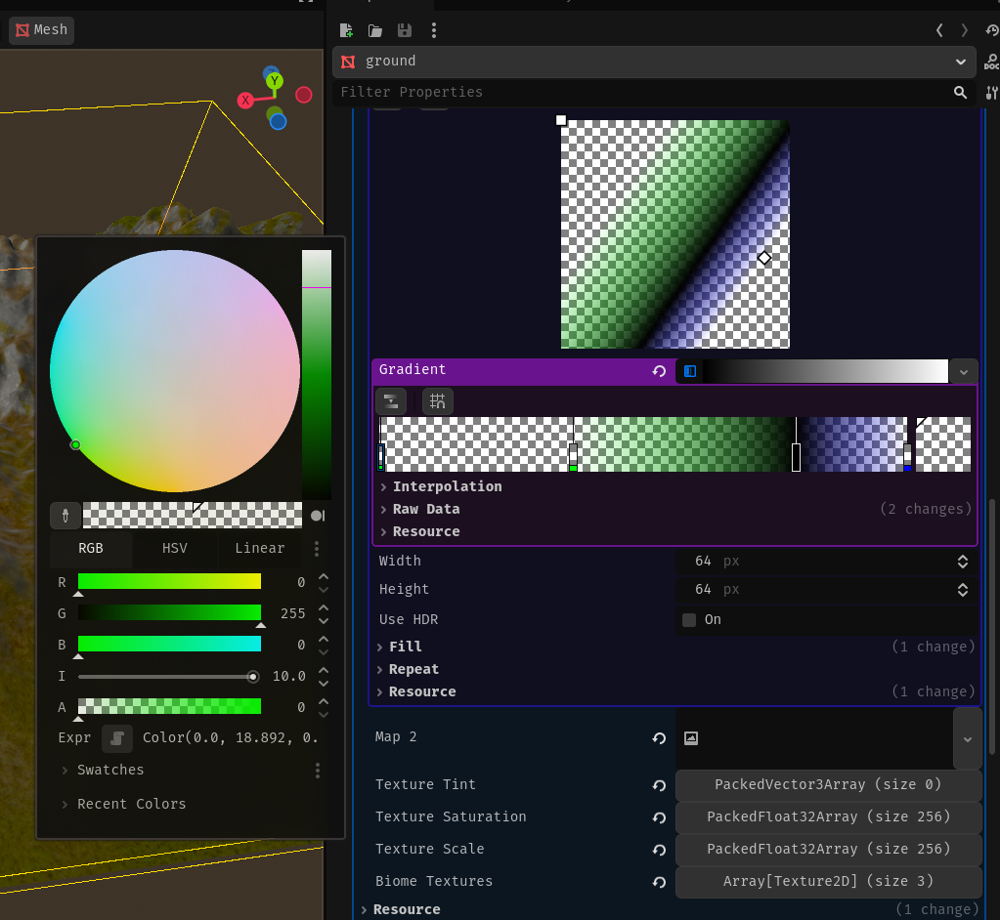

Next we need to set the textures - set 4 first texture slots in the Textures
field and remember to set the rock texture.

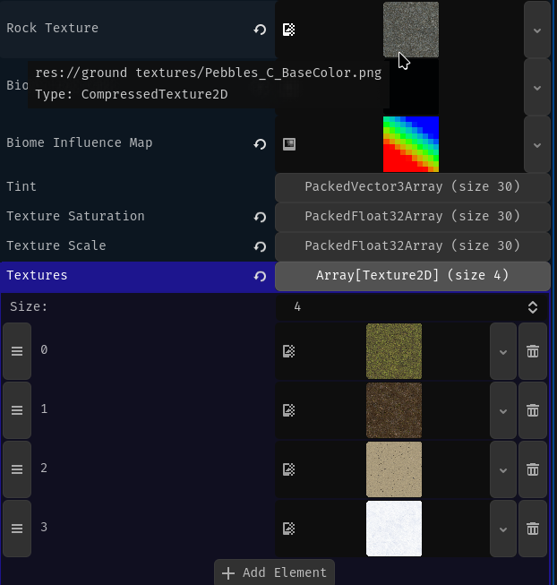

The last thing we need to do is to set the global and biome texture specific:
Saturation, tint and scale. You need to chose them by experimentation, because
different values will look good for different textures, but for me those values
worked best:

Global brightness: 0.6 Global saturation: 0.0 Rock saturation: 0.5 Rock scale:
0.4

Tint: all textures to black - no tint Texture saturation: 0.1 -> 0.3 Texture
scale: 0.2 -> 0.8

Result: 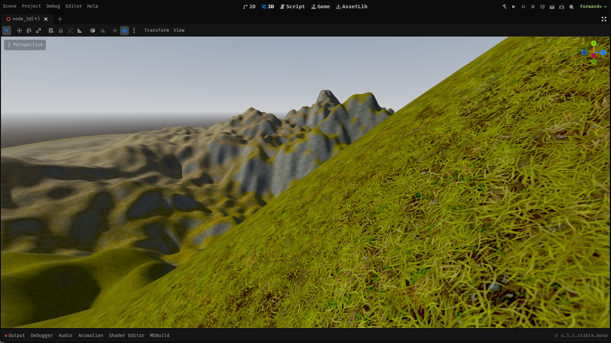

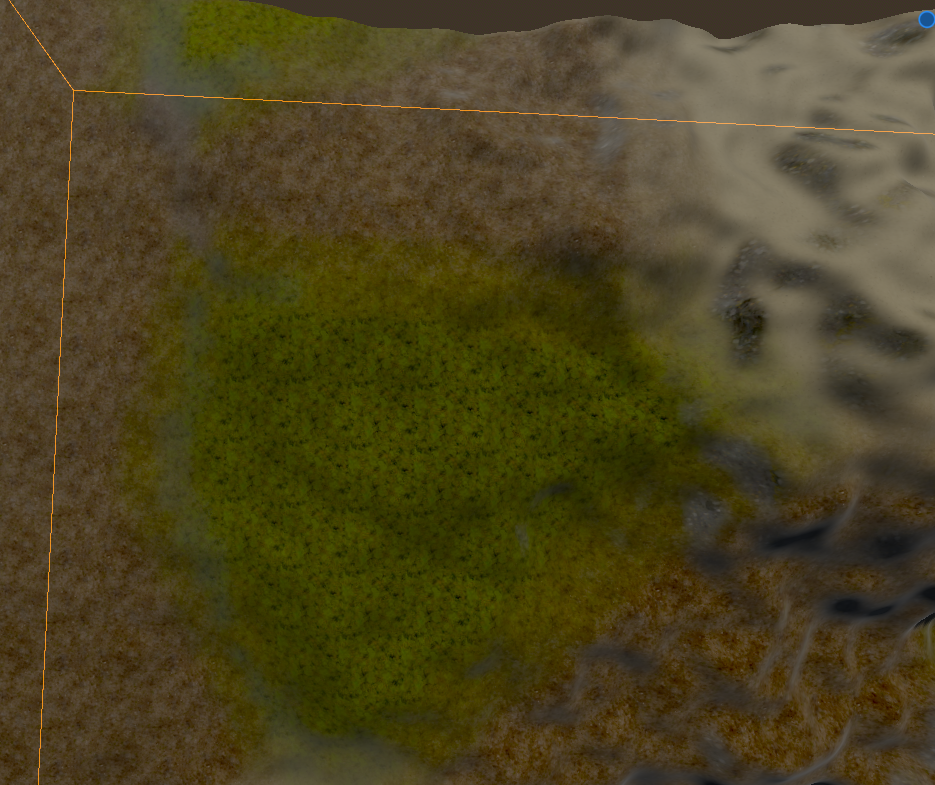

The terrain looks nice, but we can easily see repetition on some of the
textures, and the transitions between the biomes don't tool real enough.

## Adding noise

Adding some simple noise will make our terrain look more random - like real life
terrain. So we will add it to:

- Texture color- Multiply the output color by a tiny bit to make the textures
  just a tiny bit more interesting.

```cs
uniform sampler2D noise;

void fragment(){
	ALBEDO *= mix(0.9, 1.1, texture(noise,UV).r);
	METALLIC = 0.0;
}
```

The change is that simple, but it will make a **HUGE** difference.

I have used Vornoi diagram like noise for both the texture and uv noise, because
it seamed to give the best results, but feel free to experiment, with noise
types, yourself.

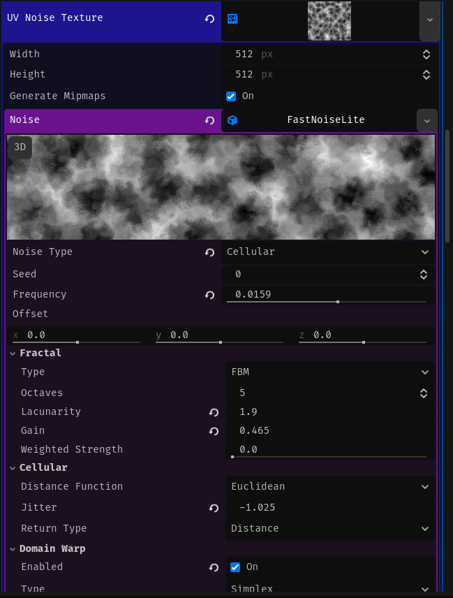

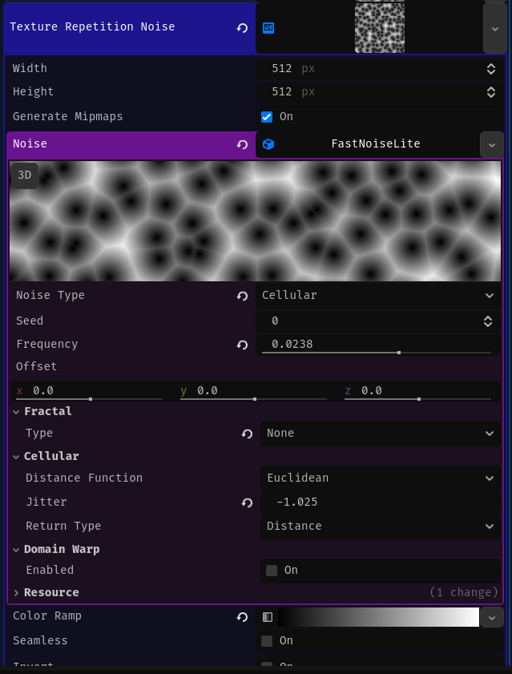

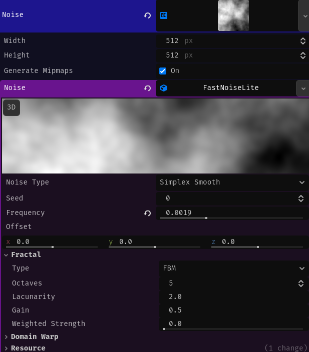

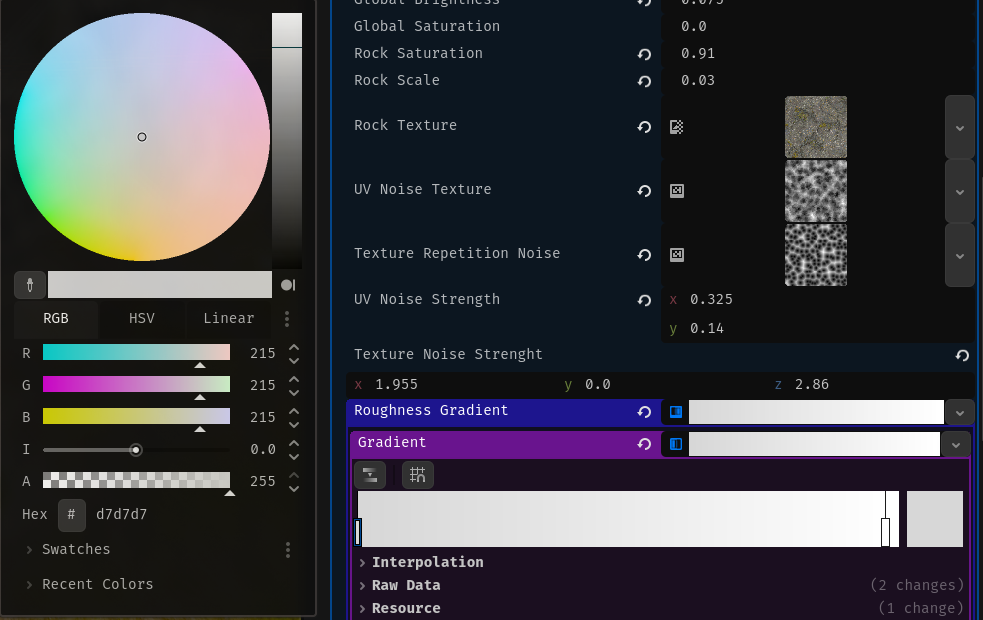

## Results

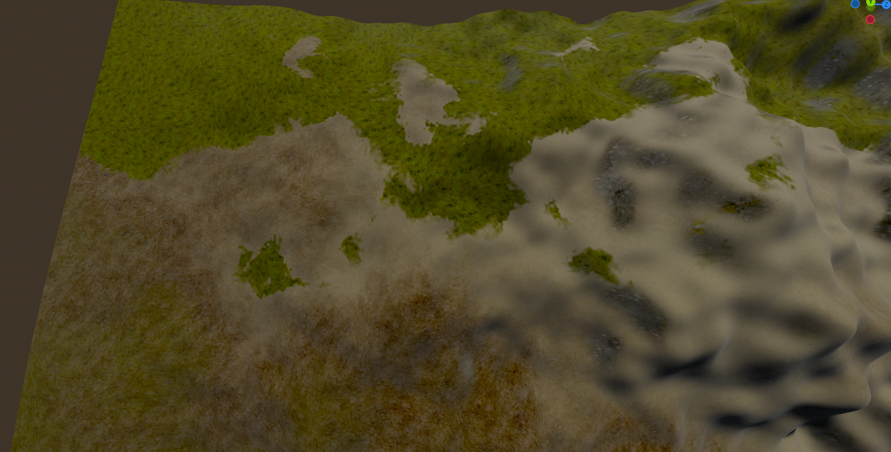

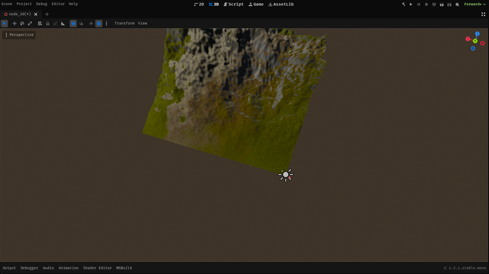

## Fixing problems with the current implementation

The current implementation looks really good, but it doesn't have that AAA
quality that we are looking for. It mainly lacks normal maps, we can easily see
texture repetition.

### Fixing lack of normal textures and texture repetition

Les's discus how we are going to fix texture repetition. There are many options
to accomplish this but they all have many problems. But in my opinion the best
way by far, to do this is to use something called stochastic sampling. I won't
go into details, in this tutorial so if you want to know how this works look at
those resources: https://www.youtube.com/watch?v=yV4-MopMuMo
https://eheitzresearch.wordpress.com/722-2/

Honestly implementing this right would take a lot of trial and error, but
thankfully there is a
.
And it is based on this .
That is in in fact based on the paper that I've linked before. Go and give some
support to those people, this shader function works so great that it honestly
feels like magic.

```gdshader
vec2 hash( vec2 p )
{
	return fract( sin( p * mat2( vec2( 127.1, 311.7 ), vec2( 269.5, 183.3 ) ) ) * 43758.5453 );
}

vec4 stochastic_sample(sampler2D tex, vec2 uv){
	vec2 skewV = mat2(vec2(1.0,1.0),vec2(-0.57735027 , 1.15470054))*uv * 3.464;
	
	vec2 vxID = floor(skewV);
	vec2 fracV = fract(skewV);
	vec3 barry = vec3(fracV.x,fracV.y,1.0-fracV.x-fracV.y);
	
	mat4 bw_vx = barry.z>0.0?
		mat4(vec4(vxID,0.0,0.0),vec4((vxID+vec2(0.0,1.0)),0.0,0.0),vec4(vxID+vec2(1.0,0.0),0,0),vec4(barry.zyx,0)):
		mat4(vec4(vxID+vec2(1.0,1.0),0.0,0.0),vec4((vxID+vec2(1.0,0.0)),0.0,0.0),vec4(vxID+vec2(0.0,1.0),0,0),vec4(-barry.z,1.0-barry.y,1.0-barry.x,0));
		
	vec2 ddx = dFdx(uv);
	vec2 ddy = dFdy(uv);
	
	return (textureGrad(tex,uv+hash(bw_vx[0].xy),ddx,ddy)*bw_vx[3].x) +
	(textureGrad(tex,uv+hash(bw_vx[1].xy),ddx,ddy)*bw_vx[3].y) +
	(textureGrad(tex,uv+hash(bw_vx[2].xy),ddx,ddy)*bw_vx[3].z)
	;
	
}
```

Now we will need to make this code work for multiple textures at once for the
efficiency sake, and than use it in our code. So first we need to create a nice
data structure that will hold needed data for using normal map, albedo and
additionally roughness textures, from biomes.

```gdshader
struct NormalAlbedoRoughness{
	vec3 normal;
	vec3 albedo;
	vec3 roughness;
};
```

Next we modify this code so that it does literally the same thing but we take
the end, return part and we copy it three times and for three different textures
and than put it all into our new struct.

```gdshader
// Taken from the https://github.com/acegiak/Godot4TerrainShader/blob/main/addons/terrain-shader/StochasticTexture.gdshader.
//  Under the Apache license https://github.com/acegiak/Godot4TerrainShader/tree/main?tab=Apache-2.0-1-ov-file#readme
// Modified so that it works with multiple textures. '-'

// 3 birds with one stone
NormalAlbedoRoughness triple_stochastic_sample(sampler2D normal_texture,sampler2D albedo_texture,sampler2D roughness_texture, vec2 uv){
	vec2 skewV = mat2(vec2(1.0,1.0),vec2(-0.57735027 , 1.15470054))*uv * 3.464;

	vec2 vxID = floor(skewV);
	vec2 fracV = fract(skewV);
	vec3 barry = vec3(fracV.x,fracV.y,1.0-fracV.x-fracV.y);

	mat4 bw_vx = barry.z>0.0?
		mat4(vec4(vxID,0.0,0.0),vec4((vxID+vec2(0.0,1.0)),0.0,0.0),vec4(vxID+vec2(1.0,0.0),0,0),vec4(barry.zyx,0)):
		mat4(vec4(vxID+vec2(1.0,1.0),0.0,0.0),vec4((vxID+vec2(1.0,0.0)),0.0,0.0),vec4(vxID+vec2(0.0,1.0),0,0),vec4(-barry.z,1.0-barry.y,1.0-barry.x,0));

	vec2 ddx = dFdx(uv);
	vec2 ddy = dFdy(uv);


	vec2 uv_x = uv+hash(bw_vx[0].xy);
	vec2 uv_y = uv+hash(bw_vx[1].xy);
	vec2 uv_z = uv+hash(bw_vx[2].xy);

	vec4 normal = (textureGrad(normal_texture,uv_x,ddx,ddy)*bw_vx[3].x) +
	(textureGrad(normal_texture,uv_y,ddx,ddy)*bw_vx[3].y) +
	(textureGrad(normal_texture,uv_z,ddx,ddy)*bw_vx[3].z);

	vec4 albedo = (textureGrad(albedo_texture,uv_x,ddx,ddy)*bw_vx[3].x) +
	(textureGrad(albedo_texture,uv_y,ddx,ddy)*bw_vx[3].y) +
	(textureGrad(albedo_texture,uv_z,ddx,ddy)*bw_vx[3].z);

	vec4 roughness = (textureGrad(roughness_texture,uv_x,ddx,ddy)*bw_vx[3].x) +
	(textureGrad(roughness_texture,uv_y,ddx,ddy)*bw_vx[3].y) +
	(textureGrad(roughness_texture,uv_z,ddx,ddy)*bw_vx[3].z);

	return NormalAlbedoRoughness(normal.xyz,albedo.xyz,roughness.xyz);
}
```

Than we need to modify our triplanar sampling function so that it also works
with 3 textures, but this time instead of using normal `texture(sampler2D,x,y)`
function, we will use the `triple_stochastic_sample()`.

```gdshader
NormalAlbedoRoughness triple_stochastic_triplanar (vec3 position, vec3 worldNormal, vec3 adjusted_normal, float biome_scale,
 sampler2D biome_normal_map, sampler2D biome_texture, sampler2D biome_roughness){
	vec3 weights = adjusted_normal / (adjusted_normal.x + adjusted_normal.y + adjusted_normal.z) * 3.0;

	vec2 uv_x = position.zy;
	vec2 uv_y = position.xz;
	vec2 uv_z = position.xy;

	NormalAlbedoRoughness output = NormalAlbedoRoughness(vec3(0), vec3(0), vec3(0));
	NormalAlbedoRoughness partial;
	if (weights.x > 0.01){
		partial = triple_stochastic_sample(rock_normal_map, rock_texture, rock_roughness, uv_x * rock_scale);
		output.normal += partial.normal * weights.x;
		output.albedo += partial.albedo * rock_saturation * weights.x;
		output.roughness += partial.roughness * weights.x;
	}
	if (weights.y > 0.01){
		partial = triple_stochastic_sample(biome_normal_map, biome_texture, biome_roughness, uv_y * biome_scale);
		output.normal += partial.normal * weights.y;
		output.albedo += partial.albedo * rock_saturation * weights.y;
		output.roughness += partial.roughness * weights.y;
	}
	if (weights.z > 0.01){
		partial = triple_stochastic_sample(rock_normal_map, rock_texture, rock_roughness, uv_z * rock_scale);
		output.normal += partial.normal * weights.z;
		output.albedo += partial.albedo * rock_saturation * weights.z;
		output.roughness += partial.roughness * weights.z;
	}

	return output;
}
```

Later we need to change rest of the code to use our new functions, so that they
utilize the code that we've written. I've split the sampling data form multiple
biomes and combining it to get the final result, into 2 separate functions so
that the main function is a bit cleaner.

```gdshader
void handle_biome(int biome, float influence, vec3 position, vec3 worldNormal, vec3 adjusted_normal, inout vec3 output_color, inout vec3 output_normal, inout vec3 output_roughness){
	if (influence < 0.01){
		return ;
	}

	NormalAlbedoRoughness output = triple_stochastic_triplanar(position, worldNormal, adjusted_normal, texture_scale[biome],biome_normal_textures[biome], biome_albedo_textures[biome],biome_roughness_textures[biome]);

	output_color += (output.albedo + texture_tint[biome] - vec3(1) * texture_saturation[biome]) * influence;
	output_normal += output.normal * influence;
	output_roughness += output.roughness * influence;
}
NormalAlbedoRoughness collect_biome_data(vec4 biome_data_1, vec4 biome_data_2,vec3 world_pos, vec3 world_normal, vec3 adjusted_normal){
	vec3 output_color = vec3(0, 0, 0);
	vec3 output_normal = vec3(0, 0, 0);
	vec3 output_roughness = vec3(0, 0, 0);

	handle_biome(0, biome_data_1.r, world_pos, world_normal, adjusted_normal, output_color, output_normal, output_roughness);
	handle_biome(1, biome_data_1.g, world_pos, world_normal, adjusted_normal, output_color, output_normal, output_roughness);
	handle_biome(2, biome_data_1.b, world_pos, world_normal, adjusted_normal, output_color, output_normal, output_roughness);
	handle_biome(3, biome_data_1.a, world_pos, world_normal, adjusted_normal, output_color, output_normal, output_roughness);
	handle_biome(4, biome_data_2.r, world_pos, world_normal, adjusted_normal, output_color, output_normal, output_roughness);
	handle_biome(5, biome_data_2.g, world_pos, world_normal, adjusted_normal, output_color, output_normal, output_roughness);
	handle_biome(6, biome_data_2.b, world_pos, world_normal, adjusted_normal, output_color, output_normal, output_roughness);
	handle_biome(7, biome_data_2.a, world_pos, world_normal, adjusted_normal, output_color, output_normal, output_roughness);

	return NormalAlbedoRoughness(output_normal, output_color, output_roughness);
}
```

And now we just call it with appropriate data and than we utilize the output
from it.

```gdshader
...
uniform sampler2D[BIOMES_COUNT] biome_albedo_textures;
uniform sampler2D[BIOMES_COUNT] biome_normal_textures;
uniform sampler2D[BIOMES_COUNT] biome_roughness_textures;
...

void fragment(){

...
	vec4 biome_data_1 = texture(map_1[chunk_data_map_index],noisy_uv);
	vec4 biome_data_2 = texture(map_2[chunk_data_map_index],noisy_uv);
	NormalAlbedoRoughness output = collect_biome_data(biome_data_1, biome_data_2, world_pos, world_normal, adjusted_normal);
	ALBEDO = output.albedo;
	NORMAL_MAP = output.normal;
	ROUGHNESS  = output.roughness.r;
...

}
```

## Final results

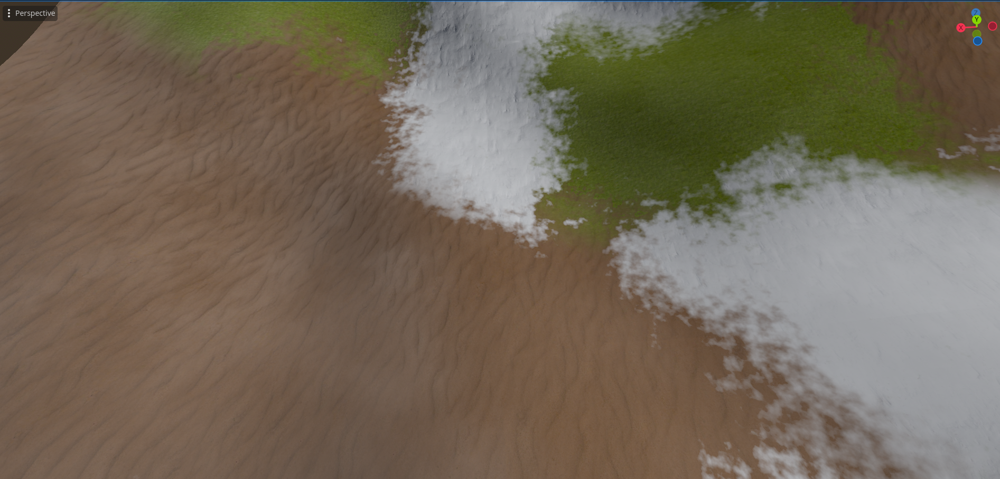
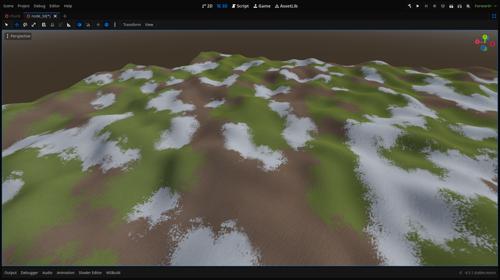
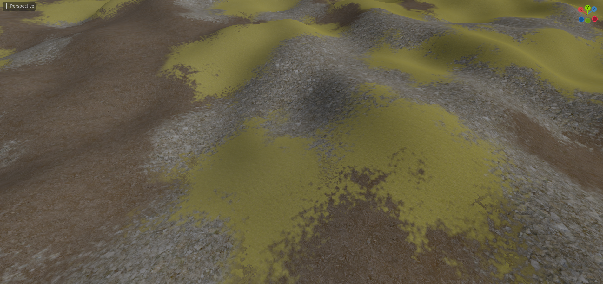 As you can see the texture
repetition is completely gone on all of the textures.

And in the end we should have something like this:

```gdshader
shader_type spatial;

struct NormalAlbedoRoughness{
	vec3 normal;
	vec3 albedo;
	vec3 roughness;
};


//  Under the appache license https://github.com/acegiak/Godot4TerrainShader/tree/main?tab=Apache-2.0-1-ov-file#readme
// Taken from the https://github.com/acegiak/Godot4TerrainShader/blob/main/addons/terrain-shader/StochasticTexture.gdshader.
// Modified so that it works with multiple textures. '-'
vec2 hash( vec2 p )
{
	return fract( sin( p * mat2( vec2( 127.1, 311.7 ), vec2( 269.5, 183.3 ) ) ) * 43758.5453 );
}
// 3 birds with one stone
NormalAlbedoRoughness triple_stochastic_sample(sampler2D normal_texture,sampler2D albedo_texture,sampler2D roughness_texture, vec2 uv){
	vec2 skewV = mat2(vec2(1.0,1.0),vec2(-0.57735027 , 1.15470054))*uv * 3.464;

	vec2 vxID = floor(skewV);
	vec2 fracV = fract(skewV);
	vec3 barry = vec3(fracV.x,fracV.y,1.0-fracV.x-fracV.y);

	mat4 bw_vx = barry.z>0.0?
		mat4(vec4(vxID,0.0,0.0),vec4((vxID+vec2(0.0,1.0)),0.0,0.0),vec4(vxID+vec2(1.0,0.0),0,0),vec4(barry.zyx,0)):
		mat4(vec4(vxID+vec2(1.0,1.0),0.0,0.0),vec4((vxID+vec2(1.0,0.0)),0.0,0.0),vec4(vxID+vec2(0.0,1.0),0,0),vec4(-barry.z,1.0-barry.y,1.0-barry.x,0));

	vec2 ddx = dFdx(uv);
	vec2 ddy = dFdy(uv);


	vec2 uv_x = uv+hash(bw_vx[0].xy);
	vec2 uv_y = uv+hash(bw_vx[1].xy);
	vec2 uv_z = uv+hash(bw_vx[2].xy);

	vec4 normal = (textureGrad(normal_texture,uv_x,ddx,ddy)*bw_vx[3].x) +
	(textureGrad(normal_texture,uv_y,ddx,ddy)*bw_vx[3].y) +
	(textureGrad(normal_texture,uv_z,ddx,ddy)*bw_vx[3].z);

	vec4 albedo = (textureGrad(albedo_texture,uv_x,ddx,ddy)*bw_vx[3].x) +
	(textureGrad(albedo_texture,uv_y,ddx,ddy)*bw_vx[3].y) +
	(textureGrad(albedo_texture,uv_z,ddx,ddy)*bw_vx[3].z);

	vec4 roughness = (textureGrad(roughness_texture,uv_x,ddx,ddy)*bw_vx[3].x) +
	(textureGrad(roughness_texture,uv_y,ddx,ddy)*bw_vx[3].y) +
	(textureGrad(roughness_texture,uv_z,ddx,ddy)*bw_vx[3].z);

	return NormalAlbedoRoughness(normal.xyz,albedo.xyz,roughness.xyz);

}
// Rest is written by me, *FR*.


const int BIOMES_COUNT = 8;

uniform float global_brightness;
uniform float global_saturation;

uniform float rock_saturation;
uniform float rock_scale;
uniform sampler2D rock_texture;
uniform sampler2D rock_normal_map;
uniform sampler2D rock_roughness;


const int chunk_data_maps_count = 100;
instance uniform int chunk_data_map_index;
// repeat is disabled, so that the data from one end of the chunk doesn't influence data form the other end of the chunk
uniform sampler2D[chunk_data_maps_count] map_1:repeat_disable;
uniform sampler2D[chunk_data_maps_count] map_2:repeat_disable;

uniform vec3[BIOMES_COUNT] texture_tint;
uniform float[BIOMES_COUNT] texture_saturation;
uniform float[BIOMES_COUNT] texture_scale;
uniform sampler2D[BIOMES_COUNT] biome_albedo_textures;
uniform sampler2D[BIOMES_COUNT] biome_normal_textures;
uniform sampler2D[BIOMES_COUNT] biome_roughness_textures;

uniform sampler2D other_noise;
uniform float metallic;
uniform float spectacular;
uniform float other_noise_scale;


NormalAlbedoRoughness triple_stochastic_triplanar (vec3 position, vec3 worldNormal, vec3 adjusted_normal, float biome_scale,
 sampler2D biome_normal_map, sampler2D biome_texture, sampler2D biome_roughness){
	vec3 weights = adjusted_normal / (adjusted_normal.x + adjusted_normal.y + adjusted_normal.z) * 3.0;

	vec2 uv_x = position.zy;
	vec2 uv_y = position.xz;
	vec2 uv_z = position.xy;

	NormalAlbedoRoughness output = NormalAlbedoRoughness(vec3(0), vec3(0), vec3(0));
	NormalAlbedoRoughness partial;
	if (weights.x > 0.01){
		partial = triple_stochastic_sample(rock_normal_map, rock_texture, rock_roughness, uv_x * rock_scale);
		output.normal += partial.normal * weights.x;
		output.albedo += partial.albedo * rock_saturation * weights.x;
		output.roughness += partial.roughness * weights.x;
	}
	if (weights.y > 0.01){
		partial = triple_stochastic_sample(biome_normal_map, biome_texture, biome_roughness, uv_y * biome_scale);
		output.normal += partial.normal * weights.y;
		output.albedo += partial.albedo * rock_saturation * weights.y;
		output.roughness += partial.roughness * weights.y;
	}
	if (weights.z > 0.01){
		partial = triple_stochastic_sample(rock_normal_map, rock_texture, rock_roughness, uv_z * rock_scale);
		output.normal += partial.normal * weights.z;
		output.albedo += partial.albedo * rock_saturation * weights.z;
		output.roughness += partial.roughness * weights.z;
	}

	return output;
}

void handle_biome(int biome, float influence, vec3 position, vec3 worldNormal, vec3 adjusted_normal, inout vec3 output_color, inout vec3 output_normal, inout vec3 output_roughness){
	if (influence < 0.01){
		return ;
	}

	NormalAlbedoRoughness output = triple_stochastic_triplanar(position, worldNormal, adjusted_normal, texture_scale[biome],biome_normal_textures[biome], biome_albedo_textures[biome],biome_roughness_textures[biome]);

	output_color += (output.albedo + texture_tint[biome] - vec3(1) * texture_saturation[biome]) * influence;
	output_normal += output.normal * influence;
	output_roughness += output.roughness * influence;
}

NormalAlbedoRoughness collect_biome_data(vec4 biome_data_1, vec4 biome_data_2,vec3 world_pos, vec3 world_normal, vec3 adjusted_normal){
	vec3 output_color = vec3(0, 0, 0);
	vec3 output_normal = vec3(0, 0, 0);
	vec3 output_roughness = vec3(0, 0, 0);

	handle_biome(0, biome_data_1.r, world_pos, world_normal, adjusted_normal, output_color, output_normal, output_roughness);
	handle_biome(1, biome_data_1.g, world_pos, world_normal, adjusted_normal, output_color, output_normal, output_roughness);
	handle_biome(2, biome_data_1.b, world_pos, world_normal, adjusted_normal, output_color, output_normal, output_roughness);
	handle_biome(3, biome_data_1.a, world_pos, world_normal, adjusted_normal, output_color, output_normal, output_roughness);
	handle_biome(4, biome_data_2.r, world_pos, world_normal, adjusted_normal, output_color, output_normal, output_roughness);
	handle_biome(5, biome_data_2.g, world_pos, world_normal, adjusted_normal, output_color, output_normal, output_roughness);
	handle_biome(6, biome_data_2.b, world_pos, world_normal, adjusted_normal, output_color, output_normal, output_roughness);
	handle_biome(7, biome_data_2.a, world_pos, world_normal, adjusted_normal, output_color, output_normal, output_roughness);

	return NormalAlbedoRoughness(output_normal, output_color, output_roughness);
}

void fragment(){
	vec3 world_pos = (INV_VIEW_MATRIX * vec4(VERTEX, 1.0)).xyz;
	vec3 world_normal = normalize((INV_VIEW_MATRIX * vec4(NORMAL, 0.0)).xyz);
	vec3 adjusted_normal = pow(abs(world_normal), vec3(8.0));


	vec4 biome_data_1 = texture(map_1[chunk_data_map_index],UV);
	vec4 biome_data_2 = texture(map_2[chunk_data_map_index],UV);
	NormalAlbedoRoughness output = collect_biome_data(biome_data_1, biome_data_2, world_pos, world_normal, adjusted_normal);
	ALBEDO = output.albedo;
	NORMAL_MAP = output.normal;
	ROUGHNESS  = output.roughness.r;


	//apply processing

	ALBEDO *= global_brightness;

	ALBEDO *= mix(0.8, 1.2, texture(other_noise, world_pos.xz*other_noise_scale).r);
	ALBEDO -= vec3(1) * global_saturation;
	METALLIC = texture(other_noise, world_pos.xz*other_noise_scale).r * metallic;
	SPECULAR = texture(other_noise, world_pos.xz*other_noise_scale).r* spectacular;
}
```
