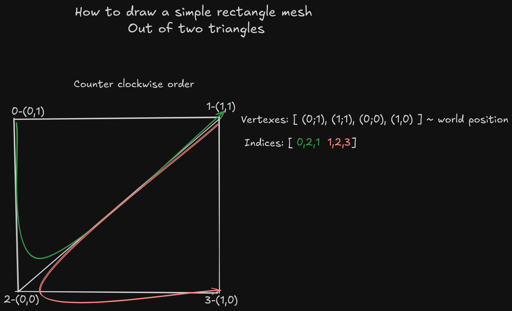
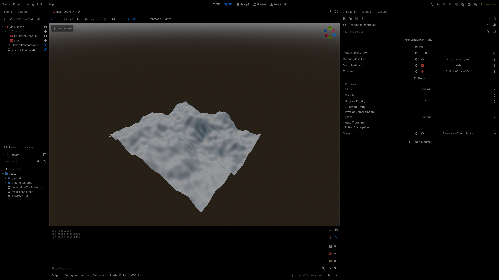
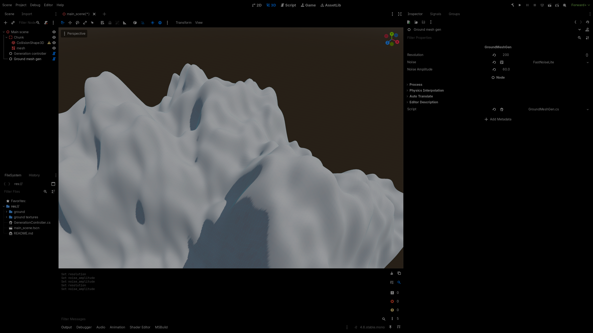

Start by creating a new Godot project and selecting the **Forward+** renderer.

## Generating Simple Mesh

Godot supports procedural mesh generation using
[MeshInstance3D](https://docs.godotengine.org/en/stable/classes/class_meshinstance3d.html).
A common approach is to
use[Surface tool](https://docs.godotengine.org/en/stable/classes/class_surfacetool.html),
which provides a **high-level** abstraction for constructing mesh data.

In this project, mesh data will be generated without using the `SurfaceTool`.
This approach allows the generated data to be reused in other parts of the
system. It also simplifies multi-threading, since the mesh data can be prepared
independently of Godot’s nodes and later applied to the mesh on the main thread.

### Generating Mesh UVs and Vertices

Vertices define the points used to construct triangles that form the terrain
mesh. They will be arranged in a regular grid, with spacing determined by the
terrain size and the desired resolution.

All generated data will be stored in a `MeshData` class.

```cs
//GroundMeshGen.cs
using Godot;
[Tool]
public partial class GroundMeshGen : Node
{
        public class MeshData
        {
                public Vector3[] vertices;
                public Vector3[] vertices_padded;
                public int[] indices;
                public Vector3[] normals;
                public Vector2[] uvs;
                public float[] height_map;
                public float[] tangents;
                private Vector2I base_world_pos;
        }

        private int triangles_per_dimension;
        private float triangle_size;

        private void GenerateUVsAndVertexes(MeshData mesh_data)
        {
                mesh_data.vertices = new Vector3[triangles_per_dimension * triangles_per_dimension];
                for (int x = 0; x < triangles_per_dimension; x++)
                {
                        for (int z = 0; z < triangles_per_dimension; z++)
                        {
                                var relative_pos = new Vector2I(x, z);
                                Vector2 worldPos = (Vector2)relative_pos * triangle_size + mesh_data.base_world_pos;
                                float height = CalculateHeight(worldPos);
                                Vector3 vertex_pos = new(worldPos.X, height, worldPos.Y);
                                mesh_data.vertices[x + z  * triangles_per_dimension] = vertex_pos;
                        }
                }

        }
}
```

Height(y position) of the vertices will be calculated by the `CalculateHeight()`
function. This function takes the vertex position and returns the corresponding
height. For now, the height calculation will be simple but more features will be
implemented later.

```cs
//GroundMeshGen.cs
[Export] private FastNoiseLite noise;
[Export] private float noise_amplitude;
private float CalculateHeight(Vector2 world_pos)
{
        return noise.GetNoise2D(world_pos.X, world_pos.Y) * noise_amplitude;
}
```

To ensure smooth shading across terrain chunks, an additional one-vertex padding
layer is needed. This padding makes it possible to compute normals in a way that
produces seamless transitions between adjacent terrain chunks.

Height will be stored in a separate array that will be used for generating
ground colliders or valid positions for buildings.

```diff lang="cs"
//GroundMeshGen.cs

private void GenerateUVsAndVertexes(MeshData mesh_data)
 {
+        int paddedWidth = triangles_per_dimension + 2;
+        mesh_data.vertices_padded = new Vector3[paddedWidth * paddedWidth];
+        mesh_data.height_map = new float[triangles_per_dimension * triangles_per_dimension];
         vertices = new Vector3[triangles_per_dimension * triangles_per_dimension];

-        for (int x = 0; x < triangles_per_dimension; x++){
-                for (int z = 0; z < triangles_per_dimension; z++){
+        for (int x = -1; x < triangles_per_dimension + 1; x++)
+        {
+                for (int z = -1; z < triangles_per_dimension + 1; z++)
+                {
                         var relative_pos = new Vector2I(x, z);
                         Vector2 worldPos = (Vector2)relative_pos * triangle_size + mesh_data.base_world_pos;
                         float height = CalculateHeight(worldPos);

                         Vector3 vertex_pos = new(worldPos.X, height, worldPos.Y);
                         
-                        mesh_data.vertices[x + z  * triangles_per_dimension] = vertex_pos;
+                        mesh_data.vertices_padded[x + 1 + (z + 1) * paddedWidth] = vertex_pos;
+
+                        if (x < 0 || z < 0 || x >= triangles_per_dimension || z >= triangles_per_dimension)
+                                continue;
+
+                        int i = x + z * triangles_per_dimension;
+
+                        mesh_data.height_map[i] = height;
+                        mesh_data.vertices[i] = vertex_pos;
                 }
         }

 }
```

Next, UV coordinates are calculated for each vertex. UV coordinates (Vector2)
describe the relative position of a vertex on the mesh surface, where each
component is in the range ⟨0, 1⟩. For example, in a mesh consisting of 100 × 100
vertices, a vertex located at grid position (20, 30) would have UV coordinates
equal to (0.2, 0.3).

```diff lang="cs"
//GroundMeshGen.cs

  private void GenerateUVsAndVertexes(MeshData mesh_data)
  {
          ...
+         mesh_data.uvs = new Vector2[triangles_per_dimension * triangles_per_dimension];
          for (int x = -1; x < triangles_per_dimension + 1; x++)
          {
                  for (int z = -1; z < triangles_per_dimension + 1; z++)
                  {
                          ...
                          mesh_data.height_map[i] = height;
                          mesh_data.vertices[i] = vertex_pos;
+                         mesh_data.uvs[i] = new Vector2(
+                             x / (float)(triangles_per_dimension - 1),
+                             z / (float)(triangles_per_dimension - 1)
+                         );
                  }
          }

  }
```

## Generating Indices

Indices define how vertices are connected to form triangles. Instead of
duplicating vertex data, the mesh uses an index buffer that specifies which
vertices form each triangle.

For performance reasons, GPUs typically render only one side of each triangle
(back-face culling). Therefore, vertices must be specified in a consistent
winding order. In Godot, triangles defined in counter-clockwise order are
considered front-facing, meaning their visible side will be rendered.



Each quad in the grid is composed of two triangles arranged as follows:

- First triangle:
  1. top-left
  2. top-right
  3. bottom-left
- Second triangle:
  1. bottom-right
  2. bottom-left
  3. top-right

In this implementation, the indices are generated using the following pattern:

```cs
current_vertex_index;
current_vertex_index + 1;
current_vertex_index + triangles_per_dimension;

current_vertex_index + triangles_per_dimension + 1;
current_vertex_index + triangles_per_dimension;
current_vertex_index + 1;
```

Implementation of indices generation:

```cs
//GroundMeshGen.cs

private void GenerateIndices(MeshData mesh_data)
{

        int vertex_count = triangles_per_dimension - 1;
        mesh_data.indices = new int[vertex_count * vertex_count * 6];
        int array_index = 0;

        for (int z = 0; z < vertex_count; z++)
        {
                for (int x = 0; x < vertex_count; x++)
                {
                        int vertex_idx = x + z * triangles_per_dimension;
                        // counter-clockwise order. 
                        mesh_data.indices[array_index++] = vertex_idx;
                        mesh_data.indices[array_index++] = vertex_idx + 1;
                        mesh_data.indices[array_index++] = vertex_idx + triangles_per_dimension;

                        mesh_data.indices[array_index++] = vertex_idx + triangles_per_dimension + 1;
                        mesh_data.indices[array_index++] = vertex_idx + triangles_per_dimension;
                        mesh_data.indices[array_index++] = vertex_idx + 1;
                }
        }

}
```

## Quick Explanation of What Normals, Tangents, and Bitangents Are

In 3D graphics, a tangent is a vector that lies on the surface of a mesh and
points in the direction of increasing U coordinate in the texture’s UV mapping.
Tangents are primarily used in normal mapping, allowing the GPU to correctly
transform normal maps from texture space into world or object space for lighting
calculations.

Think of it as a local X-axis on the surface of a triangle, perpendicular to the
normal but aligned with the texture’s U direction.

:::tip[Example]

Suppose you have a flat square in 3D space:

Vertices:

- V0 = (0, 0, 0)
- V1 = (1, 0, 0)
- V2 = (0, 0, 1)

UVs:

- UV0 = (0, 0)
- UV1 = (1, 0)
- UV2 = (0, 1)

The normal is (0, 1, 0) (pointing up). The tangent is (1, 0, 0) because moving
along the U axis of the texture corresponds to moving along the X-axis in 3D
space. A bitangent (sometimes called binormal) would point along the V axis (0,
0, 1). Together, these vectors form a TBN (Tangent-Bitangent-Normal) basis used
for transforming normals from the texture into 3D space.

:::

:::note[In short]

- Normal: points “up” from the surface.
- Tangent: points in the U direction of the texture.
- Bitangent: points in the V direction of the texture.

This allows normal maps to bend lighting correctly on any surface.

:::

## Generating Normals

The code bellow is used to calculate the normal vector.

```cs
Vector3 normal = new Vector3(
    mesh_data.vertices_padded[left].Y - mesh_data.vertices_padded[right].Y,
    2.0f,
    mesh_data.vertices_padded[down].Y - mesh_data.vertices_padded[up].Y
).Normalized();
```

Implementation of normals generation for the whole mesh:

```cs
//GroundMeshGen.cs

//  padding is needed for generating normals to avoid any seems between chunks.
private void GenerateNormals(MeshData mesh_data)
{
        int paddedWidth = triangles_per_dimension + 2;
        mesh_data.normals = new Vector3[triangles_per_dimension * triangles_per_dimension];

        for (int x = 0; x < triangles_per_dimension; x++)
        {
                for (int z = 0; z < triangles_per_dimension; z++)
                {
                        // padded indices
                        int left = x + (z + 1) * paddedWidth;
                        int right = x + 2 + (z + 1) * paddedWidth;
                        int down = x + 1 + (z + 0) * paddedWidth;
                        int up = x + 1 + (z + 2) * paddedWidth;

                        // central difference for normal
                        Vector3 normal = new Vector3(
                           mesh_data.vertices_padded[left].Y - mesh_data.vertices_padded[right].Y,
                            2.0f,
                            mesh_data.vertices_padded[down].Y - mesh_data.vertices_padded[up].Y
                        ).Normalized();

                        mesh_data.normals[x + z * triangles_per_dimension] = normal;
                }
        }

}
```

## Generating Tangents

Generate tangents function:

```cs
//GroundMeshGen.cs

public void GenerateTangents(MeshData mesh_data)
{
        int vertexCount = vertices.Length;

        var raw_tangents = new Vector3[vertexCount];
        var raw_bitangents = new Vector3[vertexCount];

        // Accumulate tangents per triangle
        for (int i = 0; i < indices.Length; i += 3)
        {
                int idx0 = mesh_data.indices[i];
                int idx1 = mesh_data.indices[i + 1];
                int idx2 = mesh_data.indices[i + 2];

                Vector3 v0 = mesh_data.vertices[idx0];
                Vector3 v1 = mesh_data.vertices[idx1];
                Vector3 v2 = mesh_data.vertices[idx2];

                Vector2 uv0 = mesh_data.uvs[idx0];
                Vector2 uv1 = mesh_data.uvs[idx1];
                Vector2 uv2 = mesh_data.uvs[idx2];

                Vector3 edge_1 = v1 - v0;
                Vector3 edge_2 = v2 - v0;

                float uv_delta_x1 = uv1.X - uv0.X;
                float uv_delta_x2 = uv2.X - uv0.X;
                float uv_delta_y1 = uv1.Y - uv0.Y;
                float uv_delta_y2 = uv2.Y - uv0.Y;

                float signed_area_of_triangle = uv_delta_x1 * uv_delta_y2 - uv_delta_x2 * uv_delta_y1;
                // we check if the triangle is valid
                if (Mathf.Abs(signed_area_of_triangle) < 1e-8f)
                        continue;

                float inv_area_of_triangle = 1.0f / signed_area_of_triangle;

                Vector3 tangent_dir = (edge_1 * uv_delta_y2 - edge_2 * uv_delta_y1) * inv_area_of_triangle;
                Vector3 bitangent_dir = (edge_2 * uv_delta_x1 - edge_1 * uv_delta_x2) * inv_area_of_triangle;

                // sum up the tangents for tech vertex in the triangle. 
                // This will be later normalized and will result in smoother output.
                raw_tangents[idx0] += tangent_dir;
                raw_tangents[idx1] += tangent_dir;
                raw_tangents[idx2] += tangent_dir;


                raw_bitangents[idx0] += bitangent_dir;
                raw_bitangents[idx1] += bitangent_dir;
                raw_bitangents[idx2] += bitangent_dir;
        }


        mesh_data.tangents = new float[vertexCount * 4];
        for (int i = 0; i < vertexCount; i++)
        {
                Vector3 normal = mesh_data.normals[i];
                Vector3 raw_tangent = raw_tangents[i];

                // Gram-Schmidt orthogonalization -> https://en.wikipedia.org/wiki/Gram%E2%80%93Schmidt_process
                Vector3 normalized_tangent = (raw_tangent - normal * normal.Dot(raw_tangent)).Normalized();

                float handedness = (normal.Cross(raw_tangent).Dot(raw_bitangents[i]) < 0.0f) ? -1.0f : 1.0f;

                int baseIndex = i * 4;
                mesh_data.tangents[baseIndex + 0] = normalized_tangent.X;
                mesh_data.tangents[baseIndex + 1] = normalized_tangent.Y;
                mesh_data.tangents[baseIndex + 2] = normalized_tangent.Z;
                mesh_data.tangents[baseIndex + 3] = handedness;
        }

}
```

## Generating Mesh

`Initialize` function will configure some very basic settings that won't change
throughout the terrain generation for different chunks.

```cs
//GroundMeshGen.cs
public void Initialize(int size)
{
        this.size = size;
        triangles_per_dimension = resolution + 1;
        triangle_size = size / (float)resolution;
}
```

`GenerateChunkData` function will take basic terrain parameters and use the
previously implemented functions to generate data for the mesh.

```cs
//GroundMeshGen.cs

/// The 'Initialize' function needs to be called first
public MeshData GenerateChunkData(Vector2I base_world_pos)
{
        var mesh_data = new MeshData
        {
                base_world_pos = base_world_pos
        };

        GenerateUVsAndVertexes(mesh_data);
        GenerateIndices(mesh_data);
        GenerateNormals(mesh_data);
        GenerateTangents(mesh_data);
        return mesh_data;
}
```

Next, a separate function will be implemented to apply the generated mesh data.
Separating data generation from application enables multi-threaded generation,
because Godot only allows node creation on the main thread. This design allows
mesh data to be computed on multiple threads and then applied safely on the main
thread.

The `ApplyData` function will pack all the `MeshData`'s contents into a one
array, and give it to the `ArrayMesh`. Next, the height map will be used to
generate a `HeightMapShape3D` collider for this mesh.

```cs
//GroundMeshGen.cs

/// Needs to be called after the `GenerateChunkData()`
public void ApplyData(MeshData data, MeshInstance3D mesh_instance, CollisionShape3D collider)
{
        var arrays = new Godot.Collections.Array();
        arrays.Resize((int)Mesh.ArrayType.Max);

        arrays[(int)Mesh.ArrayType.Vertex] = data.vertices;
        arrays[(int)Mesh.ArrayType.Index] = data.indices;
        arrays[(int)Mesh.ArrayType.Normal] = data.normals;
        arrays[(int)Mesh.ArrayType.TexUV] = data.uvs;
        arrays[(int)Mesh.ArrayType.Tangent] = data.tangents;

        HeightMapShape3D shape = new()
        {
                MapWidth = triangles_per_dimension,
                MapDepth = triangles_per_dimension,
                MapData = data.height_map
        };
        collider.Shape = shape;
        collider.Scale = new Vector3(triangle_size, 1, triangle_size);
        // `- size/2f` is needed because otherwise this will be the center point for the collider, and for mesh this will be the bottom left corner. 
        collider.Position = new(data.base_world_pos.X + size / 2f, 0, data.base_world_pos.Y + size / 2f);


        var mesh = new ArrayMesh();
        mesh.AddSurfaceFromArrays(Mesh.PrimitiveType.Triangles, arrays);

        mesh_instance.Mesh = mesh;
}
```

Next, a script that runs the whole generation process will be implemented. It
will get a lot more complex in the future but for now it will just look like
this:

```cs
// GenerationController.cs
using Godot;
[Tool]
public partial class GenerationController : Node
{
        [ExportToolButton("Run")] private Callable RunButton => Callable.From(Run);
        [Export] int terrain_chunk_size;

        [Export] GroundMeshGen ground_mesh_gen;
        [Export] MeshInstance3D mesh_instance;
        [Export] CollisionShape3D collider;
        private void Run()
        {
                Vector2I base_world_pos = new(0, 0);
                ground_mesh_gen.Initialize(terrain_chunk_size);
                var mesh_data = ground_mesh_gen.GenerateChunkData(base_world_pos);
                ground_mesh_gen.ApplyData(mesh_data, mesh_instance, collider);
        }

}
```

## End Result

Now the godot editor needs to be used to configure the scene, and than run it.





:::tip

Try following if you have a trouble running scripts as tools:

1. Build the project - Alt + B
2. Close the Godot editor and launch it again

:::

:::tip

If you are on NixOS and have problem with Godot crashing try:

1. Download .net executable for Linux from Godot's website.
2. Run the executable file with `steam-run`

:::

---

#### Bugs

If you find anything to improve in this project's code, please create an issue
describing it on the
[GitHub repository for this project](https://github.com/FilipRuman/procedural_terrain_generationV2/issues).
For website-related issues, create an issue
[here](https://github.com/FilipRuman/pages/issues).

#### Support

All pages on this site are written by a human, and you can access everything for
free without ads. If you find this work valuable, please give a star to the
[GitHub repository for this project](https://github.com/FilipRuman/procedural_terrain_generationV2).

<script src="https://giscus.app/client.js"
        data-repo="FilipRuman/procedural_terrain_generationV2"
        data-repo-id="R_kgDOQlnCIA"
        data-category="Announcements"
        data-category-id="DIC_kwDOQlnCIM4C4CHB"
        data-mapping="specific"
        data-term="basic ground mesh"
        data-strict="0"
        data-reactions-enabled="1"
        data-emit-metadata="0"
        data-input-position="top"
        data-theme="preferred_color_scheme"
        data-lang="en"
        data-loading="lazy"
        crossorigin="anonymous"
        async>
</script>
