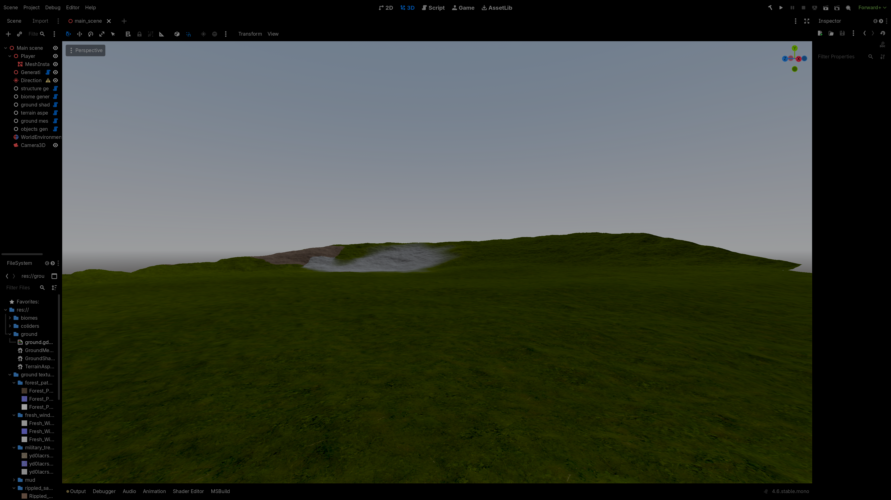

The current terrain generation works well, but it does not scale. Generating a
large map as a single mesh is both time-consuming and resource-intensive. To
address this, the terrain will be divided into chunks, and chunk data will be
generated in parallel.

## Generating Chunk Data

### Overview

[Godot restricts many scene operations (such as creating nodes, meshes, and
textures) to the main thread](https://docs.godotengine.org/en/stable/tutorials/performance/thread_safe_apis.html#doc-thread-safe-apis).
However, pure data generation can safely be performed on background threads.

For this reason, the system is structured as follows:

- **Background threads**- generate chunk data
- **Main thread**- applies the generated data (creates nodes, meshes, textures)

This separation allows efficient parallel computation without violating Godot’s
threading constraints. Since the existing code was already designed to separate
data generation from application, only the `GenerationController` needs to be
extended.

### Parallel Chunk Data Generation

We begin by implementing a `GenerateDataForChunks` function. This function takes
a list of chunk positions and generates data for each chunk in parallel using
`System.Threading.Tasks.Parallel.ForEachAsync`.

Each worker:

- Generates terrain data (same logic as before)
- Stores the result in a `ChunkData` structure

The results are pushed into a `ConcurrentQueue`, which allows safe communication
between worker threads and the main thread.

::: note

[All asynchronous code should be wrapped in a try-catch block. Otherwise,
exceptions may fail silently and will not be reported in the console.](https://filip-ruman.pages.dev/one_shot/godot_debugging/)

:::

```cs
// GenerationController.cs
public struct ChunkData(GroundMeshGen.MeshData mesh_data, BiomeGenerator.TextureData biome, Vector2I world_pos)
{
        public GroundMeshGen.MeshData mesh_data = mesh_data;
        public BiomeGenerator.TextureData biome = biome;
        public Vector2I world_pos = world_pos;
}


Task chunk_data_generation_task;
ConcurrentQueue<ChunkData> chunk_instantiation_que = new();
private void GenerateDataForChunks(Vector2I[] chunks_to_generate, Vector2I player_pos_snapped_to_chunk)
{
        chunk_data_generation_task = Parallel.ForEachAsync(Enumerable.Range(0, chunks_to_generate.Length), async (i, _) =>
             {
                     try
                     {
                             var chunk = chunks_to_generate[i];
                             Vector2I chunk_world_position = chunk + player_pos_snapped_to_chunk;

                             var biome_data = biome_generator.GenerateTextureData(new Vector2(chunk_world_position.X, chunk_world_position.Y), terrain_chunk_size + 1, biomes);
                             var mesh_data = ground_mesh_gen.GenerateChunkData(chunk_world_position);
                             chunk_instantiation_que.Enqueue(new(mesh_data, biome_data, chunk_world_position));
                     }
                     catch (Exception e)
                     {
                             GD.PrintErr($"GenerateDataForChunks failed: {e}");
                     }
             });
}
```

Now we need to implement functions that will call the previous function with
chunks to generate. Let's start with the easiest condition- we want to generate
all chunks in the view distance of the player.

```cs
private void GenerateDataForAllChunks()
{
        var chunks_to_generate = ChunkChangeCalculator.GetAllChunksInViewDistance();
        GenerateDataForChunks([.. chunks_to_generate], last_player_chunk_grid_pos * terrain_chunk_size);
}
```

### Determining Which Chunks to Generate

Initially, we can generate all chunks within the player’s view distance.
However, for large or infinite terrain, this is inefficient.

Instead, we only update chunks when the player moves. Specifically:

- Destroy chunks that move out of range
- Generate new chunks that enter the view distance

```cs
///ChunkChangeCalculator.cs
private static int view_distance_chunks;
private static int terrain_chunk_size;

public static List<Vector2I> GetAllChunksInViewDistance()
{
        List<Vector2I> output = [];

        // could be pre-calculated once
        for (int x = -view_distance_chunks; x <= view_distance_chunks; x++)
        {
                for (int y = -view_distance_chunks; y <= view_distance_chunks; y++)
                {
                        if (x * x + y * y >= view_distance_chunks * view_distance_chunks)
                                continue;

                        output.Add(new Vector2I(x * terrain_chunk_size, y * terrain_chunk_size));
                }
        }

        return output;
}
```

### Calculating Chunk Changes

To efficiently determine which chunks need updating, we precompute changes based
on player movement.

:::note[Example]

If the player moves one chunk to the right:

- Remove chunks on the left edge
- Generate new chunks on the right edge

This logic is implemented in a `ChunkChangeCalculator`, which maps player
position deltas to:

- chunks to remove
- chunks to generate

:::

For performance reasons, we assume the player moves at most one chunk per update
(including diagonals).

```cs
///ChunkChangeCalculator.cs
public struct ChunkChange(Vector2I[] chunks_to_destroy_relative_positions, Vector2I[] chunks_to_instantiate)
{
        public Vector2I[] to_destroy_relative_pos = chunks_to_destroy_relative_positions;
        public Vector2I[] to_generate_relative_pos = chunks_to_instantiate;
}
private static ChunkChange CalculateChunkChangeForPosChange(Vector2I delta)
{
        delta *= terrain_chunk_size;

        HashSet<Vector2I> old_chunk_pos = [.. GetAllChunksInViewDistance()];
        HashSet<Vector2I> new_chunk_pos = [.. old_chunk_pos.Select(pos => pos + delta)];

        var to_destroy = old_chunk_pos.Except(new_chunk_pos).ToArray();

        List<Vector2I> to_generate = [];
        foreach (var chunk in old_chunk_pos)
        {
                var new_pos = chunk + delta;
                if (!old_chunk_pos.Contains(new_pos))
                {
                        to_generate.Add(chunk);
                }
        }

        return new ChunkChange(to_destroy, [.. to_generate]);
}
```

### Initialization

An initialization step precomputes all possible position deltas and stores the
results in a dictionary for fast lookup.

```cs
//ChunkChangeCalculator.cs
public static Dictionary<Vector2I, ChunkChange> chunk_change_for_position_delta = [];

public static void Init(int _view_distance_chunks, int _terrain_chunk_size)
{
        view_distance_chunks = _view_distance_chunks;
        terrain_chunk_size = _terrain_chunk_size; chunk_change_for_position_delta = [];
        Vector2I delta = new(-1, 0);
        chunk_change_for_position_delta.Add(delta, CalculateChunkChangeForPosChange(delta));
        delta = new(-1, 1);
        chunk_change_for_position_delta.Add(delta, CalculateChunkChangeForPosChange(delta));
        delta = new(0, 1);
        chunk_change_for_position_delta.Add(delta, CalculateChunkChangeForPosChange(delta));
        delta = new(1, 1);
        chunk_change_for_position_delta.Add(delta, CalculateChunkChangeForPosChange(delta));
        delta = new(1, 0);
        chunk_change_for_position_delta.Add(delta, CalculateChunkChangeForPosChange(delta));
        delta = new(1, -1);
        chunk_change_for_position_delta.Add(delta, CalculateChunkChangeForPosChange(delta));
        delta = new(0, -1);
        chunk_change_for_position_delta.Add(delta, CalculateChunkChangeForPosChange(delta));
        delta = new(-1, -1);
        chunk_change_for_position_delta.Add(delta, CalculateChunkChangeForPosChange(delta));
}
```

<details>
<summary> Contents of the ChunkChangeCalculator.cs file </summary>

```cs
//ChunkChangeCalculator.cs
using System.Collections.Generic;
using System.Linq;
using Godot;
public static class ChunkChangeCalculator
{
        public struct ChunkChange(Vector2I[] chunks_to_destroy_relative_positions, Vector2I[] chunks_to_instantiate)
        {
                public Vector2I[] to_destroy_relative_pos = chunks_to_destroy_relative_positions;
                public Vector2I[] to_generate_relative_pos = chunks_to_instantiate;
        }
        private static ChunkChange CalculateChunkChangeForPosChange(Vector2I delta)
        {
                delta *= terrain_chunk_size;

                HashSet<Vector2I> old_chunk_pos = [.. GetAllChunksInViewDistance()];
                HashSet<Vector2I> new_chunk_pos = [.. old_chunk_pos.Select(pos => pos + delta)];

                var to_destroy = old_chunk_pos.Except(new_chunk_pos).ToArray();

                List<Vector2I> to_generate = [];
                foreach (var chunk in old_chunk_pos)
                {
                        var new_pos = chunk + delta;
                        if (!old_chunk_pos.Contains(new_pos))
                        {
                                to_generate.Add(chunk);
                        }
                }

                return new ChunkChange(to_destroy, [.. to_generate]);
        }

        private static int view_distance_chunks;
        private static int terrain_chunk_size;

        public static List<Vector2I> GetAllChunksInViewDistance()
        {
                List<Vector2I> output = [];

                // could be pre-calculated once
                for (int x = -view_distance_chunks; x <= view_distance_chunks; x++)
                {
                        for (int y = -view_distance_chunks; y <= view_distance_chunks; y++)
                        {
                                if (x * x + y * y >= view_distance_chunks * view_distance_chunks)
                                        continue;

                                output.Add(new Vector2I(x * terrain_chunk_size, y * terrain_chunk_size));
                        }
                }

                return output;
        }
        public static Dictionary<Vector2I, ChunkChange> chunk_change_for_position_delta = [];

        public static void Init(int _view_distance_chunks, int _terrain_chunk_size)
        {
                view_distance_chunks = _view_distance_chunks;
                terrain_chunk_size = _terrain_chunk_size; chunk_change_for_position_delta = [];
                Vector2I delta = new(-1, 0);
                chunk_change_for_position_delta.Add(delta, CalculateChunkChangeForPosChange(delta));
                delta = new(-1, 1);
                chunk_change_for_position_delta.Add(delta, CalculateChunkChangeForPosChange(delta));
                delta = new(0, 1);
                chunk_change_for_position_delta.Add(delta, CalculateChunkChangeForPosChange(delta));
                delta = new(1, 1);
                chunk_change_for_position_delta.Add(delta, CalculateChunkChangeForPosChange(delta));
                delta = new(1, 0);
                chunk_change_for_position_delta.Add(delta, CalculateChunkChangeForPosChange(delta));
                delta = new(1, -1);
                chunk_change_for_position_delta.Add(delta, CalculateChunkChangeForPosChange(delta));
                delta = new(0, -1);
                chunk_change_for_position_delta.Add(delta, CalculateChunkChangeForPosChange(delta));
                delta = new(-1, -1);
                chunk_change_for_position_delta.Add(delta, CalculateChunkChangeForPosChange(delta));
        }
}
```

</details>

### Clean up and Reset

The `ClearAll` will clear all the debris from the previous terrain generation
attempts.

```cs
//GenerationController.cs
/// When you want to change you need to also change the value in the ground shader 
const int max_chunk_data_textures_count = 517;
private void ClearAll()
{
        free_biome_texture_slots = new(Enumerable.Range(0, max_chunk_data_textures_count));
        biome_textures_channel_1 = new ImageTexture[max_chunk_data_textures_count];
        biome_textures_channel_2 = new ImageTexture[max_chunk_data_textures_count];

        chunk_per_world_position = [];

        foreach (var child in GetChildren())
        {
                child.QueueFree();
        }
}
```

A `RunClean` function is responsible for:

- Clearing all existing chunks using the `ClearAll` function
- Resetting internal state
- Initializing required systems
- Generating initial terrain

This is useful for both startup and error recovery.

```cs
//GenerationController.cs
private void RunClean()
{
        ClearAll();
        if (max_chunk_data_textures_count != ChunkChangeCalculator.GetAllChunksInViewDistance().Count)
        {
                GD.PushWarning("The max amount of chunk data textures is not equal to the chunk data textures that are generated.\n" +
                        "This is not optimal and could cause chunks biomes to stop working:\n" +
                        $"current:{max_chunk_data_textures_count} optimal:{ChunkChangeCalculator.GetAllChunksInViewDistance().Count}");
        }

        ground_mesh_gen.Initialize(terrain_chunk_size);
        ground_shader_controller.SetShaderConfiguration(biomes);
        ChunkChangeCalculator.Init(view_distance_chunks, terrain_chunk_size);

        GenerateDataForAllChunks();
}
```

### Integrating Parallel Terrain Generation

Incremental Chunk Updates

Next, we implement a function that updates only the necessary chunks. Before
running, it verifies:

- No generation task is currently running
- All queued chunk data has been processed

If these conditions are met:

1. Compute player movement delta
2. Look up required changes
3. Remove obsolete chunks
4. Generate data for new chunks

::: warn

If the player moves more than one chunk between updates, no precomputed data
will exist. In this case, the entire terrain is regenerated. While not optimal,
this simplifies the implementation.

:::

```cs
//GenerationController.cs
Vector2I WorldToTerrainChunkGridPos(Vector2 world_pos)
{
        return new Vector2I(Mathf.RoundToInt(world_pos.X / terrain_chunk_size), Mathf.RoundToInt(world_pos.Y / terrain_chunk_size));
}

Dictionary<Vector2I, Chunk> chunk_per_world_position;
Vector2I last_player_chunk_grid_pos;
private void ChunkDataGeneration()
{

        // This could happen after building the project in the godot editor while the generation  process is running
        if (chunk_data_generation_task == null)
        {
                ClearAll();
                GenerateDataForAllChunks();
        }

        if (!chunk_data_generation_task.IsCompleted || !chunk_instantiation_que.IsEmpty)
        {
                return;
        }

        // Update only once all chunks from the previous batch have been generated / destroyed  
        ground_shader_controller.UpdateTheBiomeTextures(biome_textures_channel_1, biome_textures_channel_2);

        Vector2 player_pos = new(player.Position.X, player.Position.Z);
        var current_player_chunk_grid_pos = WorldToTerrainChunkGridPos(player_pos);

        if (last_player_chunk_grid_pos == current_player_chunk_grid_pos)
        {
                return;
        }
        var grid_pos_delta = current_player_chunk_grid_pos - last_player_chunk_grid_pos;

        if (!ChunkChangeCalculator.chunk_change_for_position_delta.TryGetValue(grid_pos_delta, out var chunk_change))
        {
                GD.PushWarning("The position of player changed by more than a 1 chunk size which is not supported. Regenerating the whole terrain.");

                last_player_chunk_grid_pos = current_player_chunk_grid_pos;
                ClearAll();
                GenerateDataForAllChunks();
                return;
        }


        DestroyChunks(chunk_change.to_destroy_relative_pos);
        GenerateDataForChunks(chunk_change.to_generate_relative_pos, current_player_chunk_grid_pos * terrain_chunk_size);
        last_player_chunk_grid_pos = current_player_chunk_grid_pos;
}
```

Removing Chunks

To remove a chunk:

1. Retrieve the node from `chunk_per_world_position`
2. Remove its entry from any data structures
3. Free its biome texture slot
4. Call `QueueFree()` on the node

```cs
//GenerationController.cs
private void DestroyChunks(Vector2I[] chunks_to_destroy)
{
        foreach (var chunk_relative_pos in chunks_to_destroy)
        {
                Vector2I chunk_world_position = chunk_relative_pos + last_player_chunk_grid_pos * terrain_chunk_size;

                if (!chunk_per_world_position.TryGetValue(chunk_world_position, out var chunk))
                {
                        GD.PushWarning("There was already a chunk in the dictionary at this position. This either indicates a but in the logic of this program or the player did some crazy movements. Regenerating the whole terrain.");

                        ClearAll();
                        GenerateDataForAllChunks();
                        return;
                }

                free_biome_texture_slots.Enqueue(chunk.biome_map_index);
                chunk.QueueFree();
                chunk_per_world_position.Remove(chunk_world_position);
        }

}
```

Instantiating Chunks from Generated Data

The `InstantiateChunksFromQueue` function processes generated data on the main
thread.

- It dequeues `ChunkData` objects
- Calls `InstantiateChunk` for each
- Limits the number of chunks instantiated per frame to avoid frame spikes

During instantiation:

- The chunk is registered in `chunk_per_world_position`
- A free biome texture slot is assigned (from `free_biome_texture_slots`)
- When a chunk is removed, its slot is returned to the pool

```cs
//GenerationController.cs
[Export] int max_main_thread_chunk_instantiation_per_frame;

private void InstantiateChunksFromQue()
{
        int processed = 0;
        while (processed < max_main_thread_chunk_instantiation_per_frame && chunk_instantiation_que.TryDequeue(out var chunk_data))
        {
                InstantiateChunk(chunk_data);
                processed++;
        }
}

Queue<int> free_biome_texture_slots;
ImageTexture[] biome_textures_channel_1;
ImageTexture[] biome_textures_channel_2;
private void InstantiateChunk(ChunkData chunk_data)
{

        var chunk = (Chunk)chunk_prefab.Instantiate();
        chunk_per_world_position.Add(chunk_data.world_pos, chunk);

        AddChild(chunk);
        ground_mesh_gen.ApplyData(chunk_data.mesh_data, chunk.mesh_instance, chunk.collider);

        int map_index = free_biome_texture_slots.Dequeue();
        chunk.biome_map_index = map_index;
        biome_textures_channel_1[map_index] = chunk_data.biome.GetTexture(0);
        biome_textures_channel_2[map_index] = chunk_data.biome.GetTexture(1);
        chunk.mesh_instance.SetInstanceShaderParameter("biome_texture_index", map_index);
}
```

## Integration

Finally:

- Call chunk generation and instantiation functions in `_Process`
- In `_Ready`, initialize the system (if not running in the editor) using
  `RunClean`

```cs
//GenerationController.cs
public override void _Ready()
{
        if (!Engine.IsEditorHint())
                RunClean();
}

public override void _Process(double delta)
{
        ChunkDataGeneration();
        InstantiateChunksFromQue();
}
```

### Final Results



<details>
<summary> Contents of the GenerationController.cs file </summary>

```cs
//GenerationController.cs
using System;
using System.Collections.Concurrent;
using System.Collections.Generic;
using System.Linq;
using System.Threading.Tasks;
using Godot;
[Tool]
public partial class GenerationController : Node
{
        [ExportToolButton("Run")] private Callable RunButton => Callable.From(RunClean);
        [Export] int terrain_chunk_size;
        [Export] Biome[] biomes;
        [Export] int max_main_thread_chunk_instantiation_per_frame;

        [ExportGroup("player")]
        [Export] Vector2 player_pos_offset;
        [Export] Node3D player;
        [Export] int view_distance_chunks;

        [ExportCategory("references")]
        [Export] PackedScene chunk_prefab;
        [Export] GroundMeshGen ground_mesh_gen;
        [Export] BiomeGenerator biome_generator;
        [Export] GroundShaderController ground_shader_controller;


        public override void _Ready()
        {
                if (!Engine.IsEditorHint())
                        RunClean();
        }

        /// When you want to change you need to also change the value in the ground shader 
        const int max_chunk_data_textures_count = 517;
        public override void _Process(double delta)
        {
                ChunkDataGeneration();

                InstantiateChunksFromQue();
        }
        private void DestroyChunks(Vector2I[] chunks_to_destroy)
        {
                foreach (var chunk_relative_pos in chunks_to_destroy)
                {
                        Vector2I chunk_world_position = chunk_relative_pos + last_player_chunk_grid_pos * terrain_chunk_size;

                        if (!chunk_per_world_position.TryGetValue(chunk_world_position, out var chunk))
                        {
                                GD.PushWarning("There was already a chunk in the dictionary at this position. This either indicates a but in the logic of this program or the player did some crazy movements. Regenerating the whole terrain.");

                                ClearAll();
                                GenerateDataForAllChunks();
                                return;
                        }

                        free_biome_texture_slots.Enqueue(chunk.biome_map_index);
                        chunk.QueueFree();
                        chunk_per_world_position.Remove(chunk_world_position);
                }

        }

        private void RunClean()
        {
                ClearAll();
                if (max_chunk_data_textures_count != ChunkChangeCalculator.GetAllChunksInViewDistance().Count)
                {
                        GD.PushWarning("The max amount of chunk data textures is not equal to the chunk data textures that are generated.\n" +
                                "This is not optimal and could cause chunks biomes to stop working:\n" +
                                $"current:{max_chunk_data_textures_count} optimal:{ChunkChangeCalculator.GetAllChunksInViewDistance().Count}");
                }

                ground_mesh_gen.Initialize(terrain_chunk_size);
                ground_shader_controller.SetShaderConfiguration(biomes);
                ChunkChangeCalculator.Init(view_distance_chunks, terrain_chunk_size);

                GenerateDataForAllChunks();
        }

        public struct ChunkData(GroundMeshGen.MeshData mesh_data, BiomeGenerator.TextureData biome, Vector2I world_pos)
        {
                public GroundMeshGen.MeshData mesh_data = mesh_data;
                public BiomeGenerator.TextureData biome = biome;
                public Vector2I world_pos = world_pos;
        }

        Vector2I WorldToTerrainChunkGridPos(Vector2 world_pos)
        {
                return new Vector2I(Mathf.RoundToInt(world_pos.X / terrain_chunk_size), Mathf.RoundToInt(world_pos.Y / terrain_chunk_size));
        }
        Dictionary<Vector2I, Chunk> chunk_per_world_position;

        Vector2I last_player_chunk_grid_pos;
        private void ChunkDataGeneration()
        {

                // This could happen after building the project in the godot editor while the generation  process is running
                if (chunk_data_generation_task == null)
                {
                        ClearAll();
                        GenerateDataForAllChunks();
                }

                if (!chunk_data_generation_task.IsCompleted || !chunk_instantiation_que.IsEmpty)
                {
                        return;
                }

                // Update only once all chunks from the previous batch have been generated / destroyed  
                ground_shader_controller.UpdateTheBiomeTextures(biome_textures_channel_1, biome_textures_channel_2);

                Vector2 player_pos = new(player.Position.X, player.Position.Z);

                var current_player_chunk_grid_pos = WorldToTerrainChunkGridPos(player_pos);

                if (last_player_chunk_grid_pos == current_player_chunk_grid_pos)
                {
                        return;
                }
                var grid_pos_delta = current_player_chunk_grid_pos - last_player_chunk_grid_pos;

                if (!ChunkChangeCalculator.chunk_change_for_position_delta.TryGetValue(grid_pos_delta, out var chunk_change))
                {
                        GD.PushWarning("The position of player changed by more than a 1 chunk size which is not supported. Regenerating the whole terrain.");

                        last_player_chunk_grid_pos = current_player_chunk_grid_pos;
                        ClearAll();
                        GenerateDataForAllChunks();
                        return;
                }


                DestroyChunks(chunk_change.to_destroy_relative_pos);
                GenerateDataForChunks(chunk_change.to_generate_relative_pos, current_player_chunk_grid_pos * terrain_chunk_size);
                last_player_chunk_grid_pos = current_player_chunk_grid_pos;
        }
        private void GenerateDataForAllChunks()
        {
                var chunks_to_generate = ChunkChangeCalculator.GetAllChunksInViewDistance();
                GenerateDataForChunks([.. chunks_to_generate], last_player_chunk_grid_pos * terrain_chunk_size);
        }

        Task chunk_data_generation_task;
        ConcurrentQueue<ChunkData> chunk_instantiation_que = new();
        private void GenerateDataForChunks(Vector2I[] chunks_to_generate, Vector2I player_pos_snapped_to_chunk)
        {
                chunk_data_generation_task = Parallel.ForEachAsync(Enumerable.Range(0, chunks_to_generate.Length), async (i, _) =>
                     {
                             try
                             {
                                     var chunk = chunks_to_generate[i];
                                     Vector2I chunk_world_position = chunk + player_pos_snapped_to_chunk;

                                     var biome_data = biome_generator.GenerateTextureData(new Vector2(chunk_world_position.X, chunk_world_position.Y), terrain_chunk_size + 1, biomes);
                                     var mesh_data = ground_mesh_gen.GenerateChunkData(chunk_world_position);
                                     chunk_instantiation_que.Enqueue(new(mesh_data, biome_data, chunk_world_position));
                             }
                             catch (Exception e)
                             {
                                     GD.PrintErr($"GenerateDataForChunks failed: {e}");
                             }
                     });
        }
        private void InstantiateChunksFromQue()
        {
                int processed = 0;
                while (processed < max_main_thread_chunk_instantiation_per_frame && chunk_instantiation_que.TryDequeue(out var chunk_data))
                {
                        InstantiateChunk(chunk_data);
                        processed++;
                }
        }

        Queue<int> free_biome_texture_slots;
        ImageTexture[] biome_textures_channel_1;
        ImageTexture[] biome_textures_channel_2;
        private void InstantiateChunk(ChunkData chunk_data)
        {

                var chunk = (Chunk)chunk_prefab.Instantiate();
                chunk_per_world_position.Add(chunk_data.world_pos, chunk);

                AddChild(chunk);
                ground_mesh_gen.ApplyData(chunk_data.mesh_data, chunk.mesh_instance, chunk.collider);

                int map_index = free_biome_texture_slots.Dequeue();
                chunk.biome_map_index = map_index;
                biome_textures_channel_1[map_index] = chunk_data.biome.GetTexture(0);
                biome_textures_channel_2[map_index] = chunk_data.biome.GetTexture(1);
                chunk.mesh_instance.SetInstanceShaderParameter("biome_texture_index", map_index);
        }
        private void ClearAll()
        {
                free_biome_texture_slots = new(Enumerable.Range(0, max_chunk_data_textures_count));
                biome_textures_channel_1 = new ImageTexture[max_chunk_data_textures_count];
                biome_textures_channel_2 = new ImageTexture[max_chunk_data_textures_count];

                chunk_per_world_position = [];

                foreach (var child in GetChildren())
                {
                        child.QueueFree();
                }
        }
}
```

</details>

---

#### Bugs

If you find anything to improve in this project's code, please create an issue
describing it on the
[GitHub repository for this project](https://github.com/FilipRuman/procedural_terrain_generationV2/issues).
For website-related issues, create an issue
[here](https://github.com/FilipRuman/pages/issues).

#### Support

All pages on this site are written by a human, and you can access everything for
free without ads. If you find this work valuable, please give a star to the
[GitHub repository for this project](https://github.com/FilipRuman/procedural_terrain_generationV2).

<script src="https://giscus.app/client.js"
        data-repo="FilipRuman/procedural_terrain_generationV2"
        data-repo-id="R_kgDOQlnCIA"
        data-category="Announcements"
        data-category-id="DIC_kwDOQlnCIM4C4CHB"
        data-mapping="specific"
        data-term="chunked terrain generation"
        data-strict="0"
        data-reactions-enabled="1"
        data-emit-metadata="0"
        data-input-position="top"
        data-theme="preferred_color_scheme"
        data-lang="en"
        data-loading="lazy"
        crossorigin="anonymous"
        async>
</script>
