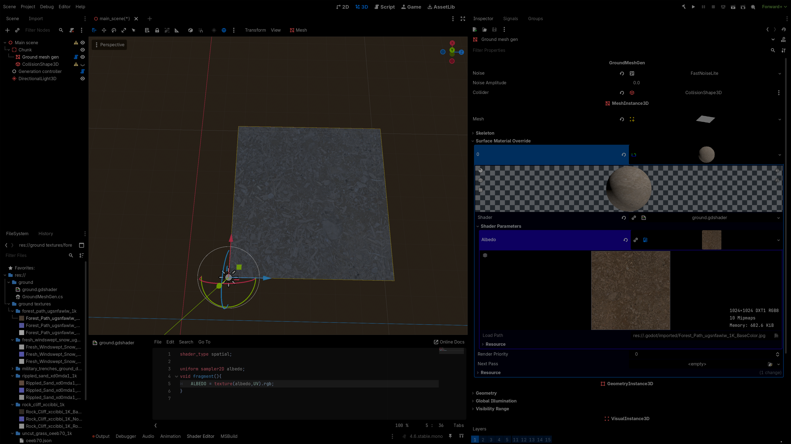
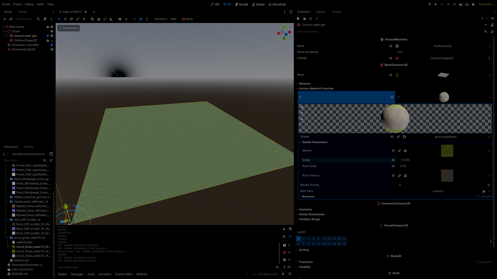

This chapter will explain each part of an AAA quality ground shader.

## Basic Setup

Shaders are programs executed on the GPU rather than the CPU. Their syntax and
structure are similar to conventional programming languages, so prior graphics
experience is helpful but not required. You can always use
[Godot's website](https://docs.godotengine.org/en/stable/tutorials/shaders/shader_reference/shading_language.html)
to lookup shader related data.

Each part of the shader will be introduced **incrementally**. The final result
is relatively **complex**, as terrain shaders must address multiple technical
challenges such as texture repetition, biome blending, and surface detail
variation.

Begin by creating a `.gdshader` file and inserting the following code:

```gdshader
//ground.gdshader

shader_type spatial;

uniform sampler2D albedo;
void fragment(){
	ALBEDO = texture(albedo,UV).rgb;
}
```

This code will just apply the `albedo` texture across the whole mesh. To use
this shader you need to:

1. Open the mesh instance of your **terrain mesh** in the Godot editor.
2. Assign **shader material** to the **surface material override**.
3. Place the created shader inside of the shader material and fill the `albedo`
   texture with a test texture of your choice.



## Triplanar Sampling

If multiple terrain chunks are placed next to each other, visible seams may
appear between them. This occurs because the current implementation relies on UV
coordinates for texture sampling. Since each chunk has its own UV space, the
texture mapping **doesn't align seamlessly across chunk boundaries**.

A common solution to this problem is to sample textures using **world-space**
position instead of **UV** coordinates. This technique ensures consistent
texture placement across chunk borders and eliminates visible seams.

```diff lang="gdshader"
//ground.gdshader
shader_type spatial;

uniform sampler2D albedo;
+uniform float scale;
void fragment(){
+	vec3 world_pos = (INV_VIEW_MATRIX * vec4(VERTEX, 1.0)).xyz;
-   ALBEDO = texture(albedo,UV).rgb;
+	ALBEDO = texture(albedo,world_pos.xz * scale).rgb;
}
```

The previous approach resolves the seam issue, but **introduces another
problem**. When the terrain is rotated or when steep slopes are present,
textures appear stretched. This happens because the texture is sampled using
only the X and Z coordinates, **ignoring the Y axis**.

To address this, a technique called **triplanar sampling** is used. Triplanar
sampling projects textures along the X, Y, and Z axes and blends them based on
the surface normal. This prevents texture stretching on steep slopes. An
additional benefit is that different textures (for example, rock vs grass) can
be applied depending on the terrain slope.

Triplanar sampling implementation:

```gdshader
uniform float rock_scale;
uniform sampler2D rock_texture;
vec3 triplanar (vec3 position, float biome_scale,vec3 normal, sampler2D biome_texture){
	vec3 weights = normal / (normal.x + normal.y + normal.z) * 3.0;


	vec2 uv_x = position.zy;
	vec2 uv_y = position.xz;
	vec2 uv_z = position.xy;

	vec3 output = vec3(0,0,0);
	if (weights.x > 0.01){
		output +=  texture(rock_texture, uv_x * rock_scale).rgb * weights.x;
	}
	if (weights.y > 0.01){
		output +=  texture(biome_texture, uv_y * biome_scale).rgb * weights.y;
	}
	if (weights.z > 0.01){
		output +=  texture(rock_texture, uv_z * rock_scale).rgb * weights.z;
	}

	return output;
}
```

This implementation uses the surface normal to determine blending weights for
each texture projection. Surfaces that face upward receive more weight from the
ground texture, while steep surfaces receive more weight from the rock texture.

To compute the normal vector at a given point, the following code can be used:

```gdshader
vec3 world_normal = normalize((INV_VIEW_MATRIX * vec4(NORMAL, 0.0)).xyz);
```

Combining those functions:

```diff lang="gdshader"
//ground.gdshader
shader_type spatial;

uniform sampler2D albedo;
uniform float scale;

+uniform float rock_scale;
+uniform sampler2D rock_texture;
+vec3 triplanar (vec3 position, float biome_scale,vec3 normal, sampler2D biome_texture){
+	vec3 weights = adjusted_normal / (adjusted_normal.x + adjusted_normal.y + adjusted_normal.z) * 3.0;
+
+	vec2 uv_x = position.zy;
+	vec2 uv_y = position.xz;
+	vec2 uv_z = position.xy;
+
+	vec3 output = vec3(0,0,0);
+	if (weights.x > 0.01){
+		output +=  texture(rock_texture, uv_x * rock_scale).rgb * weights.x;
+	}
+	if (weights.y > 0.01){
+		output +=  texture(biome_texture, uv_y * biome_scale).rgb * weights.y;
+	}
+	if (weights.z > 0.01){
+		output +=  texture(rock_texture, uv_x * rock_scale).rgb * weights.z;
+	}
+
+	return output;
+}


void fragment(){
	vec3 world_pos = (INV_VIEW_MATRIX * vec4(VERTEX, 1.0)).xyz;
+	vec3 world_normal = normalize((INV_VIEW_MATRIX * vec4(NORMAL, 0.0)).xyz);


-	ALBEDO = texture(albedo,world_pos.xz * scale).rgb;
+	ALBEDO = triplanar(world_pos, scale, world_normal, albedo);
}
```

After applying triplanar mapping, texture stretching should no longer be
visible. However, another issue becomes apparent: the transition between rock
and grass textures can appear overly smooth, producing a blurred blend that
looks awful.

This can be improved by sharpening the blending curve:

```diff lang="gdshader"
//ground.gdshader
void fragment(){
	vec3 world_pos = (INV_VIEW_MATRIX * vec4(VERTEX, 1.0)).xyz;
	vec3 world_normal = normalize((INV_VIEW_MATRIX * vec4(NORMAL, 0.0)).xyz);
+	vec3 adjusted_normal = pow(abs(world_normal), vec3(8.0));

-	ALBEDO = triplanar(world_pos, scale, world_normal, albedo);
+	ALBEDO = triplanar(world_pos, scale, adjusted_normal, albedo);
}
```



## Fixing Main Issues with the Current Implementation

The current implementation looks fine, but it lacks features that would elevate
it on the AAA quality:

- Normal and roughness textures support.
- Fix texture repetition visible at large scale.
- Support for more than one biome.

### Fixing Texture Repetition

A strong approach for reducing visible tiling artifacts is stochastic sampling.
This technique introduces controlled randomness into texture sampling, breaking
up repetitive patterns while preserving continuity. A full explanation is
outside the scope of this tutorial, but the following resources provide detailed
coverage:

- [Stochastic sample explanation](https://www.youtube.com/watch?v=yV4-MopMuMo)
- [Paper about stochastic sampling](https://eheitzresearch.wordpress.com/722-2/)

Implementing stochastic sampling from scratch typically requires significant
experimentation. Fortunately,
[a high-quality Godot implementation](https://github.com/acegiak/Godot4TerrainShader/tree/main?tab=readme-ov-file)
is available. To give credit where it's due, this implementation is based on a
[Unity adaptation](https://pastebin.com/sDrnzYxB). That implementation in turn
is based on [this paper](https://eheitzresearch.wordpress.com/722-2/).

```gdshader
//ground.gdshader
vec2 hash( vec2 p )
{
	return fract( sin( p * mat2( vec2( 127.1, 311.7 ), vec2( 269.5, 183.3 ) ) ) * 43758.5453 );
}
vec3  stochastic_sample(sampler2D albedo_texture, vec2 uv){
	vec2 skewV = mat2(vec2(1.0,1.0),vec2(-0.57735027 , 1.15470054))*uv * 3.464;

	vec2 vxID = floor(skewV);
	vec2 fracV = fract(skewV);
	vec3 barry = vec3(fracV.x,fracV.y,1.0-fracV.x-fracV.y);

	mat4 bw_vx = barry.z>0.0?
		mat4(vec4(vxID,0.0,0.0),vec4((vxID+vec2(0.0,1.0)),0.0,0.0),vec4(vxID+vec2(1.0,0.0),0,0),vec4(barry.zyx,0)):
		mat4(vec4(vxID+vec2(1.0,1.0),0.0,0.0),vec4((vxID+vec2(1.0,0.0)),0.0,0.0),vec4(vxID+vec2(0.0,1.0),0,0),vec4(-barry.z,1.0-barry.y,1.0-barry.x,0));

	vec2 ddx = dFdx(uv);
	vec2 ddy = dFdy(uv);


	vec2 uv_x = uv+hash(bw_vx[0].xy);
	vec2 uv_y = uv+hash(bw_vx[1].xy);
	vec2 uv_z = uv+hash(bw_vx[2].xy);

	return (textureGrad(albedo_texture,uv_x,ddx,ddy)*bw_vx[3].x) +
	(textureGrad(albedo_texture,uv_y,ddx,ddy)*bw_vx[3].y) +
	(textureGrad(albedo_texture,uv_z,ddx,ddy)*bw_vx[3].z);
}
```

This code can be use now in our code to replace the standard texture sample.

```diff lang="gdshader"
//ground.gdshader
...
+ vec2 hash( vec2 p )
+ {
+ 	return fract( sin( p * mat2( vec2( 127.1, 311.7 ), vec2( 269.5, 183.3 ) ) ) * 43758.5453 );
+ }
+ vec3  stochastic_sample(sampler2D albedo_texture, vec2 uv){
+ 	vec2 skewV = mat2(vec2(1.0,1.0),vec2(-0.57735027 , 1.15470054))*uv * 3.464;
+ 
+ 	vec2 vxID = floor(skewV);
+ 	vec2 fracV = fract(skewV);
+ 	vec3 barry = vec3(fracV.x,fracV.y,1.0-fracV.x-fracV.y);
+ 
+ 	mat4 bw_vx = barry.z>0.0?
+ 		mat4(vec4(vxID,0.0,0.0),vec4((vxID+vec2(0.0,1.0)),0.0,0.0),vec4(vxID+vec2(1.0,0.0),0,0),vec4(barry.zyx,0)):
+ 		mat4(vec4(vxID+vec2(1.0,1.0),0.0,0.0),vec4((vxID+vec2(1.0,0.0)),0.0,0.0),vec4(vxID+vec2(0.0,1.0),0,0),vec4(-barry.z,1.0-barry.y,1.0-barry.x,0));
+ 
+ 	vec2 ddx = dFdx(uv);
+ 	vec2 ddy = dFdy(uv);
+ 
+ 
+ 	vec2 uv_x = uv+hash(bw_vx[0].xy);
+ 	vec2 uv_y = uv+hash(bw_vx[1].xy);
+ 	vec2 uv_z = uv+hash(bw_vx[2].xy);
+ 
+ 	return (textureGrad(albedo_texture,uv_x,ddx,ddy)*bw_vx[3].x) +
+ 	(textureGrad(albedo_texture,uv_y,ddx,ddy)*bw_vx[3].y) +
+ 	(textureGrad(albedo_texture,uv_z,ddx,ddy)*bw_vx[3].z);
+ }

vec3 triplanar (vec3 position, float biome_scale,vec3 normal, sampler2D biome_texture){
	vec3 weights = normal / (normal.x + normal.y + normal.z) * 3.0;

	vec2 uv_x = position.zy;
	vec2 uv_y = position.xz;
	vec2 uv_z = position.xy;

	vec3 output = vec3(0,0,0);
	if (weights.x > 0.01){
-		output +=  texture(rock_texture, uv_x * rock_scale).rgb * weights.x;
+       output += stochastic_sample(rock_texture, uv_x * rock_scale).rgb * weights.x;
	}
	if (weights.y > 0.01){
-		output +=  texture(biome_texture, uv_y * biome_scale).rgb * weights.y;
+       output += stochastic_sample(biome_texture, uv_y * biome_scale).rgb * weights.y;
	}
	if (weights.z > 0.01){
-		output +=  texture(rock_texture, uv_z * rock_scale).rgb * weights.z;
+       output += stochastic_sample(rock_texture, uv_z * rock_scale).rgb * weights.z;
	}

	return output;
}
```

### Support for Normal and Roughness Textures

First, a data structure that will store all the needed data.

```gdshader
struct NormalAlbedoRoughness{
	vec3 normal;
	vec3 albedo;
	vec3 roughness;
};
```

Next, some of the functions that we've implemented before need to be changed a
bit.

```diff lang="gdshader"
- vec3  stochastic_sample(sampler2D albedo_texture, vec2 uv){
+ NormalAlbedoRoughness triple_stochastic_sample(sampler2D normal_texture,sampler2D albedo_texture,sampler2D roughness_texture, vec2 uv){
	vec2 skewV = mat2(vec2(1.0,1.0),vec2(-0.57735027 , 1.15470054))*uv * 3.464;

	vec2 vxID = floor(skewV);
	vec2 fracV = fract(skewV);
	vec3 barry = vec3(fracV.x,fracV.y,1.0-fracV.x-fracV.y);

	mat4 bw_vx = barry.z>0.0?
		mat4(vec4(vxID,0.0,0.0),vec4((vxID+vec2(0.0,1.0)),0.0,0.0),vec4(vxID+vec2(1.0,0.0),0,0),vec4(barry.zyx,0)):
		mat4(vec4(vxID+vec2(1.0,1.0),0.0,0.0),vec4((vxID+vec2(1.0,0.0)),0.0,0.0),vec4(vxID+vec2(0.0,1.0),0,0),vec4(-barry.z,1.0-barry.y,1.0-barry.x,0));

	vec2 ddx = dFdx(uv);
	vec2 ddy = dFdy(uv);


	vec2 uv_x = uv+hash(bw_vx[0].xy);
	vec2 uv_y = uv+hash(bw_vx[1].xy);
	vec2 uv_z = uv+hash(bw_vx[2].xy);

- 	return (textureGrad(albedo_texture,uv_x,ddx,ddy)*bw_vx[3].x) +
- 	(textureGrad(albedo_texture,uv_y,ddx,ddy)*bw_vx[3].y) +
- 	(textureGrad(albedo_texture,uv_z,ddx,ddy)*bw_vx[3].z);

+	vec4 normal = (textureGrad(normal_texture,uv_x,ddx,ddy)*bw_vx[3].x) +
+	(textureGrad(normal_texture,uv_y,ddx,ddy)*bw_vx[3].y) +
+	(textureGrad(normal_texture,uv_z,ddx,ddy)*bw_vx[3].z);
+
+	vec4 albedo = (textureGrad(albedo_texture,uv_x,ddx,ddy)*bw_vx[3].x) +
+	(textureGrad(albedo_texture,uv_y,ddx,ddy)*bw_vx[3].y) +
+	(textureGrad(albedo_texture,uv_z,ddx,ddy)*bw_vx[3].z);
+
+	vec4 roughness = (textureGrad(roughness_texture,uv_x,ddx,ddy)*bw_vx[3].x) +
+	(textureGrad(roughness_texture,uv_y,ddx,ddy)*bw_vx[3].y) +
+	(textureGrad(roughness_texture,uv_z,ddx,ddy)*bw_vx[3].z);
+
+	return NormalAlbedoRoughness(normal.xyz,albedo.xyz,roughness.xyz);

}
```

```diff lag="gdshader"
+uniform sampler2D rock_texture;
+uniform sampler2D rock_normal_map;
+uniform sampler2D rock_roughness;
-vec3 triplanar (vec3 position, float biome_scale,vec3 normal, sampler2D biome_texture){
+NormalAlbedoRoughness triple_stochastic_triplanar (vec3 position, vec3 worldNormal, vec3 adjusted_normal,vec3 biome_tint,
+	float biome_color_offset, float biome_scale,
+	sampler2D biome_normal_map, sampler2D biome_texture, sampler2D biome_roughness){
	vec3 weights = adjusted_normal / (adjusted_normal.x + adjusted_normal.y + adjusted_normal.z) * 3.0;

	vec2 uv_x = position.zy;
	vec2 uv_y = position.xz;
	vec2 uv_z = position.xy;

- vec3 output = vec3(0,0,0);
+	NormalAlbedoRoughness output = NormalAlbedoRoughness(vec3(0), vec3(0), vec3(0));
+	NormalAlbedoRoughness partial;
	if (weights.x > 0.01){

-      output += stochastic_sample(rock_texture, uv_x * rock_scale).rgb * weights.x;
+		partial = triple_stochastic_sample(rock_normal_map, rock_texture, rock_roughness, uv_x * rock_scale);
+		output.normal += partial.normal * weights.x;
+		output.albedo += partial.albedo * rock_saturation * weights.x;
+		output.roughness += partial.roughness * weights.x;
	}
	if (weights.y > 0.01){
-       output += stochastic_sample(biome_texture, uv_y * biome_scale).rgb * weights.y;
+		partial = triple_stochastic_sample(biome_normal_map, biome_texture, biome_roughness, uv_y * biome_scale);
+		output.normal += partial.normal * weights.y;
+		output.albedo += (partial.albedo + biome_tint - vec3(biome_color_offset))* weights.y  ;
+		output.roughness += partial.roughness * weights.y;
	}
	if (weights.z > 0.01){
-       output += stochastic_sample(rock_texture, uv_z * rock_scale).rgb * weights.z;
+		partial = triple_stochastic_sample(rock_normal_map, rock_texture, rock_roughness, uv_z * rock_scale);
+		output.normal += partial.normal * weights.z;
+		output.albedo += partial.albedo * rock_saturation * weights.z;
+		output.roughness += partial.roughness * weights.z;
	}

	return output;
}
```

### Types of Biome Generation

One of the main goals of this project is to implement a system capable of
generating multiple biomes with distinct properties (for example, different
ground textures).

There are many approaches to biome generation, but two of the most common are:

- Selecting a biome based solely on terrain height.
- Generating biomes using multiple parameters that vary across the map, and in
  turn result in more natural biome generation.

Height-based biome generation is simple and widely used. However, using multiple
terrain parameters provides greater flexibility and results in more realistic
terrain. Since many tutorials already cover height-based biome generation (for
example this
[tutorial series](https://www.youtube.com/watch?v=wbpMiKiSKm8&list=PLFt_AvWsXl0eBW2EiBtl_sxmDtSgZBxB3)
), this guide focuses on the more flexible approach.

In this tutorial, biome distribution will be generated using several terrain
characteristics (such as height, slope, or noise-based parameters like
moisture). These biome weights will then influence both terrain appearance and
object placement. Implementation details will be explained in later sections.

### Support for Multiple Biomes

Because of the selected biome generation implementation, the shader needs access
to biome weight information. This is achieved by encoding biome weights into
textures.

Each terrain chunk will have an associated biome texture. Each color channel
stores the influence of a specific biome. The value of each channel represents
the blending weight of that biome at a given position.

Since one texture provides four channels (RGBA), multiple textures may be
required when supporting many biomes. For example:

- 4 biomes → 1 texture
- 8 biomes → 2 textures

In this tutorial, we assume 8 biomes, which requires 2 biome textures per
terrain chunk.

This approach is straightforward to implement, memory-efficient, and integrates
well with shader-based texture blending, but it may not scale well with large
amounts of biome types.

With the biome data representation defined, we can now proceed with implementing
the shader.

#### Storing the Biome's Ground Textures

Each biome needs its own textures and processing value. Sadly `gdshader` doesn't
have dynamic arrays.

```gdshader
const int BIOMES_COUNT = 8;
uniform vec3[BIOMES_COUNT] biome_texture_tints;
uniform float[BIOMES_COUNT] biome_texture_color_offsets;
uniform float[BIOMES_COUNT] biome_texture_scales;
uniform sampler2D[BIOMES_COUNT] biome_albedo_textures;
uniform sampler2D[BIOMES_COUNT] biome_normal_textures;
uniform sampler2D[BIOMES_COUNT] biome_roughness_textures;
```

#### Using the Biome Data

Function that will take the biome's influence and sample the needed textures
needs to be implemented. It will add to the output multiplied by the influence
of that biome.

```gdshader
void handle_biome(int biome, float influence, vec3 position, vec3 worldNormal, vec3 adjusted_normal,
	inout vec3 output_color, inout vec3 output_normal, inout vec3 output_roughness){
	if (influence < 0.01){
		return ;
	}

	NormalAlbedoRoughness output = triple_stochastic_triplanar(position, worldNormal, adjusted_normal,
		biome_texture_tints[biome], biome_texture_color_offsets[biome], biome_texture_scales[biome],
		biome_normal_textures[biome], biome_albedo_textures[biome], biome_roughness_textures[biome]);

	output_color += (output.albedo + texture_tint[biome] - vec3(1) * texture_color_offset[biome]) * influence;
	output_normal += output.normal * influence;
	output_roughness += output.roughness * influence;
}
```

Next a `collect_biome_data` will collect data from `handle_biome` function
applied for each of the biome.

```gdshader
NormalAlbedoRoughness collect_biome_data(vec4 biome_data_1, vec4 biome_data_2,vec3 world_pos, vec3 world_normal, vec3 adjusted_normal){
	vec3 output_color = vec3(0, 0, 0);
	vec3 output_normal = vec3(0, 0, 0);
	vec3 output_roughness = vec3(0, 0, 0);

	handle_biome(0, biome_data_1.r, world_pos, world_normal, adjusted_normal, output_color, output_normal, output_roughness);
	handle_biome(1, biome_data_1.g, world_pos, world_normal, adjusted_normal, output_color, output_normal, output_roughness);
	handle_biome(2, biome_data_1.b, world_pos, world_normal, adjusted_normal, output_color, output_normal, output_roughness);
	handle_biome(3, biome_data_1.a, world_pos, world_normal, adjusted_normal, output_color, output_normal, output_roughness);
	handle_biome(4, biome_data_2.r, world_pos, world_normal, adjusted_normal, output_color, output_normal, output_roughness);
	handle_biome(5, biome_data_2.g, world_pos, world_normal, adjusted_normal, output_color, output_normal, output_roughness);
	handle_biome(6, biome_data_2.b, world_pos, world_normal, adjusted_normal, output_color, output_normal, output_roughness);
	handle_biome(7, biome_data_2.a, world_pos, world_normal, adjusted_normal, output_color, output_normal, output_roughness);

	return NormalAlbedoRoughness(output_normal, output_color, output_roughness);
}
```

In the end the fragment function will need to sample data from its biome
textures using the `collect_biome_data` function with valid inputs.

```diff lang="gdshader"
+const int biome_textures_count = 517;
+instance uniform int biome_texture_index;
+// repeat is disabled, so that the data from one end of the chunk doesn't influence data from the other end of the chunk
+uniform sampler2D[biome_textures_count] biome_textures_1 : repeat_disable;
+uniform sampler2D[biome_textures_count] biome_textures_2 : repeat_disable;

void fragment(){
	vec3 world_pos = (INV_VIEW_MATRIX * vec4(VERTEX, 1.0)).xyz;
	vec3 world_normal = normalize((INV_VIEW_MATRIX * vec4(NORMAL, 0.0)).xyz);
	vec3 adjusted_normal = pow(abs(world_normal), vec3(8.0));

-	ALBEDO = triplanar(world_pos, scale, adjusted_normal, albedo);
+	vec4 biome_data_1 =texture(biome_textures_1[biome_texture_index],UV);
+	vec4 biome_data_2 =texture(biome_textures_2[biome_texture_index],UV);
+	NormalAlbedoRoughness output = collect_biome_data(biome_data_1, biome_data_2, world_pos, world_normal, adjusted_normal);
+	ALBEDO = output.albedo;
+	NORMAL_MAP = output.normal;
+	ROUGHNESS  = output.roughness.r;
}
```

Final Adjustments

To produce more realistic surface variation, a final layer of detail can be
added to the shader output. A noise texture can be used to introduce subtle
variation in the albedo, metallic, and specular values. This helps break up
uniform surfaces and improves visual realism.

Additionally, the final color can be adjusted using gain and color offset.

```diff lang="gdshader"
+uniform sampler2D post_processing_noise;
+uniform sampler2D post_processing_noise_scale;
+uniform float metallic;
+uniform float spectacular;
+uniform float global_brightness;
+uniform float global_saturation;
+uniform float post_processing_albedo_influence;

void fragment(){
	vec3 world_pos = (INV_VIEW_MATRIX * vec4(VERTEX, 1.0)).xyz;
	vec3 world_normal = normalize((INV_VIEW_MATRIX * vec4(NORMAL, 0.0)).xyz);
	vec3 adjusted_normal = pow(abs(world_normal), vec3(8.0));

	vec4 biome_data_1 =texture(biome_textures_1[biome_texture_index],UV);
	vec4 biome_data_2 =texture(biome_textures_2[biome_texture_index],UV);
	NormalAlbedoRoughness output = collect_biome_data(biome_data_1, biome_data_2, world_pos, world_normal, adjusted_normal);
	ALBEDO = output.albedo;
	NORMAL_MAP = output.normal;
	ROUGHNESS = output.roughness.r;

+	ALBEDO *= global_color_gain;
+	ALBEDO *= mix(1.0 - post_processing_albedo_influence, 1.0 + post_processing_albedo_influence, texture(post_processing_noise, world_pos.xz / 100.0 * post_processing_noise_scale).r);
+	ALBEDO -= vec3(1) * global_color_offset;
+   // added some offset so that I can use one noise and make the metallic and spectacular independent
+	METALLIC = texture(post_processing_noise, world_pos.xz / 100.0 * post_processing_noise_scale + vec2(1230,3210)).r * metallic;
+	SPECULAR = texture(post_processing_noise, world_pos.xz / 100.0 * post_processing_noise_scale + vec2(4560,6540)).r* spectacular;
}
```

## Final Result


<details>

```gdshader
shader_type spatial;

struct NormalAlbedoRoughness{
	vec3 normal;
	vec3 albedo;
	vec3 roughness;
};


//  Under the appache license https://github.com/acegiak/Godot4TerrainShader/tree/main?tab=Apache-2.0-1-ov-file#readme
// Taken from the https://github.com/acegiak/Godot4TerrainShader/blob/main/addons/terrain-shader/StochasticTexture.gdshader.
// Modified so that it works with multiple textures. '-'
vec2 hash( vec2 p )
{
	return fract( sin( p * mat2( vec2( 127.1, 311.7 ), vec2( 269.5, 183.3 ) ) ) * 43758.5453 );
}
// 3 birds with one stone
NormalAlbedoRoughness triple_stochastic_sample(sampler2D normal_texture,sampler2D albedo_texture,sampler2D roughness_texture, vec2 uv){
	vec2 skewV = mat2(vec2(1.0,1.0),vec2(-0.57735027 , 1.15470054))*uv * 3.464;

	vec2 vxID = floor(skewV);
	vec2 fracV = fract(skewV);
	vec3 barry = vec3(fracV.x,fracV.y,1.0-fracV.x-fracV.y);

	mat4 bw_vx = barry.z>0.0?
		mat4(vec4(vxID,0.0,0.0),vec4((vxID+vec2(0.0,1.0)),0.0,0.0),vec4(vxID+vec2(1.0,0.0),0,0),vec4(barry.zyx,0)):
		mat4(vec4(vxID+vec2(1.0,1.0),0.0,0.0),vec4((vxID+vec2(1.0,0.0)),0.0,0.0),vec4(vxID+vec2(0.0,1.0),0,0),vec4(-barry.z,1.0-barry.y,1.0-barry.x,0));

	vec2 ddx = dFdx(uv);
	vec2 ddy = dFdy(uv);


	vec2 uv_x = uv+hash(bw_vx[0].xy);
	vec2 uv_y = uv+hash(bw_vx[1].xy);
	vec2 uv_z = uv+hash(bw_vx[2].xy);

	vec4 normal = (textureGrad(normal_texture,uv_x,ddx,ddy)*bw_vx[3].x) +
	(textureGrad(normal_texture,uv_y,ddx,ddy)*bw_vx[3].y) +
	(textureGrad(normal_texture,uv_z,ddx,ddy)*bw_vx[3].z);

	vec4 albedo = (textureGrad(albedo_texture,uv_x,ddx,ddy)*bw_vx[3].x) +
	(textureGrad(albedo_texture,uv_y,ddx,ddy)*bw_vx[3].y) +
	(textureGrad(albedo_texture,uv_z,ddx,ddy)*bw_vx[3].z);

	vec4 roughness = (textureGrad(roughness_texture,uv_x,ddx,ddy)*bw_vx[3].x) +
	(textureGrad(roughness_texture,uv_y,ddx,ddy)*bw_vx[3].y) +
	(textureGrad(roughness_texture,uv_z,ddx,ddy)*bw_vx[3].z);

	return NormalAlbedoRoughness(normal.xyz,albedo.xyz,roughness.xyz);

}
// Rest is written by me, *FR*.


const int BIOMES_COUNT = 8;

uniform float global_color_gain;
uniform float global_color_offset;

uniform float rock_saturation;
uniform float rock_scale;
uniform sampler2D rock_texture;
uniform sampler2D rock_normal_map;
uniform sampler2D rock_roughness;

//WARN: this value HAS TO BE THE SAME as the one in the TerrianGen.cs !!!
const int biome_textures_count = 517;
instance uniform int biome_texture_index;
// repeat is disabled, so that the data from one end of the chunk doesn't influence data form the other end of the chunk
uniform sampler2D[biome_textures_count] biome_textures_1 : repeat_disable;
uniform sampler2D[biome_textures_count] biome_textures_2 : repeat_disable;

uniform vec3[BIOMES_COUNT] biome_texture_tints;
uniform float[BIOMES_COUNT] biome_texture_color_offsets;
uniform float[BIOMES_COUNT] biome_texture_scales;
uniform sampler2D[BIOMES_COUNT] biome_albedo_textures;
uniform sampler2D[BIOMES_COUNT] biome_normal_textures;
uniform sampler2D[BIOMES_COUNT] biome_roughness_textures;

uniform int biome_texture_resolution;

uniform sampler2D post_processing_noise;
uniform float post_processing_noise_scale;
uniform float metallic;
uniform float post_processing_albedo_influence;
uniform float spectacular;


NormalAlbedoRoughness triple_stochastic_triplanar (vec3 position, vec3 worldNormal, vec3 adjusted_normal,vec3 biome_tint,
	float biome_color_offset, float biome_scale,
	sampler2D biome_normal_map, sampler2D biome_texture, sampler2D biome_roughness){
	vec3 weights = adjusted_normal / (adjusted_normal.x + adjusted_normal.y + adjusted_normal.z) * 3.0;

	vec2 uv_x = position.zy;
	vec2 uv_y = position.xz;
	vec2 uv_z = position.xy;

	NormalAlbedoRoughness output = NormalAlbedoRoughness(vec3(0), vec3(0), vec3(0));
	NormalAlbedoRoughness partial;
	if (weights.x > 0.01){
		partial = triple_stochastic_sample(rock_normal_map, rock_texture, rock_roughness, uv_x * rock_scale);
		output.normal += partial.normal * weights.x;
		output.albedo += partial.albedo * rock_saturation * weights.x;
		output.roughness += partial.roughness * weights.x;
	}
	if (weights.y > 0.01){
		partial = triple_stochastic_sample(biome_normal_map, biome_texture, biome_roughness, uv_y * biome_scale);
		output.normal += partial.normal * weights.y;
		output.albedo += partial.albedo * weights.y + biome_tint - vec3(biome_color_offset);
		output.roughness += partial.roughness * weights.y;
	}
	if (weights.z > 0.01){
		partial = triple_stochastic_sample(rock_normal_map, rock_texture, rock_roughness, uv_z * rock_scale);
		output.normal += partial.normal * weights.z;
		output.albedo += partial.albedo * rock_saturation * weights.z;
		output.roughness += partial.roughness * weights.z;
	}

	return output;
}

void handle_biome(int biome, float influence, vec3 position, vec3 worldNormal, vec3 adjusted_normal,
	inout vec3 output_color, inout vec3 output_normal, inout vec3 output_roughness){
	if (influence < 0.01){
		return ;
	}

	NormalAlbedoRoughness output = triple_stochastic_triplanar(position, worldNormal, adjusted_normal,
		biome_texture_tints[biome], biome_texture_color_offsets[biome], biome_texture_scales[biome],
		biome_normal_textures[biome], biome_albedo_textures[biome], biome_roughness_textures[biome]);

	output_color += (output.albedo) * influence;
	output_normal += output.normal * influence;
	output_roughness += output.roughness * influence;
}

NormalAlbedoRoughness collect_biome_data(vec4 biome_data_1, vec4 biome_data_2,vec3 world_pos, vec3 world_normal, vec3 adjusted_normal){
	vec3 output_color = vec3(0, 0, 0);
	vec3 output_normal = vec3(0, 0, 0);
	vec3 output_roughness = vec3(0, 0, 0);

	handle_biome(0, biome_data_1.r, world_pos, world_normal, adjusted_normal, output_color, output_normal, output_roughness);
	handle_biome(1, biome_data_1.g, world_pos, world_normal, adjusted_normal, output_color, output_normal, output_roughness);
	handle_biome(2, biome_data_1.b, world_pos, world_normal, adjusted_normal, output_color, output_normal, output_roughness);
	handle_biome(3, biome_data_1.a, world_pos, world_normal, adjusted_normal, output_color, output_normal, output_roughness);
	handle_biome(4, biome_data_2.r, world_pos, world_normal, adjusted_normal, output_color, output_normal, output_roughness);
	handle_biome(5, biome_data_2.g, world_pos, world_normal, adjusted_normal, output_color, output_normal, output_roughness);
	handle_biome(6, biome_data_2.b, world_pos, world_normal, adjusted_normal, output_color, output_normal, output_roughness);
	handle_biome(7, biome_data_2.a, world_pos, world_normal, adjusted_normal, output_color, output_normal, output_roughness);

	return NormalAlbedoRoughness(output_normal, output_color, output_roughness);
}

void fragment(){
	vec3 world_pos = (INV_VIEW_MATRIX * vec4(VERTEX, 1.0)).xyz;
	vec3 world_normal = normalize((INV_VIEW_MATRIX * vec4(NORMAL, 0.0)).xyz);
	vec3 adjusted_normal = pow(abs(world_normal), vec3(8.0));


	vec4 biome_data_1 =texture(biome_textures_1[biome_texture_index],UV);
	vec4 biome_data_2 =texture(biome_textures_2[biome_texture_index],UV);
	NormalAlbedoRoughness output = collect_biome_data(biome_data_1, biome_data_2, world_pos, world_normal, adjusted_normal);
	ALBEDO = output.albedo;
	NORMAL_MAP = output.normal;
	ROUGHNESS  = output.roughness.r;


	//apply processing

	ALBEDO *= global_color_gain;
	ALBEDO *= mix(1.0 - post_processing_albedo_influence, 1.0 + post_processing_albedo_influence, texture(post_processing_noise, world_pos.xz / 100.0 * post_processing_noise_scale).r);
	ALBEDO -= vec3(1) * global_color_offset;
	// added some offset so that I can use one noise and make the metallic and spectacular independent
	METALLIC = texture(post_processing_noise, world_pos.xz / 100.0 * post_processing_noise_scale + vec2(1230,3210)).r * metallic;
	SPECULAR = texture(post_processing_noise, world_pos.xz / 100.0 * post_processing_noise_scale + vec2(4560,6540)).r * spectacular;
}
```

</details>

---

#### Bugs

If you find anything to improve in this project's code, please create an issue
describing it on the
[GitHub repository for this project](https://github.com/FilipRuman/procedural_terrain_generationV2/issues).
For website-related issues, create an issue
[here](https://github.com/FilipRuman/pages/issues).

#### Support

All pages on this site are written by a human, and you can access everything for
free without ads. If you find this work valuable, please give a star to the
[GitHub repository for this project](https://github.com/FilipRuman/procedural_terrain_generationV2).

<script src="https://giscus.app/client.js"
        data-repo="FilipRuman/procedural_terrain_generationV2"
        data-repo-id="R_kgDOQlnCIA"
        data-category="Announcements"
        data-category-id="DIC_kwDOQlnCIM4C4CHB"
        data-mapping="specific"
        data-term="ground shader"
        data-strict="0"
        data-reactions-enabled="1"
        data-emit-metadata="0"
        data-input-position="top"
        data-theme="preferred_color_scheme"
        data-lang="en"
        data-loading="lazy"
        crossorigin="anonymous"
        async>
</script>

```
```
