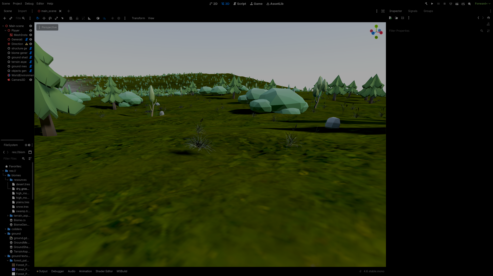

The terrain surface now looks good, but it lacks detail. To improve visual
richness, we need to generate small objects such as trees, grass, rocks, and
bushes. This section focuses on procedural generation of these objects.

## Object Definitions

We begin by defining a class that represents a spawnable object. This class
should be configurable in the editor and include:

- Mesh
- Collider
- Scale and rotation settings
- Spawn-related parameters

```cs
//TerrainObject.cs
using Godot;
[GlobalClass, Tool]
public partial class TerrainObject : Resource
{
        [Export] public PackedScene collision_shape;
        [Export] public Mesh mesh;
        [Export] public float mesh_y_offset;
        [Export] public float base_sale;
        [Export] public float scale_change_amplitude;
        [Export(PropertyHint.Range, "0,180,1")] public int rotation_amplitude;
        [Export(PropertyHint.Range, "0,1,0.01")] public float base_chance_to_spawn;
        [Export(PropertyHint.Range, "0,1,0.01")] public float max_slope;
}
```

Next, we define a data structure (`ObjectInstantiationData`) that stores all
information required to instantiate an object:

- Position
- Rotation
- Scale

This structure is used to transfer data from worker threads to the main thread.

```cs
//ObjectInstantiationData.cs
using Godot;

public struct ObjectInstantiationData(Vector3 pos, Vector3 rot, Vector3 scale, TerrainObject obj)
{
        public Vector3 pos = pos;
        public Vector3 rot = rot;
        public Vector3 scale = scale;
        public TerrainObject obj = obj;
}
```

## Generating Object Instance Data

### Biome-Based Object Generation Explanation

Object placement depends on biome data. Each biome has an associated
`BiomeObjectsGenData` class responsible for generating objects appropriate for
that biome.

For each position on the terrain:

- Compute biome influences
- Determine which objects can spawn
- Assign spawn probabilities based on biome weights

This ensures, for example, that cacti appear in deserts and not in snowy
regions.

```cs
//BiomeObjectsGenData.cs
[Export] FastNoiseLite rotation_noise;
[Export] FastNoiseLite scale_noise;
private ObjectInstantiationData GetInstantiationData(Vector3 world_pos, TerrainObject obj)
{
        world_pos -= Vector3.Up * obj.mesh_y_offset;
        var scale = obj.base_sale + scale_noise.GetNoise2D(world_pos.X, world_pos.Z) * obj.scale_change_amplitude;
        var rotation = GetRotation(new(world_pos.X, world_pos.Z), obj.rotation_amplitude);
        return new(world_pos, rotation, Vector3.One * scale, obj);
}

public Vector3 GetRotation(Vector2 pos, float rotation_amplitude)
{
        var x_noise_sample = pos;
        var y_noise_sample = pos + Vector2.One * 9172970;
        var z_noise_sample = pos + Vector2.One * 1520209;

        // side to side rotation- trees always grow at some angle
        var x_rot = rotation_amplitude * rotation_noise.GetNoise2D(x_noise_sample.X, x_noise_sample.Y);
        var z_rot = rotation_amplitude * rotation_noise.GetNoise2D(z_noise_sample.X, z_noise_sample.Y);
        // direction that the objects is facing
        var y_rot = 180 * rotation_noise.GetNoise2D(y_noise_sample.X, y_noise_sample.Y);

        return new(x_rot, y_rot, z_rot);
}
```

### Deterministic Generation

Terrain generation must be deterministic. For a given chunk position, the same
objects should always be generated.

To achieve this, the random number generator (RNG) is seeded using the chunk’s
position. A special static class will be defined to make it easier.

```cs
using Godot;
public static class RNG
{
        public static ulong seed_base;
        public static void SetGDRandomSeed(Vector2 pos)
        {
                GD.Seed(seed_base ^
                (ulong)Mathf.FloorToInt(pos.X) * 73856093UL ^
                (ulong)Mathf.FloorToInt(pos.Y) * 19349663UL);
        }
        public static void SetGDRandomSeed(Vector3 pos)
        {
                GD.Seed(seed_base ^
                (ulong)Mathf.FloorToInt(pos.Z) * 53876596UL ^
                (ulong)Mathf.FloorToInt(pos.X) * 73856093UL ^
                (ulong)Mathf.FloorToInt(pos.Y) * 19349663UL);
        }
}
```

### Object Variants and Distribution

Each object type (e.g., trees, rocks, grass) may have multiple variants. To
select between them, we combine:

- Noise-based distribution (for clustering)
- Pseudo-random variation (for diversity)

This produces natural-looking clusters without excessive repetition.

```cs
//BiomeObjectsGenData.cs
[Export] FastNoiseLite spawn_chance_noise;
private ObjectInstantiationData? GetObjectInstantiationDataForPosition(Vector3 world_pos, TerrainObject[] obj_array, TerrainAspectsSolver.TerrainAspects terrain_aspects)
{
        RNG.SetGDRandomSeed(world_pos);
        for (int i = 0; i < obj_array.Length; i++)
        {
                var obj = obj_array[i];

                if (terrain_aspects.slope > obj.max_slope)
                {
                        continue;
                }
                Vector2 random_offset = new(
                    i * 75487.76656f,
                    i * 56984.02931f
                );
                Vector2 noise_sampling_position = new Vector2(world_pos.X, world_pos.Z) + random_offset;
                float chance_to_spawn = obj.base_chance_to_spawn + spawn_chance_noise.GetNoise2D(noise_sampling_position.X, noise_sampling_position.Y);

                if (GD.Randf() > chance_to_spawn)
                {
                        continue;
                }
                return GetInstantiationData(world_pos, obj);
        }

        return null;
}
```

### Object Types

Objects are divided into categories such as:

- Trees
- Grass
- Rocks

This allows different generation strategies per type. For example:

- Trees: low density, require spacing
- Rocks and grass: high density, no spacing constraints

```cs
//BiomeObjectsGenData.cs
[Export] TerrainObject[] trees;
[Export] TerrainObject[] grass;
[Export] TerrainObject[] rocks;

public enum GetterType
{
        rock,
        grass,
        tree
}

public ObjectInstantiationData? GetObjectOfType(GetterType type, Vector3 world_pos, TerrainAspectsSolver.TerrainAspects terrain_aspects)
{
        TerrainObject[] array_of_obj = null;
        switch (type)
        {
                case GetterType.rock:
                        array_of_obj = rocks;
                        break;
                case GetterType.grass:
                        array_of_obj = grass;
                        break;
                case GetterType.tree:
                        array_of_obj = trees;
                        break;
        }
        return GetObjectInstantiationDataForPosition(world_pos, array_of_obj, terrain_aspects);
}
```

<details>
<summary> whole BiomeObjectsGenData.cs file </summary>

```cs
//BiomeObjectsGenData.cs
using Godot;
[Tool, GlobalClass]
public partial class BiomeObjectsGenData : Resource
{
        [Export] TerrainObject[] trees;
        [Export] TerrainObject[] grass;
        [Export] TerrainObject[] rocks;
        [Export] FastNoiseLite rotation_noise;
        [Export] FastNoiseLite scale_noise;
        [Export] FastNoiseLite spawn_chance_noise;

        public enum GetterType
        {
                rock,
                grass,
                tree
        }

        public ObjectInstantiationData? GetObjectOfType(GetterType type, Vector3 world_pos, TerrainAspectsSolver.TerrainAspects terrain_aspects)
        {
                TerrainObject[] array_of_obj = null;
                switch (type)
                {
                        case GetterType.rock:
                                array_of_obj = rocks;
                                break;
                        case GetterType.grass:
                                array_of_obj = grass;
                                break;
                        case GetterType.tree:
                                array_of_obj = trees;
                                break;
                }
                return GetObjectInstantiationDataForPosition(world_pos, array_of_obj, terrain_aspects);
        }

        private ObjectInstantiationData? GetObjectInstantiationDataForPosition(Vector3 world_pos, TerrainObject[] obj_array, TerrainAspectsSolver.TerrainAspects terrain_aspects)
        {
                RNG.SetGDRandomSeed(world_pos);
                for (int i = 0; i < obj_array.Length; i++)
                {
                        var obj = obj_array[i];

                        if (terrain_aspects.slope > obj.max_slope)
                        {
                                continue;
                        }
                        Vector2 random_offset = new(
                            i * 75487.76656f,
                            i * 56984.02931f
                        );
                        Vector2 noise_sampling_position = new Vector2(world_pos.X, world_pos.Z) + random_offset;
                        float chance_to_spawn = obj.base_chance_to_spawn + spawn_chance_noise.GetNoise2D(noise_sampling_position.X, noise_sampling_position.Y);

                        if (GD.Randf() > chance_to_spawn)
                        {
                                continue;
                        }
                        return GetInstantiationData(world_pos, obj);
                }

                return null;
        }
        private ObjectInstantiationData GetInstantiationData(Vector3 world_pos, TerrainObject obj)
        {
                world_pos -= Vector3.Up * obj.mesh_y_offset;
                var scale = obj.base_sale + scale_noise.GetNoise2D(world_pos.X, world_pos.Z) * obj.scale_change_amplitude;
                var rotation = GetRotation(new(world_pos.X, world_pos.Z), obj.rotation_amplitude);
                return new(world_pos, rotation, Vector3.One * scale, obj);
        }

        public Vector3 GetRotation(Vector2 pos, float rotation_amplitude)
        {
                var x_noise_sample = pos;
                var y_noise_sample = pos + Vector2.One * 9172970;
                var z_noise_sample = pos + Vector2.One * 1520209;

                // side to side rotation- trees always grow at some angle
                var x_rot = rotation_amplitude * rotation_noise.GetNoise2D(x_noise_sample.X, x_noise_sample.Y);
                var z_rot = rotation_amplitude * rotation_noise.GetNoise2D(z_noise_sample.X, z_noise_sample.Y);
                // direction that the objects is facing
                var y_rot = 180 * rotation_noise.GetNoise2D(y_noise_sample.X, y_noise_sample.Y);

                return new(x_rot, y_rot, z_rot);
        }

}
```

</details>

We need to assign a separate `BiomeObjectsGenData` for each of the biomes.

```diff lang="cs"
using Godot;
[Tool, GlobalClass]
public partial class Biome : Resource
{
        public byte index_in_biomes_array;
+       [Export] public BiomeObjectsGenData objects_data;

        [ExportGroup("Preferred terrain aspects")]
        [Export] public FloatRange preferred_moisture;
        [Export] public FloatRange preferred_elevation;
        [Export] public FloatRange preferred_temperature;

        [ExportGroup("Ground texture")]
        [Export] public Texture albedo;
        [Export] public Texture normal;
        [Export] public Texture roughness;
        [Export(PropertyHint.ColorNoAlpha)] public Color tint;
        [Export] public float color_offset;
        [Export] public float scale;
}
```

## Instantiating Objects

## Efficient Rendering with MultiMesh

For rendering, we use
[MultiMeshInstance3D](https://docs.godotengine.org/en/stable/tutorials/3d/using_multi_mesh_instance.html#setting-up-the-nodes),
which allows efficient instancing of many identical meshes.

Instance data is stored in an `ObjectTypeSpawnData` structure, which contains:

- Mesh reference
- Transform data for all instances

Transforms must be packed into a float array in the format required by
`MultiMesh`.

### Collider Data

In addition to rendering, objects may require colliders. Therefore,
`ObjectTypeSpawnData` also stores:

- Positions
- Scales

These are used to instantiate collision nodes separately.

```cs
// ObjectsGenerator.cs
public class ObjectTypeSpawnData
{
        public int instance_count;
        public Mesh mesh;
        public float[] instance_transforms;
        public PackedScene collision_shape;
        public Vector4[] colliders_pos_scale;
}

private static void SpawnObjectType(ObjectTypeSpawnData spawn_data, Node3D parent_for_objects)
{
        var mesh_instance = new MultiMeshInstance3D();
        parent_for_objects.AddChild(mesh_instance);

        mesh_instance.Multimesh = new()
        {
                Mesh = spawn_data.mesh,
                TransformFormat = MultiMesh.TransformFormatEnum.Transform3D,
                InstanceCount = spawn_data.instance_count,
                Buffer = spawn_data.instance_transforms
        };

        if (spawn_data.collision_shape == null)
                return;

        foreach (var collider_data in spawn_data.colliders_pos_scale)
        {
                var pos = new Vector3(collider_data.X, collider_data.Y, collider_data.Z);
                var scale = collider_data.W;

                var collision_node = (Node3D)spawn_data.collision_shape.Instantiate();
                collision_node.Scale = Vector3.One * scale;
                collision_node.Position = pos;
                parent_for_objects.AddChild(collision_node);
        }

}
```

`ObjectInstantiationData` must be converted into the format required by
`MultiMesh`.

This involves:

- Constructing a Basis (rotation + scale)
- Flattening the resulting transform, combined with position, into a float array

```cs
// ObjectsGenerator.cs

const int FloatsPerPackedTransform = 12;
Basis basis = new(Quaternion.FromEuler(object_data.rot * Mathf.DegToRad(1.0f)));
basis = basis.Scaled(object_data.scale);

var base_index = i * FloatsPerPackedTransform;

instance_transforms[base_index] = basis.X.X;
instance_transforms[base_index + 1] = basis.Y.X;
instance_transforms[base_index + 2] = basis.Z.X;
instance_transforms[base_index + 3] = object_data.pos.X;

instance_transforms[base_index + 4] = basis.X.Y;
instance_transforms[base_index + 5] = basis.Y.Y;
instance_transforms[base_index + 6] = basis.Z.Y;
instance_transforms[base_index + 7] = object_data.pos.Y;

instance_transforms[base_index + 8] = basis.X.Z;
instance_transforms[base_index + 9] = basis.Y.Z;
instance_transforms[base_index + 10] = basis.Z.Z;
instance_transforms[base_index + 11] = object_data.pos.Z;
```

We need to do this for each of the object instances and setup data for
colliders.

```cs
// ObjectsGenerator.cs
public class ObjectTypeSpawnData
{
        public int instance_count;
        public Mesh mesh;
        public float[] instance_transforms;
        public PackedScene collision_shape;
        public Vector4[] colliders_pos_scale;
        public ObjectTypeSpawnData(Mesh mesh, PackedScene collision_shape, List<ObjectInstantiationData> object_instances)
        {
                this.mesh = mesh;
                this.collision_shape = collision_shape;

                const int FloatsPerPackedTransform = 12;
                instance_count = object_instances.Count;
                instance_transforms = new float[object_instances.Count * FloatsPerPackedTransform];
                colliders_pos_scale = new Vector4[object_instances.Count];
                for (int i = 0; i < object_instances.Count; i++)
                {
                        var object_data = object_instances[i];
                        colliders_pos_scale[i] = new Vector4(object_data.pos.X, object_data.pos.Y, object_data.pos.Z, object_data.scale.X);
                        Basis basis = new(Quaternion.FromEuler(object_data.rot * Mathf.DegToRad(1.0f)));
                        basis = basis.Scaled(object_data.scale);

                        var base_index = i * FloatsPerPackedTransform;

                        instance_transforms[base_index] = basis.X.X;
                        instance_transforms[base_index + 1] = basis.Y.X;
                        instance_transforms[base_index + 2] = basis.Z.X;
                        instance_transforms[base_index + 3] = object_data.pos.X;

                        instance_transforms[base_index + 4] = basis.X.Y;
                        instance_transforms[base_index + 5] = basis.Y.Y;
                        instance_transforms[base_index + 6] = basis.Z.Y;
                        instance_transforms[base_index + 7] = object_data.pos.Y;

                        instance_transforms[base_index + 8] = basis.X.Z;
                        instance_transforms[base_index + 9] = basis.Y.Z;
                        instance_transforms[base_index + 10] = basis.Z.Z;
                        instance_transforms[base_index + 11] = object_data.pos.Z;
                }
        }

}
```

## Object Generation Process

To generate objects within a chunk:

- Sample random positions within the chunk
- Compute terrain height and biome influences
- Evaluate spawn probability
- Generate `ObjectInstantiationData`
- Group results by object type

The results are stored in a dictionary mapping object types to their instances.
This allows us to easily spawn multiple instances of a single object type under
one `MultiMeshInstance3D`.

### Objects Without Spacing

For objects such as grass and rocks, spacing constraints are unnecessary.

The `GenerateObjectsWithoutSpacing` function:

- Samples positions at random.
- Generates instances based on probability
- Groups them into `ObjectTypeSpawnData`

```cs
// ObjectsGenerator.cs
public void GenerateObjectsWithoutSpacing(BiomeObjectsGenData.GetterType object_type, int spawn_attempts, int chunk_size,
        BiomeGenerator.TextureData biome_data, Vector2 base_world_position,
        ref Dictionary<TerrainObject, List<ObjectInstantiationData>> object_instances_dictionary)
{
        for (int i = 0; i < spawn_attempts; i++)
        {
                Vector2 uv = new(GD.Randf(), GD.Randf());
                var world_pos_2d = uv * chunk_size + base_world_position;
                var height = ground_mesh_gen.CalculateHeight(world_pos_2d, out var terrain_aspects);
                var biomes_influence = biome_data.GetBiomeInfluenceForUV(uv);
                Vector3 world_pos_3d = new(world_pos_2d.X, height, world_pos_2d.Y);

                foreach (var biome_influence in biomes_influence)
                {
                        // it gives better results - objects from different biomes overlap less
                        var influence_cubed = biome_influence.influence * biome_influence.influence * biome_influence.influence;
                        if (GD.Randf() > influence_cubed)
                                continue;
                        var object_inst_data = biome_influence.biome.objects_data.GetObjectOfType(object_type, world_pos_3d, terrain_aspects);

                        if (object_inst_data == null)
                                continue;

                        if (object_instances_dictionary.TryGetValue(object_inst_data.Value.obj, out var list_of_instances))
                                list_of_instances.Add(object_inst_data.Value);
                        else
                                object_instances_dictionary.Add(object_inst_data.Value.obj, [object_inst_data.Value]);

                        break;
                }
        }
}
```

The `GenerateObjectsWithoutSpacing` function needs to be called for each of the
object types that needs to be generated without spacing(grass and rock). Next
collect all the data out of the `object_instances_dictionary` and put it into
separate `ObjectTypeSpawnData` for each object variant.

```cs
// ObjectsGenerator.cs
[Export] GroundMeshGen ground_mesh_gen;
[Export] float minimal_tree_spacing;
[Export(PropertyHint.Range, "0,1,0.001")] float base_tree_spawn_chance;
[Export] int rock_spawn_attempts_per_mesh_chunk;
[Export] int grass_spawn_attempts_per_mesh_chunk;

public ObjectTypeSpawnData[] GenerateObjectSpawnDataForChunk(int chunk_size,
        BiomeGenerator.TextureData biome_data, Vector2 base_world_position)
{
        chunk_size -= 2;

        RNG.SetGDRandomSeed(base_world_position);
        Dictionary<TerrainObject, List<ObjectInstantiationData>> object_instances_dictionary = [];

        TreeObjectsGenerator.GenerateObjectsForMeshChunk(base_tree_spawn_chance, minimal_tree_spacing, chunk_size,
                          ground_mesh_gen, biome_data, base_world_position, ref object_instances_dictionary);

        GenerateObjectsWithoutSpacing(BiomeObjectsGenData.GetterType.grass, grass_spawn_attempts_per_mesh_chunk, chunk_size,
                                biome_data, base_world_position, ref object_instances_dictionary);

        GenerateObjectsWithoutSpacing(BiomeObjectsGenData.GetterType.rock, rock_spawn_attempts_per_mesh_chunk, chunk_size,
                                biome_data, base_world_position, ref object_instances_dictionary);


        var output = new ObjectTypeSpawnData[object_instances_dictionary.Count];
        int i = 0;
        foreach (var instances_for_type in object_instances_dictionary)
        {
                output[i] = new(instances_for_type.Key.mesh, instances_for_type.Key.collision_shape, instances_for_type.Value);
                i++;
        }

        return output;
}
```

`SpawnObjectType` function will be used to instantiate one variant of object
from the data that was generated by the `GenerateObjectsData`. This will be
called by a general `SpawnObjects` function for each `ObjectTypeSpawnData`.

```cs
// ObjectsGenerator.cs
public static void SpawnObjects(ObjectTypeSpawnData[] input, Node3D parent_for_objects)
{
        foreach (var spawn_data in input)
        {
                SpawnObjectType(spawn_data, parent_for_objects);
        }
}
```

<details>
<summary> whole ObjectsGenerator.cs file </summary>

```cs
// ObjectsGenerator.cs
using System.Collections.Generic;
using Godot;
[Tool]
public partial class ObjectsGenerator : Node
{
        [Export] GroundMeshGen ground_mesh_gen;
        [Export] float minimal_tree_spacing;
        [Export(PropertyHint.Range, "0,1,0.001")] float base_tree_spawn_chance;
        [Export] int rock_spawn_attempts_per_mesh_chunk;
        [Export] int grass_spawn_attempts_per_mesh_chunk;

        public class ObjectTypeSpawnData
        {
                public int instance_count;
                public Mesh mesh;
                public float[] instance_transforms;
                public PackedScene collision_shape;
                public Vector4[] colliders_pos_scale;
                public ObjectTypeSpawnData(Mesh mesh, PackedScene collision_shape, List<ObjectInstantiationData> object_instances)
                {
                        this.mesh = mesh;
                        this.collision_shape = collision_shape;

                        const int FloatsPerPackedTransform = 12;
                        instance_count = object_instances.Count;
                        instance_transforms = new float[object_instances.Count * FloatsPerPackedTransform];
                        colliders_pos_scale = new Vector4[object_instances.Count];
                        for (int i = 0; i < object_instances.Count; i++)
                        {
                                var object_data = object_instances[i];
                                colliders_pos_scale[i] = new Vector4(object_data.pos.X, object_data.pos.Y, object_data.pos.Z, object_data.scale.X);
                                Basis basis = new(Quaternion.FromEuler(object_data.rot * Mathf.DegToRad(1.0f)));
                                basis = basis.Scaled(object_data.scale);

                                var base_index = i * FloatsPerPackedTransform;

                                instance_transforms[base_index] = basis.X.X;
                                instance_transforms[base_index + 1] = basis.Y.X;
                                instance_transforms[base_index + 2] = basis.Z.X;
                                instance_transforms[base_index + 3] = object_data.pos.X;

                                instance_transforms[base_index + 4] = basis.X.Y;
                                instance_transforms[base_index + 5] = basis.Y.Y;
                                instance_transforms[base_index + 6] = basis.Z.Y;
                                instance_transforms[base_index + 7] = object_data.pos.Y;

                                instance_transforms[base_index + 8] = basis.X.Z;
                                instance_transforms[base_index + 9] = basis.Y.Z;
                                instance_transforms[base_index + 10] = basis.Z.Z;
                                instance_transforms[base_index + 11] = object_data.pos.Z;
                        }
                }

        }

        public ObjectTypeSpawnData[] GenerateObjectSpawnDataForChunk(int chunk_size,
                BiomeGenerator.TextureData biome_data, Vector2 base_world_position)
        {
                chunk_size -= 2;

                RNG.SetGDRandomSeed(base_world_position);
                Dictionary<TerrainObject, List<ObjectInstantiationData>> object_instances_dictionary = [];

                TreeObjectsGenerator.GenerateObjectsForMeshChunk(base_tree_spawn_chance, minimal_tree_spacing, chunk_size,
                                  ground_mesh_gen, biome_data, base_world_position, ref object_instances_dictionary);

                GenerateObjectsWithoutSpacing(BiomeObjectsGenData.GetterType.grass, grass_spawn_attempts_per_mesh_chunk, chunk_size,
                                        biome_data, base_world_position, ref object_instances_dictionary);

                GenerateObjectsWithoutSpacing(BiomeObjectsGenData.GetterType.rock, rock_spawn_attempts_per_mesh_chunk, chunk_size,
                                        biome_data, base_world_position, ref object_instances_dictionary);


                var output = new ObjectTypeSpawnData[object_instances_dictionary.Count];
                int i = 0;
                foreach (var instances_for_type in object_instances_dictionary)
                {
                        output[i] = new(instances_for_type.Key.mesh, instances_for_type.Key.collision_shape, instances_for_type.Value);
                        i++;
                }

                return output;
        }
        public void GenerateObjectsWithoutSpacing(BiomeObjectsGenData.GetterType object_type, int spawn_attempts, int chunk_size,
                BiomeGenerator.TextureData biome_data, Vector2 base_world_position,
                ref Dictionary<TerrainObject, List<ObjectInstantiationData>> object_instances_dictionary)
        {
                for (int i = 0; i < spawn_attempts; i++)
                {
                        Vector2 uv = new(GD.Randf(), GD.Randf());
                        var world_pos_2d = uv * chunk_size + base_world_position;
                        var height = ground_mesh_gen.CalculateHeight(world_pos_2d, out var terrain_aspects);
                        var biomes_influence = biome_data.GetBiomeInfluenceForUV(uv);
                        Vector3 world_pos_3d = new(world_pos_2d.X, height, world_pos_2d.Y);

                        foreach (var biome_influence in biomes_influence)
                        {
                                // it gives better results - objects from different biomes overlap less
                                var influence_cubed = biome_influence.influence * biome_influence.influence * biome_influence.influence;
                                if (GD.Randf() > influence_cubed)
                                        continue;
                                var object_inst_data = biome_influence.biome.objects_data.GetObjectOfType(object_type, world_pos_3d, terrain_aspects);

                                if (object_inst_data == null)
                                        continue;

                                if (object_instances_dictionary.TryGetValue(object_inst_data.Value.obj, out var list_of_instances))
                                        list_of_instances.Add(object_inst_data.Value);
                                else
                                        object_instances_dictionary.Add(object_inst_data.Value.obj, [object_inst_data.Value]);

                                break;
                        }
                }
        }
        private static void SpawnObjectType(ObjectTypeSpawnData spawn_data, Node3D parent_for_objects)
        {
                var mesh_instance = new MultiMeshInstance3D();
                parent_for_objects.AddChild(mesh_instance);

                mesh_instance.Multimesh = new()
                {
                        Mesh = spawn_data.mesh,
                        TransformFormat = MultiMesh.TransformFormatEnum.Transform3D,
                        InstanceCount = spawn_data.instance_count,
                        Buffer = spawn_data.instance_transforms
                };

                if (spawn_data.collision_shape == null)
                        return;

                foreach (var collider_data in spawn_data.colliders_pos_scale)
                {
                        var pos = new Vector3(collider_data.X, collider_data.Y, collider_data.Z);
                        var scale = collider_data.W;

                        var collision_node = (Node3D)spawn_data.collision_shape.Instantiate();
                        collision_node.Scale = Vector3.One * scale;
                        collision_node.Position = pos;
                        parent_for_objects.AddChild(collision_node);
                }

        }

        public static void SpawnObjects(ObjectTypeSpawnData[] input, Node3D parent_for_objects)
        {
                foreach (var spawn_data in input)
                {
                        SpawnObjectType(spawn_data, parent_for_objects);
                }
        }
}
```

</details>

## Generating Objects with Spacing (E.g., Trees)

When generating small objects such as grass or rocks, overlap checks are not
necessary. These objects are small enough that intersections are infrequent and
visually insignificant.

In contrast, larger objects such as trees require spacing constraints.
Overlapping trees are visually noticeable and should be avoided. To enforce
minimum distance between instances, we introduce a spacing mechanism.

For performance reasons, this is implemented using a grid-based approach:

- The terrain is divided into grid cells
- Each cell can contain at most one object
- Cell size is chosen based on the required minimum spacing

To prevent overlaps between objects generated in neighboring terrain chunks, an
additional margin of one grid cell is generated around each chunk.

```cs
//TreeObjectsGenerator.cs

const int grid_padding = 2;

private class ObjectsSpacingGrid(int grid_width)
{
        // 1'st dimension -> x + y * grid_width 
        // 2'nd dimension -> all objects in this grid cell
        public ObjectSpacing[] grid = new ObjectSpacing[grid_width * grid_width];
        private readonly int grid_width = grid_width;
        public ObjectSpacing? this[Vector2I pos]
        {
                get
                {
                        if (pos.X < -1 || pos.X >= grid_width - 1 || pos.Y < -1 || pos.Y >= grid_width - 1)
                                return null;

                        int index = pos.X + grid_padding / 2 + (pos.Y + grid_padding / 2) * grid_width;
                        return grid[index];
                }
                set
                {

                        if (pos.X < -1 || pos.X >= grid_width - 1 || pos.Y < -1 || pos.Y >= grid_width - 1)
                                return;

                        int index = pos.X + grid_padding / 2 + (pos.Y + grid_padding / 2) * grid_width;
                        grid[index] = value;
                }
        }
}
public class ObjectSpacing(Vector2 pos, float min_distance_sqrt)
{
        public Vector2 pos = pos;
        public float min_distance_sqrt = min_distance_sqrt;
}
```

To ensure a position is valid for object instantiation, the distance to all
objects in neighboring cells must be checked.

```cs
//TreeObjectsGenerator.cs
private static bool IsPosValid(Vector2 pos, float main_min_distance_sqrt, Vector2I grid_pos, ObjectsSpacingGrid grid)
{
        for (int x = -1; x <= 1; x++)
        {
                for (int y = -1; y <= 1; y++)
                {
                        var obj = grid[grid_pos + new Vector2I(x, y)];
                        if (obj == null)
                                continue;
                        if (!IsFarFarEnough(pos, main_min_distance_sqrt, obj))
                                return false;

                }
        }
        return true;
}
private static bool IsFarFarEnough(Vector2 pos, float main_min_distance_sqrt, ObjectSpacing obj)
{
        var spacing = Mathf.Max(main_min_distance_sqrt, obj.min_distance_sqrt);
        if (pos.DistanceSquaredTo(obj.pos) < spacing * spacing)
                return false;
        return true;
}
```

The cell size should be selected such that at most one object can be placed per
cell. This simplifies the generation and spacing process

```cs
private static float GridCellWidth(float minimal_object_spacing_sqrt)
{
        var dist_max = minimal_object_spacing_sqrt;
        return dist_max / Mathf.Sqrt2;
}
```

Generating spaced objects is similar to the process without spacing. The main
differences are:

- Random positions are sampled once per grid cell, rather than multiple times
  across the entire terrain chunk.
- Each position must be validated using the `IsPosValid` function.

```cs
//TreeObjectsGenerator.cs


private static void GenerateObjectForGridCell(float minimal_object_spacing_sqrt, Vector2 base_cell_world_pos, Vector2I grid_pos, float grid_cell_width, bool is_margin,
     GroundMeshGen ground_mesh_gen, BiomeGenerator.TextureData biome_data,
     ref ObjectsSpacingGrid grid, ref Dictionary<TerrainObject, List<ObjectInstantiationData>> instances_data_for_object_type)
{

        Vector2 uv = new(GD.Randf(), GD.Randf());
        var world_pos_2d = uv * grid_cell_width + base_cell_world_pos;
        if (!IsPosValid(world_pos_2d, minimal_object_spacing_sqrt, grid_pos, grid))
        {
                return;
        }

        var height = ground_mesh_gen.CalculateHeight(world_pos_2d, out var terrain_aspects);
        var biomes_influence = biome_data.GetBiomeInfluenceForUV(uv);
        Vector3 world_pos_3d = new(world_pos_2d.X, height, world_pos_2d.Y);

        foreach (var biome_influence in biomes_influence)
        {
                var influence_cubed = biome_influence.influence * biome_influence.influence * biome_influence.influence;
                if (GD.Randf() > influence_cubed)
                        continue;
                var object_inst_data = biome_influence.biome.objects_data.GetObjectOfType(BiomeObjectsGenData.GetterType.tree, world_pos_3d, terrain_aspects);

                if (object_inst_data == null)
                        continue;

                if (!is_margin)
                {
                        if (instances_data_for_object_type.TryGetValue(object_inst_data.Value.obj, out var object_type_array))
                        {
                                object_type_array.Add(object_inst_data.Value);
                        }
                        else
                        {
                                instances_data_for_object_type.Add(object_inst_data.Value.obj, [object_inst_data.Value]);
                        }
                }

                grid[grid_pos] = new(world_pos_2d, minimal_object_spacing_sqrt);
                break;
        }


}
```

`GenerateObjectForGridCell` function needs to be called for each of the cells to
generate objects for the whole terrain chunks.

```cs
//TreeObjectsGenerator.cs
public static void GenerateObjectsForMeshChunk(float base_object_spawn_chance, float minimal_object_spacing_sqrt, int mesh_chunk_size, GroundMeshGen ground_mesh_gen,
        BiomeGenerator.TextureData biome_data, Vector2 base_world_position,
        ref Dictionary<TerrainObject, List<ObjectInstantiationData>> object_instances_dictionary)
{

        float grid_cell_width = GridCellWidth(minimal_object_spacing_sqrt);
        var grid_cells_count_per_dimension = Mathf.CeilToInt(mesh_chunk_size / grid_cell_width) + grid_padding;
        var grid = new ObjectsSpacingGrid(grid_cells_count_per_dimension);
        for (int x = -1; x < grid_cells_count_per_dimension - 1; x++)
        {
                for (int y = -1; y < grid_cells_count_per_dimension - 1; y++)
                {
                        if (GD.Randf() > base_object_spawn_chance)
                                continue;
                        var base_cell_world_pos = base_world_position + new Vector2(x, y) * grid_cell_width;
                        bool is_margin = x == -1 || y == -1 || x == grid_cells_count_per_dimension - 2 || y == grid_cells_count_per_dimension - 2;

                        GenerateObjectForGridCell(minimal_object_spacing_sqrt, base_cell_world_pos, new(x, y), grid_cell_width, is_margin,
                                ground_mesh_gen, biome_data, ref grid, ref object_instances_dictionary);
                }
        }
}
```

<details>
<summary> whole TreeObjectsGenerator.cs file </summary>

```cs
//TreeObjectsGenerator.cs
using Godot;
using System.Collections.Generic;
public static class TreeObjectsGenerator
{
        const int grid_padding = 2;

        private class ObjectsSpacingGrid(int grid_width)
        {
                // 1'st dimension -> x + y * grid_width 
                // 2'nd dimension -> all objects in this grid cell
                public ObjectSpacing[] grid = new ObjectSpacing[grid_width * grid_width];
                private readonly int grid_width = grid_width;
                public ObjectSpacing? this[Vector2I pos]
                {
                        get
                        {
                                if (pos.X < -1 || pos.X >= grid_width - 1 || pos.Y < -1 || pos.Y >= grid_width - 1)
                                        return null;

                                int index = pos.X + grid_padding / 2 + (pos.Y + grid_padding / 2) * grid_width;
                                return grid[index];
                        }
                        set
                        {

                                if (pos.X < -1 || pos.X >= grid_width - 1 || pos.Y < -1 || pos.Y >= grid_width - 1)
                                        return;

                                int index = pos.X + grid_padding / 2 + (pos.Y + grid_padding / 2) * grid_width;
                                grid[index] = value;
                        }
                }
        }
        public class ObjectSpacing(Vector2 pos, float min_distance_sqrt)
        {
                public Vector2 pos = pos;
                public float min_distance_sqrt = min_distance_sqrt;
        }
        private static float GridCellWidth(float minimal_object_spacing_sqrt)
        {
                var dist_max = minimal_object_spacing_sqrt;
                return dist_max / Mathf.Sqrt2;
        }
        public static void GenerateObjectsForMeshChunk(float base_object_spawn_chance, float minimal_object_spacing_sqrt, int mesh_chunk_size, GroundMeshGen ground_mesh_gen,
                BiomeGenerator.TextureData biome_data, Vector2 base_world_position,
                ref Dictionary<TerrainObject, List<ObjectInstantiationData>> object_instances_dictionary)
        {

                float grid_cell_width = GridCellWidth(minimal_object_spacing_sqrt);
                var grid_cells_count_per_dimension = Mathf.CeilToInt(mesh_chunk_size / grid_cell_width) + grid_padding;
                var grid = new ObjectsSpacingGrid(grid_cells_count_per_dimension);
                for (int x = -1; x < grid_cells_count_per_dimension - 1; x++)
                {
                        for (int y = -1; y < grid_cells_count_per_dimension - 1; y++)
                        {
                                if (GD.Randf() > base_object_spawn_chance)
                                        continue;
                                var base_cell_world_pos = base_world_position + new Vector2(x, y) * grid_cell_width;
                                bool is_margin = x == -1 || y == -1 || x == grid_cells_count_per_dimension - 2 || y == grid_cells_count_per_dimension - 2;

                                GenerateObjectForGridCell(minimal_object_spacing_sqrt, base_cell_world_pos, new(x, y), grid_cell_width, is_margin,
                                        ground_mesh_gen, biome_data, ref grid, ref object_instances_dictionary);
                        }
                }
        }

        private static void GenerateObjectForGridCell(float minimal_object_spacing_sqrt, Vector2 base_cell_world_pos, Vector2I grid_pos, float grid_cell_width, bool is_margin,
             GroundMeshGen ground_mesh_gen, BiomeGenerator.TextureData biome_data,
             ref ObjectsSpacingGrid grid, ref Dictionary<TerrainObject, List<ObjectInstantiationData>> instances_data_for_object_type)
        {

                Vector2 uv = new(GD.Randf(), GD.Randf());
                var world_pos_2d = uv * grid_cell_width + base_cell_world_pos;
                if (!IsPosValid(world_pos_2d, minimal_object_spacing_sqrt, grid_pos, grid))
                {
                        return;
                }

                var height = ground_mesh_gen.CalculateHeight(world_pos_2d, out var terrain_aspects);
                var biomes_influence = biome_data.GetBiomeInfluenceForUV(uv);
                Vector3 world_pos_3d = new(world_pos_2d.X, height, world_pos_2d.Y);

                foreach (var biome_influence in biomes_influence)
                {
                        var influence_cubed = biome_influence.influence * biome_influence.influence * biome_influence.influence;
                        if (GD.Randf() > influence_cubed)
                                continue;
                        var object_inst_data = biome_influence.biome.objects_data.GetObjectOfType(BiomeObjectsGenData.GetterType.tree, world_pos_3d, terrain_aspects);

                        if (object_inst_data == null)
                                continue;

                        if (!is_margin)
                        {
                                if (instances_data_for_object_type.TryGetValue(object_inst_data.Value.obj, out var object_type_array))
                                {
                                        object_type_array.Add(object_inst_data.Value);
                                }
                                else
                                {
                                        instances_data_for_object_type.Add(object_inst_data.Value.obj, [object_inst_data.Value]);
                                }
                        }

                        grid[grid_pos] = new(world_pos_2d, minimal_object_spacing_sqrt);
                        break;
                }


        }
        private static bool IsPosValid(Vector2 pos, float main_min_distance_sqrt, Vector2I grid_pos, ObjectsSpacingGrid grid)
        {
                for (int x = -1; x <= 1; x++)
                {
                        for (int y = -1; y <= 1; y++)
                        {
                                var obj = grid[grid_pos + new Vector2I(x, y)];
                                if (obj == null)
                                        continue;
                                if (!IsFarFarEnough(pos, main_min_distance_sqrt, obj))
                                        return false;

                        }
                }
                return true;
        }
        private static bool IsFarFarEnough(Vector2 pos, float main_min_distance_sqrt, ObjectSpacing obj)
        {
                var spacing = Mathf.Max(main_min_distance_sqrt, obj.min_distance_sqrt);
                if (pos.DistanceSquaredTo(obj.pos) < spacing * spacing)
                        return false;
                return true;
        }

}
```

</details>

## Integration

Finally, the `GenerationController` needs minor adjustments:

- Generate `ObjectTypeSpawnData` during chunk data generation
- Store this data in the `ChunkData` structure
- During chunk instantiation on the main thread, call
  `ObjectsGenerator.SpawnObjects` to create the objects

```diff lang="cs"
using System;
using System.Collections.Concurrent;
using System.Collections.Generic;
using System.Linq;
using System.Threading.Tasks;
using Godot;
[Tool]
public partial class GenerationController : Node
{
        [ExportToolButton("Run")] private Callable RunButton => Callable.From(RunClean);
        [Export] int terrain_chunk_size;
        [Export] Biome[] biomes;
        [Export] int max_main_thread_chunk_instantiation_per_frame;

        [ExportGroup("player")]
        [Export] Vector2 player_pos_offset;
        [Export] Node3D player;
        [Export] int view_distance_chunks;

        [ExportCategory("references")]
        [Export] PackedScene chunk_prefab;
        [Export] GroundMeshGen ground_mesh_gen;
        [Export] BiomeGenerator biome_generator;
        [Export] GroundShaderController ground_shader_controller;
+       [Export] ObjectsGenerator objects_generator;

        public override void _Ready()
        {
                if (!Engine.IsEditorHint())
                        RunClean();
        }

        /// When you want to change you need to also change the value in the ground shader 
        const int max_chunk_data_textures_count = 517;
        public override void _Process(double delta)
        {
                ChunkDataGeneration();
                InstantiateChunksFromQue();
        }
        private void DestroyChunks(Vector2I[] chunks_to_destroy)
        {
                foreach (var chunk_relative_pos in chunks_to_destroy)
                {
                        Vector2I chunk_world_position = chunk_relative_pos + last_player_chunk_grid_pos * terrain_chunk_size;

                        if (!chunk_per_world_position.TryGetValue(chunk_world_position, out var chunk))
                        {
                                GD.PushWarning("There was already a chunk in the dictionary at this position. This either indicates a but in the logic of this program or the player did some crazy movements. Regenerating the whole terrain.");

                                ClearAll();
                                GenerateDataForAllChunks();
                                return;
                        }

                        free_biome_texture_slots.Enqueue(chunk.biome_map_index);
                        chunk.QueueFree();
                        chunk_per_world_position.Remove(chunk_world_position);
                }

        }

        private void RunClean()
        {
                ClearAll();
                if (max_chunk_data_textures_count != ChunkChangeCalculator.GetAllChunksInViewDistance().Count)
                {
                        GD.PushWarning("The max amount of chunk data textures is not equal to the chunk data textures that are generated.\n" +
                                "This is not optimal and could cause chunks biomes to stop working:\n" +
                                $"current:{max_chunk_data_textures_count} optimal:{ChunkChangeCalculator.GetAllChunksInViewDistance().Count}");
                }

                ground_mesh_gen.Initialize(terrain_chunk_size);
                ground_shader_controller.SetShaderConfiguration(biomes);
                ChunkChangeCalculator.Init(view_distance_chunks, terrain_chunk_size);

                GenerateDataForAllChunks();
        }

-       public struct ChunkData(GroundMeshGen.MeshData mesh_data, BiomeGenerator.TextureData biome, Vector2I world_pos)
+       public struct ChunkData(GroundMeshGen.MeshData mesh_data, BiomeGenerator.TextureData biome, Vector2I world_pos, ObjectsGenerator.ObjectTypeSpawnData[] objects_data)
        {
+               public ObjectsGenerator.ObjectTypeSpawnData[] objects_data = objects_data;
                public GroundMeshGen.MeshData mesh_data = mesh_data;
                public BiomeGenerator.TextureData biome = biome;
                public Vector2I world_pos = world_pos;
        }

        Vector2I WorldToTerrainChunkGridPos(Vector2 world_pos)
        {
                return new Vector2I(Mathf.RoundToInt(world_pos.X / terrain_chunk_size), Mathf.RoundToInt(world_pos.Y / terrain_chunk_size));
        }
        Dictionary<Vector2I, Chunk> chunk_per_world_position;

        Vector2I last_player_chunk_grid_pos;
        private void ChunkDataGeneration()
        {

                // This could happen after building the project in the godot editor while the generation  process is running
                if (chunk_data_generation_task == null)
                {
                        ClearAll();
                        GenerateDataForAllChunks();
                }

                if (!chunk_data_generation_task.IsCompleted || !chunk_instantiation_que.IsEmpty)
                {
                        return;
                }

                // Update only once all chunks from the previous batch have been generated / destroyed  
                ground_shader_controller.UpdateTheBiomeTextures(biome_textures_channel_1, biome_textures_channel_2);

                Vector2 player_pos = new(player.Position.X, player.Position.Z);

                var current_player_chunk_grid_pos = WorldToTerrainChunkGridPos(player_pos);

                if (last_player_chunk_grid_pos == current_player_chunk_grid_pos)
                {
                        return;
                }
                var grid_pos_delta = current_player_chunk_grid_pos - last_player_chunk_grid_pos;

                if (!ChunkChangeCalculator.chunk_change_for_position_delta.TryGetValue(grid_pos_delta, out var chunk_change))
                {
                        GD.PushWarning("The position of player changed by more than a 1 chunk size which is not supported. Regenerating the whole terrain.");

                        last_player_chunk_grid_pos = current_player_chunk_grid_pos;
                        ClearAll();
                        GenerateDataForAllChunks();
                        return;
                }


                DestroyChunks(chunk_change.to_destroy_relative_pos);
                GenerateDataForChunks(chunk_change.to_generate_relative_pos, current_player_chunk_grid_pos * terrain_chunk_size);
                last_player_chunk_grid_pos = current_player_chunk_grid_pos;
        }
        private void GenerateDataForAllChunks()
        {
                var chunks_to_generate = ChunkChangeCalculator.GetAllChunksInViewDistance();
                GenerateDataForChunks([.. chunks_to_generate], last_player_chunk_grid_pos * terrain_chunk_size);
        }

        Task chunk_data_generation_task;
        ConcurrentQueue<ChunkData> chunk_instantiation_que = new();
        private void GenerateDataForChunks(Vector2I[] chunks_to_generate, Vector2I player_pos_snapped_to_chunk)
        {
                chunk_data_generation_task = Parallel.ForEachAsync(Enumerable.Range(0, chunks_to_generate.Length), async (i, _) =>
                     {
                             try
                             {
                                     var chunk = chunks_to_generate[i];
                                     Vector2I chunk_world_position = chunk + player_pos_snapped_to_chunk;

                                     var biome_data = biome_generator.GenerateTextureData(chunk_world_position, terrain_chunk_size + 1, biomes);
+                                    var objects_data = objects_generator.GenerateObjectSpawnDataForChunk(terrain_chunk_size, biome_data, chunk_world_position);
                                     var mesh_data = ground_mesh_gen.GenerateChunkData(chunk_world_position);
-                                    chunk_instantiation_que.Enqueue(new(mesh_data, biome_data, chunk_world_position));
+                                    chunk_instantiation_que.Enqueue(new(mesh_data, biome_data, chunk_world_position, objects_data));
                             }
                             catch (Exception e)
                             {
                                     GD.PrintErr($"GenerateDataForChunks failed: {e}");
                             }
                     });
        }
        private void InstantiateChunksFromQue()
        {
                int processed = 0;
                while (processed < max_main_thread_chunk_instantiation_per_frame && chunk_instantiation_que.TryDequeue(out var chunk_data))
                {
                        InstantiateChunk(chunk_data);
                        processed++;
                }
        }

        Queue<int> free_biome_texture_slots;
        ImageTexture[] biome_textures_channel_1;
        ImageTexture[] biome_textures_channel_2;
        private void InstantiateChunk(ChunkData chunk_data)
        {

                var chunk = (Chunk)chunk_prefab.Instantiate();
                chunk_per_world_position.Add(chunk_data.world_pos, chunk);

                AddChild(chunk);
                ground_mesh_gen.ApplyData(chunk_data.mesh_data, chunk.mesh_instance, chunk.collider);
+               ObjectsGenerator.SpawnObjects(chunk_data.objects_data, chunk);

                int map_index = free_biome_texture_slots.Dequeue();
                chunk.biome_map_index = map_index;
                biome_textures_channel_1[map_index] = chunk_data.biome.GetTexture(0);
                biome_textures_channel_2[map_index] = chunk_data.biome.GetTexture(1);
                chunk.mesh_instance.SetInstanceShaderParameter("biome_texture_index", map_index);
        }
        private void ClearAll()
        {
                free_biome_texture_slots = new(Enumerable.Range(0, max_chunk_data_textures_count));
                biome_textures_channel_1 = new ImageTexture[max_chunk_data_textures_count];
                biome_textures_channel_2 = new ImageTexture[max_chunk_data_textures_count];

                chunk_per_world_position = [];

                foreach (var child in GetChildren())
                {
                        child.QueueFree();
                }
        }
}
```

## Results



---

#### Bugs

If you find anything to improve in this project's code, please create an issue
describing it on the
[GitHub repository for this project](https://github.com/FilipRuman/procedural_terrain_generationV2/issues).
For website-related issues, create an issue
[here](https://github.com/FilipRuman/pages/issues).

#### Support

All pages on this site are written by a human, and you can access everything for
free without ads. If you find this work valuable, please give a star to the
[GitHub repository for this project](https://github.com/FilipRuman/procedural_terrain_generationV2).

<script src="https://giscus.app/client.js"
        data-repo="FilipRuman/procedural_terrain_generationV2"
        data-repo-id="R_kgDOQlnCIA"
        data-category="Announcements"
        data-category-id="DIC_kwDOQlnCIM4C4CHB"
        data-mapping="specific"
        data-term="objects generation"
        data-strict="0"
        data-reactions-enabled="1"
        data-emit-metadata="0"
        data-input-position="top"
        data-theme="preferred_color_scheme"
        data-lang="en"
        data-loading="lazy"
        crossorigin="anonymous"
        async>
</script>
